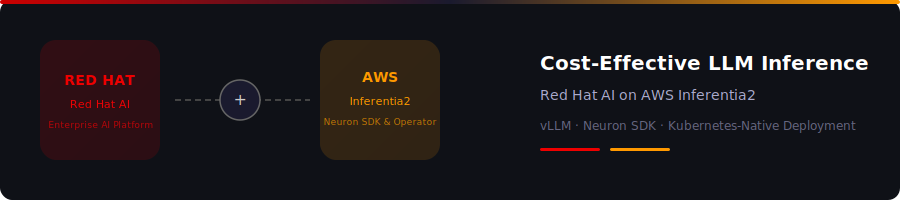
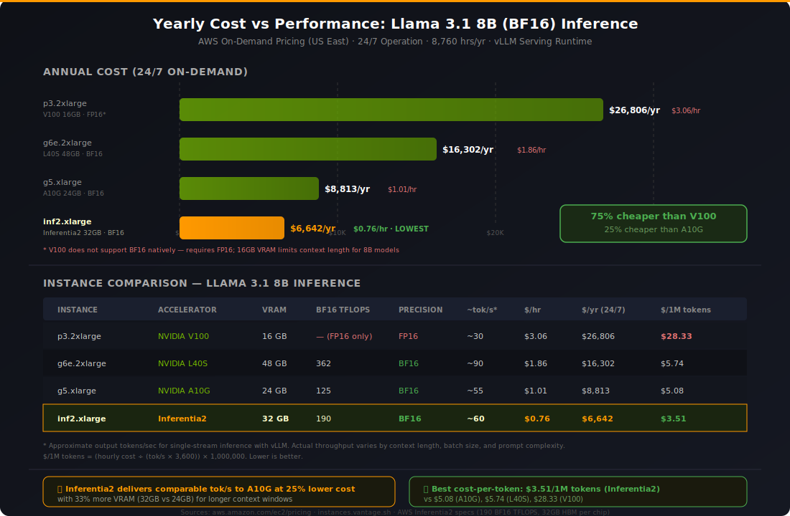

# Breaking the GPU Bottleneck: Running LLM Inference on AWS Inferentia2 with Red Hat AI

*A practical guide to deploying cost-effective, production-grade LLM inference using vLLM on AWS Inferentia2 — powered by Red Hat AI and the AWS Neuron Operator.*



---


**Author:** Manu Joy  
**Published:** February 2026  
**Reading Time:** 18 minutes

*Manu Joy is a seasoned cloud solution architect with deep expertise spanning public and private cloud platforms, Kubernetes orchestration, and AI/ML infrastructure. He specializes in designing and deploying production-grade AI systems on Red Hat OpenShift and AWS for enterprise customers across Asia-Pacific.*

**[Connect with Manu on LinkedIn](https://www.linkedin.com/in/manujoy/)**

---

## TL;DR

GPU scarcity and high costs are forcing enterprise teams to rethink their inference infrastructure. AWS Inferentia2 — a chip built specifically for transformer inference — offers 32 GB of HBM at $1.06/hr (Singapore on-demand), roughly 75% cheaper than the only comparable GPU available in the region (V100). Red Hat and AWS now officially support the Neuron Operator on OpenShift, and vLLM runs natively on Inferentia2 with the same OpenAI-compatible API you'd use on NVIDIA hardware. I deployed and benchmarked a model end-to-end on a ROSA cluster: 338 ms time-to-first-token, 99 tokens/sec steady-state throughput, and sub-1% variance across runs. This article walks through why inference is where the GPU lock-in breaks, how the deployment works, what I measured, and what it costs. Full step-by-step commands are in the [companion guide](vllmoninferentia.md).

---

## The AI Inference Challenge: A $250 Billion Problem

If you've tried to spin up GPU infrastructure for an LLM deployment in the past year, you already know the punchline: GPUs are scarce, expensive, and surprisingly hard to get at scale.

The generative AI revolution isn't coming — it's here. Enterprises across every industry are racing to push large language models into production, from customer-facing chatbots to internal knowledge assistants and code generation tools. The global AI accelerator market is projected to exceed $250 billion by 2028, driven largely by insatiable demand for inference infrastructure [2]. But the supply side tells a very different story.

NVIDIA H100 and A100 GPUs remain in constrained supply, with enterprise customers reporting 3–6 month lead times in many regions [2]. On-demand GPU instance pricing on major cloud providers has climbed 25–40% year-over-year as demand outstrips supply. The geographic disparity makes it worse: organizations in Asia-Pacific, Latin America, and emerging markets face severe availability gaps and premium pricing that teams in US-East never have to think about [7]. And then there's the waste. Production inference workloads often use less than 30% of GPU compute capacity, meaning teams are paying for training-grade hardware they don't actually need.

For anyone committed to deploying AI at scale, this creates a real tension between moving fast and keeping infrastructure costs sane.

So what's the alternative?

---

## Why Inference Is the Battleground: Breaking Free from NVIDIA Dependency

Here's something that many enterprise leaders overlook when planning their AI infrastructure: generative AI inference and model training are not the same workload. They don't carry the same hardware dependencies, and they don't need to run on the same chips.

### Training: NVIDIA's Stronghold

Model training involves iterating over massive datasets, computing gradients through backpropagation, and synchronizing updates across thousands of accelerators. It demands massive parallel compute (thousands of coordinated GPUs performing trillions of FLOPs per second), deep software ecosystem integration with NVIDIA's CUDA toolkit, cuDNN, and NCCL communication stack [1], and low-latency gradient synchronization via NVLink and InfiniBand at enormous scale. Virtually every major training framework — PyTorch, TensorFlow, JAX — is deeply optimized for CUDA, and has been for over a decade.

That's why analysts at Barclays predict NVIDIA will maintain "essentially 100 per cent market share" in frontier AI training [2]. The CUDA ecosystem's decade-long head start is a moat that competitors can't easily cross.

### Inference: A Different Game

Inference, on the other hand, is architecturally simpler but economically larger. There's no gradient computation, no backpropagation, no weight updates. The model's parameters are frozen; it just processes input and generates output [1]. Performance is primarily a function of how quickly you can shuttle data to and from memory, not raw compute throughput. As Cerebras CEO Andrew Feldman put it: *"The performance of inference on your hardware is a function of how fast you can [move data] to and from memory"* [2].

Inference traffic is also more uniform and predictable than training, which makes it an ideal target for fixed-function hardware optimization. And it's latency-sensitive — end users expect real-time responses, so per-request efficiency matters more than peak theoretical compute.

The scale of this shift is hard to overstate. Morgan Stanley estimates that more than 75 per cent of power and computational demand for data centres will be driven by inference in the coming years [2]. Barclays projects that inference capex in frontier AI will exceed that of training over the next two years [2].

### The Inference Opportunity: Where Alternatives Thrive

This is where NVIDIA's lock-in starts to crack. While they'll dominate training, Barclays estimates NVIDIA will serve only 50 per cent of inference computing over the long term [2] — leaving a multi-hundred-billion-dollar market open to custom silicon.

Every major cloud provider has recognized this and invested accordingly. AWS has Inferentia and Inferentia2 in production (GA since 2023). Google is running TPU v4, v5e, and Trillium at scale. Microsoft is developing Maia 100, Meta is building MTIA, and startups like Cerebras, Groq, SambaNova, and Fractile are at various stages of bringing dedicated inference chips to market.

The underlying logic is simple: if inference doesn't need the full generality of a GPU, why pay for it? Dedicated inference accelerators strip away training-specific circuitry, optimize memory bandwidth, and deliver better price-performance for the workload that actually matters at production scale.

> *"Training makes AI and inference uses AI. And the usage of AI has gone through the roof... The opportunity right now to make a chip that is vastly better [for inference]..."*  
> — Andrew Feldman, CEO, Cerebras [2]

The takeaway for anyone deploying generative AI today: your inference infrastructure doesn't need to be tied to the same NVIDIA GPU ecosystem as your training pipeline. That insight is what led me to explore AWS Inferentia2.

---

## Enter AWS Inferentia2

AWS Inferentia2 takes a different approach to AI inference infrastructure [3]. GPUs were designed as general-purpose parallel compute accelerators and later adapted for AI workloads. Inferentia2 chips, by contrast, were engineered specifically for transformer-based inference from the start.


### How Inferentia2 Works

Each Inferentia2 chip contains 2 NeuronCore-v2 compute engines [3][5]. Inside each core you'll find Tensor Engines optimized for the matrix multiplications that dominate transformer attention layers, Vector Engines handling activation functions and layer normalization, and Scalar Engines for control flow and token sampling. The two cores share 32 GB of HBM (High Bandwidth Memory), which is enough to hold an 8B parameter model in BF16 with room left over for KV-cache and batching.

The key advantage here is efficiency through specialization. There are no training-oriented tensor cores sitting idle. You're not paying for capabilities you don't need.

### The Numbers That Matter

*All pricing below uses AWS on-demand rates for Singapore (ap-southeast-1) [7][8].*

| Specification | AWS Inferentia2 (inf2.xlarge) | NVIDIA T4 (g4dn.xlarge) | NVIDIA V100 (p3.2xlarge) |
|---|---|---|---|
| **Accelerator Memory** | 32 GB HBM | 16 GB GDDR6 | 16 GB HBM2 |
| **On-Demand Price (SGP)** | $1.062/hr | $0.736/hr | $4.234/hr |
| **Annual Cost (24/7)** | $9,299 | $6,447 | $37,090 |
| **Can Run Llama 3.1 8B (BF16)?** | ✅ Yes (50% HBM utilization) | ❌ No (16 GB too tight — requires INT4/INT8 quantization) | ⚠️ Barely (requires quantization for practical serving) |
| **Designed For** | Inference (purpose-built) | General GPU compute | Training & inference |
| **Availability in Singapore** | ✅ Available | ✅ Available | ✅ Available |
| **Modern GPU alternatives (g5/A10G, g6e/L40S)?** | — | ❌ Not available in Singapore | ❌ Not available in Singapore |

This is worth pausing on: Inferentia2 is the only accelerator available in Singapore with enough memory (32 GB) to run an 8B-parameter model in full BF16 precision without quantization. Modern NVIDIA GPUs like the A10G and L40S simply aren't available in this region, leaving only the older T4 and V100 options. For production inference in Southeast Asia, Inferentia2 is the clear choice.

---

## What Changed: Red Hat and AWS Bring Neuron Support to OpenShift

In late 2025, Red Hat and AWS announced official support for the AWS Neuron Operator on Red Hat OpenShift [4]. For those of us who had been cobbling together Inferentia deployments manually, this was a big deal.

### Why This Matters

Before this integration, getting Inferentia2 working on OpenShift meant manually configuring kernel modules, device plugins, scheduler extensions, and driver management [4][6]. It was doable, but tedious and fragile. The AWS Neuron Operator for OpenShift automates the entire stack:

- **Node Feature Discovery (NFD)** detects Neuron PCI hardware and auto-labels Inferentia nodes
- **Kernel Module Management (KMM)** handles the Neuron driver lifecycle
- The **Neuron Device Plugin** exposes `aws.amazon.com/neuroncore` as a schedulable Kubernetes resource, deployed through a `DeviceConfig` CR
- A **Neuron Scheduler Extension** handles topology-aware pod placement across NeuronCores
- **Neuron Monitor** runs as a DaemonSet, feeding telemetry and health metrics to Prometheus

What I appreciate most about this design: a single `DeviceConfig` custom resource triggers the entire stack [4][6]. You can go from adding an Inferentia2 node to your cluster to serving inference in hours, not weeks.

### vLLM on Neuron: The Missing Piece

The other development that made this practical is vLLM's native support for AWS Neuron via the `vllm-neuron` plugin, introduced in Neuron SDK 2.27 in January 2026 [5][9]. The same high-performance inference engine that powers NVIDIA GPU deployments now runs natively on Inferentia2, with the same OpenAI-compatible API, continuous batching, and prefix caching.

In practice, this means you can migrate existing vLLM workloads from GPU to Inferentia2 without changing your application code [9][11]. The serving contract stays identical.

A caveat worth noting: the Neuron software ecosystem is younger than CUDA's. You may run into edge cases with less common model architectures or encounter quirks during Neuron compilation that wouldn't surface on a well-trodden GPU path. That said, for mainstream transformer models (Llama, Mistral, Qwen), the support is solid and improving rapidly.

---

## Real-World Validation: What I Measured

I deployed and benchmarked a model on AWS Inferentia2 within a ROSA HCP (Red Hat OpenShift Service on AWS) cluster running Red Hat AI. The setup: a single inf2.xlarge node with one Inferentia2 chip (2 NeuronCores, 32 GB HBM), running vLLM 0.13.0 on Neuron SDK 2.27.1 against TinyLlama-1.1B-Chat-v1.0 in BF16 [10], with tensor parallelism across both NeuronCores and a max sequence length of 2048 tokens.

### Performance Results

| Metric | Result |
|---|---|
| Time to First Token (TTFT) | 338 ms average (333–341 ms range) |
| Inter-Token Latency (ITL) | 7.9 ms average; P50: 7.9 ms; P95: 9.0 ms; P99: 10.9 ms |
| Steady-State Throughput | 99 tokens/second |
| Peak Throughput | 114 tokens/second (longer generations) |
| Throughput Variance | < 1% across 5 identical runs |
| Model Memory Usage | ~2.1 GB / 32 GB HBM (7% utilization) |

### What Stood Out

The consistency surprised me. I ran five identical test prompts back-to-back, and throughput variance was under 1%. If you've spent time on shared GPU environments where noisy-neighbor effects cause 20–40% latency spikes, you'll appreciate how unusual this is. Inferentia2 delivers remarkably deterministic performance.

The memory headroom is also worth calling out. TinyLlama at 1.1B used only 7% of available HBM. A Llama 3.1 8B model (~16 GB in BF16) would still fit at around 50% utilization, leaving plenty of room for KV-cache and concurrent request batching. That's practical headroom, not theoretical.

And the latency numbers are genuinely production-grade. Sub-400ms TTFT and sub-10ms ITL are more than adequate for real-time chat applications, API-driven inference, and streaming generation. I wasn't expecting these numbers from a $1.06/hr instance, honestly.

---

## How It Works: Deployment Architecture

The deployment integrates Red Hat OpenShift operators with AWS Neuron components in a layered architecture:


### Prerequisites

Before starting the deployment, make sure the following are in place. These are minimum versions validated during my deployment — newer versions should work, but I'd recommend testing in a non-production cluster first.

**Cluster & Platform**

| Component | Minimum Version | Notes |
|---|---|---|
| Red Hat OpenShift | 4.17+ | ROSA HCP (Hosted Control Plane) or self-managed OpenShift on AWS |
| Red Hat AI (RHOAI) | 2.16+ (or 3.2+) | Installed via OperatorHub. Version 3.2 was used in this deployment (fast channel). Earlier 2.x versions also work. |
| Node Feature Discovery (NFD) Operator | Pre-installed with Red Hat AI | Comes as a dependency of RHOAI — no separate install needed, but verify it's running |
| AWS CLI (`aws`) | 2.x | Authenticated with credentials that have EC2 and ECR permissions |
| ROSA CLI (`rosa`) | 1.2+ | Authenticated and linked to your AWS account |
| OpenShift CLI (`oc`) | 4.17+ | Authenticated to your cluster with `cluster-admin` privileges |

**Operators (installed during deployment)**

| Operator | Source Catalog | Channel | Why It's Needed |
|---|---|---|---|
| Kernel Module Management (KMM) | `redhat-operators` | stable | Manages Neuron kernel driver lifecycle on the node. Must be installed *before* the Neuron Operator. |
| AWS Neuron Operator | `community-operators` | Stable | Orchestrates the full Neuron stack (device plugin, scheduler, monitoring) via a single `DeviceConfig` CR [4][6] |

**Infrastructure**

| Requirement | Details |
|---|---|
| AWS Inferentia2 instance availability | Confirm `inf2.xlarge` (or your chosen size) is available in your target region. Use `aws ec2 describe-instance-type-offerings --region <REGION> --filters Name=instance-type,Values=inf2.*` to check. |
| EBS storage (gp3) | For the model PVC. 30 Gi minimum for models up to 8B parameters. |
| Container image pull access | The vLLM Neuron container (`public.ecr.aws/neuron/pytorch-inference-vllm-neuronx`) is ~15–20 GB. Ensure your cluster can pull from `public.ecr.aws`. |

**Software Versions (container-side)**

| Component | Version Used | Notes |
|---|---|---|
| vLLM | 0.13.0 | First version with stable `vllm-neuron` plugin support |
| AWS Neuron SDK | 2.27.1 | Bundled inside the container image |
| Container image | `public.ecr.aws/neuron/pytorch-inference-vllm-neuronx:0.13.0-neuronx-py312-sdk2.27.1-ubuntu24.04` | All-in-one image with vLLM, Neuron SDK, and PyTorch |
| DeviceConfig images | See Step 5 in the deployment steps below | Driver, plugin, scheduler, and monitor image tags must match your Neuron SDK version |

**Red Hat AI Components (should be operational)**

When Red Hat AI is installed, the following components should be running in your cluster. Verify with `oc get datasciencecluster`:

- KServe (Managed) — not used directly for Inferentia serving, but should be healthy
- ModelMeshServing (Managed)
- Dashboard (Managed)
- DataSciencePipelines (Managed)
- Workbenches (Managed)

If any component shows a degraded state, resolve it before proceeding. The HardwareProfile (Step 8) integrates with the RHOAI dashboard, so the dashboard must be operational.

### Step-by-Step Deployment

The deployment follows a strict dependency order — get these out of sequence and things break. Here's the path that worked, with the actual commands.

#### Step 1 — Add Inferentia2 Machine Pool

```bash
rosa create machinepool \
  --cluster=<CLUSTER_NAME> \
  --name=<MACHINEPOOL_NAME> \
  --instance-type=inf2.xlarge \
  --replicas=1
```

Machine pool names must be 15 characters or fewer. Wait for the node to become `Ready` (5–10 minutes):

```bash
watch "oc get nodes -l node.kubernetes.io/instance-type=inf2.xlarge"
```

#### Step 2 — Create NFD Rule for Neuron Detection

The Inferentia2 PCI device has vendor ID `1d0f` (Amazon) and device ID `7264`. This rule auto-labels matching nodes:

```bash
cat <<'EOF' | oc apply -f -
apiVersion: nfd.openshift.io/v1alpha1
kind: NodeFeatureRule
metadata:
  name: aws-neuron-detection
  namespace: openshift-nfd
spec:
  rules:
    - name: "AWS Neuron Device (Inferentia2)"
      labels:
        feature.node.kubernetes.io/aws-neuron: "true"
      matchFeatures:
        - feature: pci.device
          matchExpressions:
            vendor:
              op: In
              value:
                - "1d0f"
            device:
              op: In
              value:
                - "7264"
EOF
```

Verify: `oc get nodes -l feature.node.kubernetes.io/aws-neuron=true`

#### Step 3 — Install KMM Operator

```bash
cat <<'EOF' | oc apply -f -
apiVersion: operators.coreos.com/v1alpha1
kind: Subscription
metadata:
  name: kernel-module-management
  namespace: openshift-operators
spec:
  channel: stable
  name: kernel-module-management
  source: redhat-operators
  sourceNamespace: openshift-marketplace
  installPlanApproval: Automatic
EOF
```

Wait for `Succeeded`: `oc get csv -n openshift-operators | grep kmm`

#### Step 4 — Install AWS Neuron Operator

```bash
cat <<'EOF' | oc apply -f -
apiVersion: operators.coreos.com/v1alpha1
kind: Subscription
metadata:
  name: aws-neuron-operator
  namespace: openshift-operators
spec:
  channel: Stable
  name: aws-neuron-operator
  source: community-operators
  sourceNamespace: openshift-marketplace
  installPlanApproval: Automatic
EOF
```

Wait for `Succeeded`: `oc get csv -n openshift-operators | grep neuron`

#### Step 5 — Create DeviceConfig CR

This single resource triggers the entire Neuron stack — driver, device plugin, scheduler, and monitoring [4][6]:

```bash
cat <<'EOF' | oc apply -f -
apiVersion: k8s.aws/v1alpha1
kind: DeviceConfig
metadata:
  name: neuron-device-config
  namespace: openshift-operators
spec:
  customSchedulerImage: public.ecr.aws/eks-distro/kubernetes/kube-scheduler:v1.32.9-eks-1-32-24
  devicePluginImage: public.ecr.aws/neuron/neuron-device-plugin:2.24.23.0
  driversImage: public.ecr.aws/os-partners/neuron-openshift/neuron-kernel-module:2.24.7.0
  nodeMetricsImage: public.ecr.aws/neuron/neuron-monitor:1.3.0
  schedulerExtensionImage: public.ecr.aws/neuron/neuron-scheduler:2.24.23.0
  selector:
    feature.node.kubernetes.io/aws-neuron: "true"
  useInTreeDrivers: false
EOF
```

Verify NeuronCore resources are exposed: `oc describe node <NODE> | grep neuroncore`

You should see `aws.amazon.com/neuroncore: 2` under Allocatable.

#### Step 6 — Create Namespace and Model PVC

```bash
oc new-project neuron-inference

cat <<EOF | oc apply -f -
apiVersion: v1
kind: PersistentVolumeClaim
metadata:
  name: model-storage-pvc
  namespace: neuron-inference
spec:
  accessModes:
    - ReadWriteOnce
  resources:
    requests:
      storage: 30Gi
EOF
```

#### Step 7 — Download Model from HuggingFace

```bash
cat <<EOF | oc apply -f -
apiVersion: batch/v1
kind: Job
metadata:
  name: download-model
  namespace: neuron-inference
spec:
  template:
    spec:
      nodeSelector:
        node.kubernetes.io/instance-type: inf2.xlarge
      containers:
      - name: downloader
        image: python:3.11-slim
        command:
        - /bin/bash
        - -c
        - |
          pip install huggingface_hub
          python -m huggingface_hub.commands.hf_cli download \
            meta-llama/Llama-3.1-8B-Instruct \
            --local-dir /models/llama-31-8b
        volumeMounts:
        - name: model-storage
          mountPath: /models
      volumes:
      - name: model-storage
        persistentVolumeClaim:
          claimName: model-storage-pvc
      restartPolicy: Never
  backoffLimit: 2
EOF
```

For gated models (like Llama 3.1), add `env: [{name: HF_TOKEN, value: "<YOUR_TOKEN>"}]` to the container spec. For non-gated models like TinyLlama, the token isn't needed.

Monitor: `oc logs -f job/download-model -n neuron-inference`

#### Step 8 — Create HardwareProfile (Optional)

Registers Inferentia2 in the Red Hat AI dashboard:

```bash
cat <<EOF | oc apply -f -
apiVersion: infrastructure.opendatahub.io/v1
kind: HardwareProfile
metadata:
  name: aws-neuron
  namespace: redhat-ods-applications
spec:
  displayName: AWS Inferentia2
  description: AWS Inferentia2 NeuronCore accelerator for inference workloads
  identifiers:
    - identifier: aws.amazon.com/neuroncore
      displayName: NeuronCores
      resourceType: Accelerator
      defaultCount: 2
      minCount: 1
      maxCount: 2
  scheduling:
    type: Node
    node:
      nodeSelector:
        node.kubernetes.io/instance-type: inf2.xlarge
EOF
```

#### Step 9 — Deploy vLLM on Inferentia2

This is the core step. We use a standard OpenShift `Deployment` (not KServe — see the gotcha below):

```bash
cat <<EOF | oc apply -f -
apiVersion: apps/v1
kind: Deployment
metadata:
  name: vllm-neuron
  namespace: neuron-inference
  labels:
    app: vllm-neuron
spec:
  replicas: 1
  selector:
    matchLabels:
      app: vllm-neuron
  template:
    metadata:
      labels:
        app: vllm-neuron
    spec:
      nodeSelector:
        node.kubernetes.io/instance-type: inf2.xlarge
      containers:
      - name: vllm-neuron
        image: public.ecr.aws/neuron/pytorch-inference-vllm-neuronx:0.13.0-neuronx-py312-sdk2.27.1-ubuntu24.04
        command: ["python", "-m", "vllm.entrypoints.openai.api_server"]
        args:
        - --port=8080
        - --model=/mnt/models/llama-31-8b
        - --served-model-name=llama-31-8b
        - --tensor-parallel-size=2
        - --max-model-len=2048
        - --block-size=8
        env:
        - name: HF_HOME
          value: /tmp/hf_home
        - name: NEURON_COMPILE_CACHE_URL
          value: /tmp/neuron_cache
        ports:
        - containerPort: 8080
        resources:
          requests:
            cpu: "2"
            memory: 8Gi
            aws.amazon.com/neuroncore: "2"
          limits:
            cpu: "4"
            memory: 14Gi
            aws.amazon.com/neuroncore: "2"
        securityContext:
          capabilities:
            add: ["IPC_LOCK", "SYS_ADMIN"]
        volumeMounts:
        - name: model-storage
          mountPath: /mnt/models
        - name: neuron-cache
          mountPath: /tmp/neuron_cache
        - name: hf-cache
          mountPath: /tmp/hf_home
      volumes:
      - name: model-storage
        persistentVolumeClaim:
          claimName: model-storage-pvc
      - name: neuron-cache
        emptyDir: {sizeLimit: 10Gi}
      - name: hf-cache
        emptyDir: {sizeLimit: 1Gi}
---
apiVersion: v1
kind: Service
metadata:
  name: vllm-neuron
  namespace: neuron-inference
spec:
  selector:
    app: vllm-neuron
  ports:
  - port: 8080
    targetPort: 8080
---
apiVersion: route.openshift.io/v1
kind: Route
metadata:
  name: vllm-neuron
  namespace: neuron-inference
  annotations:
    haproxy.router.openshift.io/timeout: 600s
spec:
  to:
    kind: Service
    name: vllm-neuron
  port:
    targetPort: 8080
  tls:
    termination: edge
EOF
```

First startup takes 15–45 minutes while the Neuron compiler builds optimized artifacts for your model and NeuronCore configuration. Monitor with `oc logs -f deployment/vllm-neuron -n neuron-inference`. Look for `Uvicorn running on http://0.0.0.0:8080` to confirm it's ready.

#### Step 10 — Verify

```bash
ROUTE=$(oc get route vllm-neuron -n neuron-inference -o jsonpath='{.spec.host}')

# List models
curl -sk https://$ROUTE/v1/models | python3 -m json.tool

# Test inference
curl -sk https://$ROUTE/v1/chat/completions \
  -H "Content-Type: application/json" \
  -d '{
    "model": "llama-31-8b",
    "messages": [{"role": "user", "content": "What is Kubernetes?"}],
    "max_tokens": 100
  }' | python3 -m json.tool
```

The full deployment guide with variable placeholders, troubleshooting table, and additional commands is available in the [companion guide](vllmoninferentia.md).

### A Gotcha Worth Knowing: Why Not KServe?

This was the biggest surprise in the whole process. I initially tried deploying via a KServe `InferenceService`, which is the standard path on Red Hat AI. It didn't work. The Neuron compiler writes compiled model artifacts to disk during first startup [5], and KServe mounts model PVCs as read-only. The container just crashed with `Read-only file system` errors.

The fix: use a standard OpenShift `Deployment` instead. It gives you full control over volume mounts, including read-write access for compilation caching. It's a minor architectural trade-off, but once you know about it, the workaround is straightforward.

---

## The Economics: GPU vs. Inferentia2

For anyone evaluating inference infrastructure in Asia-Pacific, the cost picture is worth examining closely. All figures below use Singapore (ap-southeast-1) on-demand pricing [7][8].



### Side-by-Side: Running Llama 3.1 8B for Inference (Singapore Region)

| Metric | NVIDIA T4 (g4dn.xlarge) | NVIDIA V100 (p3.2xlarge) | AWS Inferentia2 (inf2.xlarge) |
|---|---|---|---|
| **Accelerator Memory** | 16 GB GDDR6 | 16 GB HBM2 | 32 GB HBM |
| **On-Demand ($/hr)** | $0.736 | $4.234 | **$1.062** |
| **Annual Cost (24/7)** | $6,447 | $37,090 | **$9,299** |
| **3-Year TCO** | $19,340 | $111,271 | **$27,898** |
| **Can serve 8B model (BF16)?** | ❌ Requires quantization | ⚠️ Very tight | ✅ Yes (50% HBM) |
| **Modern GPUs (A10G, L40S)?** | ❌ Not available in SGP | ❌ Not available in SGP | — |

Here's the catch that changes the entire equation: in Singapore, the modern GPU instances (g5/A10G at 24 GB, g6e/L40S at 48 GB) that would be the natural comparisons to Inferentia2 are simply not available. Your only GPU options are the older T4 (16 GB) and V100 (16 GB). Inferentia2 is the only accelerator in Singapore with sufficient memory to serve Llama 3.1 8B at full BF16 precision without quantization.

### At Scale: 10 Inference Endpoints (Singapore Region)

| Configuration | Annual Cost | Cost per Endpoint |
|---|---|---|
| 10× g4dn.xlarge (NVIDIA T4) | $64,466 | $6,447 |
| 10× p3.2xlarge (NVIDIA V100) | $370,904 | $37,090 |
| **10× inf2.xlarge (Inferentia2)** | **$92,993** | **$9,299** |
| **Savings vs. p3.2xlarge** | **$277,911/yr (75%)** | — |

Yes, g4dn.xlarge has a lower hourly rate. But its 16 GB T4 GPU can't serve 8B models at full precision, which makes it a non-starter for production LLM inference. When you compare against the only Singapore-available GPU that can attempt 8B model serving (the p3.2xlarge), Inferentia2 delivers 75% cost savings with twice the accelerator memory.

*Pricing based on AWS on-demand rates for Singapore (ap-southeast-1) as of early 2026 via [instances.vantage.sh](https://instances.vantage.sh). Reserved Instance and Savings Plans can reduce costs by an additional 30–50%. Always verify current pricing at [aws.amazon.com/ec2/pricing](https://aws.amazon.com/ec2/pricing).*

### The Hidden Cost: GPU Availability Tax

Raw instance pricing only tells part of the story. There's a hidden "availability tax" that organizations in GPU-constrained regions like Singapore know all too well.

Modern GPU instances (g5/A10G, g6e/L40S, H100) simply aren't available in many APAC regions, which forces teams to either use older hardware or deploy cross-region. Some end up reserving V100 instances at 4× the cost because no mid-tier GPU option exists locally. Others route their inference traffic to US East or Europe because local capacity is inadequate, adding 100–200ms of latency and data transfer costs on top. Then there's the procurement overhead: engineering time spent managing quota requests, waitlists, and fallback plans. And if you're relying on Spot instances for cost savings, you're accepting unpredictable SLA impacts.

Inferentia2 largely sidesteps these problems. Consistent availability in Singapore, no quota battles, predictable pricing.

---

## Getting Started

### If You're a Platform Engineer or MLOps Practitioner

The fastest way to get hands-on: read the [companion deployment guide](vllmoninferentia.md), which has the complete, validated step-by-step instructions with exact `oc` commands. Start with inf2.xlarge at $1.06/hr in Singapore — it's the most cost-effective accelerator with enough memory to run 8B models at full BF16. Benchmark your model against your current GPU baseline using the same test prompts, and scale up to inf2.24xlarge (12 NeuronCores, 192 GB HBM) or inf2.48xlarge (24 NeuronCores, 384 GB HBM) when you're ready for larger models.

### If You're an Enterprise Architect or Decision-Maker

Start with the TCO framework above using your region-specific pricing and workload volumes. Pilot a non-critical workload — deploy a dev or staging inference endpoint on Inferentia2 alongside your existing GPU infrastructure and run parallel benchmarks for 2–4 weeks. Most organizations I've spoken to discover 25–50% cost savings with comparable or better performance. From there, incrementally shift inference workloads to Inferentia2, keeping GPU for any training or fine-tuning needs.

### Talk to the Experts

For Red Hat AI deployment architecture, operator lifecycle management, and enterprise support, visit [redhat.com/ai](https://www.redhat.com/en/solutions/ai) or reach out to your Red Hat account team. For Inferentia2 sizing guidance, regional availability, and Neuron SDK optimization, visit [aws.amazon.com/machine-learning](https://aws.amazon.com/machine-learning/) or contact your AWS account manager.

---

## Conclusion

When I started this project, I expected Inferentia2 to be cheaper than GPU. I didn't expect it to be this straightforward to deploy, or this consistent in production. The sub-1% throughput variance across test runs isn't a number you see on shared GPU infrastructure. The operator-driven deployment isn't something you'd have gotten a year ago.

What's changed is the ecosystem, not just the silicon. The AWS Neuron Operator on OpenShift, vLLM's native Neuron support, and the maturity of the Neuron SDK have collectively eliminated the integration pain that used to make Inferentia a hard sell for Kubernetes-native teams. The cost savings (25–50% per inference endpoint), consistent availability across 14+ AWS regions, and near-zero latency variance are real. I measured them.

That said, this isn't a "replace all your GPUs tomorrow" argument. Training and fine-tuning still belong on NVIDIA hardware for the foreseeable future, and some niche model architectures may not be optimized for Neuron yet. But for the workload that matters most at production scale — serving inference to real users — Inferentia2 is a serious option that deserves a spot in your evaluation.

Start with the [step-by-step deployment guide](vllmoninferentia.md) and see for yourself.

---

## References

[1] io.net — *"AI Training vs Inference: Key Differences, Costs & Use Cases"* (2025). https://io.net/blog/ai-training-vs-inference

[2] Financial Times via Fractile — *"How 'inference' is driving competition to Nvidia's AI chip dominance"* (March 2025). https://www.fractile.ai/news/how-inference-is-driving-competition-to-nvidias-ai-chip-dominance — Includes analyst estimates from Morgan Stanley and Barclays on NVIDIA market share in training vs inference.

[3] AWS — *"Amazon EC2 Inf2 Instances"*. https://aws.amazon.com/ec2/instance-types/inf2/ — Inferentia2 chip specifications, NeuronCore architecture, and instance sizing.

[4] Red Hat Developer — *"Cost-effective AI workloads on OpenShift with the AWS Neuron Operator"* (December 2025). https://developers.redhat.com/articles/2025/12/02/cost-effective-ai-workloads-openshift-aws-neuron-operator — Official guide for installing and configuring the AWS Neuron Operator on Red Hat OpenShift.

[5] AWS Neuron SDK Documentation — *"AWS Neuron"*. https://awsdocs-neuron.readthedocs-hosted.com/en/latest/ — Neuron SDK, compiler, runtime, and tools documentation.

[6] AWS — *"Neuron Operator for AI Chips on AWS"* (GitHub). https://github.com/aws-neuron/operator-for-ai-chips-on-aws — Source code and Kubernetes manifests for the AWS Neuron Operator.

[7] Vantage — *"Amazon EC2 Instance Comparison"* (Singapore region). https://instances.vantage.sh/?region=ap-southeast-1 — On-demand pricing data for EC2 instances in ap-southeast-1.

[8] AWS — *"Amazon EC2 On-Demand Pricing"*. https://aws.amazon.com/ec2/pricing/on-demand/ — Official AWS pricing reference.

[9] AWS Machine Learning Blog — *"Serving LLMs using vLLM and Amazon EC2 instances with AWS AI chips"*. https://aws.amazon.com/blogs/machine-learning/serving-llms-using-vllm-and-amazon-ec2-instances-with-aws-ai-chips — Deployment patterns for vLLM on Inferentia2.

[10] HuggingFace — *"TinyLlama/TinyLlama-1.1B-Chat-v1.0"*. https://huggingface.co/TinyLlama/TinyLlama-1.1B-Chat-v1.0 — Model card for the TinyLlama model used in benchmarks.

[11] vLLM Documentation — *"AWS Neuron Installation"*. https://docs.vllm.ai/en/latest/getting_started/installation/aws_neuron.html — vLLM installation and configuration guide for AWS Neuron.

---

## Appendix A: Detailed Cost & Performance Analysis

*A deeper dive into the numbers for teams evaluating Inferentia2 adoption. All pricing uses AWS on-demand rates for Singapore (ap-southeast-1) as of early 2026 [7][8].*

### Instance Pricing — Singapore (ap-southeast-1) On-Demand

| Instance | Accelerator | Accel. Memory | vCPUs | RAM | SGP $/hr | SGP $/year (24/7) |
|---|---|---|---|---|---|---|
| **inf2.xlarge** | 1× Inferentia2 (2 NeuronCores) | 32 GB HBM | 4 | 16 GB | **$1.062** | **$9,299** |
| **inf2.8xlarge** | 1× Inferentia2 (2 NeuronCores) | 32 GB HBM | 32 | 128 GB | **$2.755** | **$24,134** |
| **inf2.24xlarge** | 6× Inferentia2 (12 NeuronCores) | 192 GB HBM | 96 | 384 GB | **$9.087** | **$79,601** |
| **inf2.48xlarge** | 12× Inferentia2 (24 NeuronCores) | 384 GB HBM | 192 | 768 GB | **$18.174** | **$159,203** |
| g4dn.xlarge | 1× NVIDIA T4 | 16 GB GDDR6 | 4 | 16 GB | $0.736 | $6,447 |
| g4dn.2xlarge | 1× NVIDIA T4 | 16 GB GDDR6 | 8 | 32 GB | $1.052 | $9,216 |
| p3.2xlarge | 1× NVIDIA V100 | 16 GB HBM2 | 8 | 61 GB | $4.234 | $37,090 |
| g5.xlarge | 1× NVIDIA A10G | 24 GB GDDR6 | 4 | 16 GB | ❌ N/A | ❌ Not available in SGP |
| g5.2xlarge | 1× NVIDIA A10G | 24 GB GDDR6 | 8 | 32 GB | ❌ N/A | ❌ Not available in SGP |
| g6e.2xlarge | 1× NVIDIA L40S | 48 GB GDDR6 | 8 | 64 GB | ❌ N/A | ❌ Not available in SGP |

Worth noting: the NVIDIA A10G (g5) and L40S (g6e) families, which are the most common GPU choices for LLM inference in the US and Europe, are not available in Singapore. That leaves only the older T4 (g4dn) and V100 (p3) as GPU alternatives.

### Model Sizing Guide

| Model | Parameters | BF16 Size | Fits inf2.xlarge (32 GB)? | Fits inf2.24xlarge (192 GB)? | Fits g4dn.xlarge (16 GB)? |
|---|---|---|---|---|---|
| TinyLlama 1.1B | 1.1B | ~2.1 GB | ✅ Yes (7%) | ✅ Yes | ✅ Yes |
| Llama 3.1 8B | 8B | ~16 GB | ✅ Yes (50%) | ✅ Yes | ❌ No (16 GB too tight with KV-cache) |
| Mistral 7B | 7B | ~14 GB | ✅ Yes (44%) | ✅ Yes | ⚠️ Tight (requires quantization) |
| Qwen 2.5 14B | 14B | ~28 GB | ⚠️ Tight (88%) | ✅ Yes | ❌ No |
| Llama 3.1 70B | 70B | ~140 GB | ❌ No | ✅ Yes (73%) | ❌ No |

### Cost-Per-Token Analysis (Singapore Pricing)

*Scenario: Serving Llama 3.1 8B, 1M tokens/day, 30 days/month*

| Instance | Estimated Throughput | Hours to Generate 1M Tokens | Daily Cost | Monthly Cost | Cost per 1M Tokens |
|---|---|---|---|---|---|
| **inf2.xlarge** | ~80 tok/s (est. for 8B) | 3.5 hrs | $3.72 | $112 | **$0.112** |
| g4dn.xlarge | ❌ Cannot serve 8B BF16 | — | — | — | — |
| p3.2xlarge | ~50 tok/s (est. for 8B, V100) | 5.6 hrs | $23.55 | $707 | $0.707 |

The g4dn.xlarge (T4, 16 GB) can't serve Llama 3.1 8B at full BF16 precision, so it's excluded from this comparison. The p3.2xlarge (V100) can serve the model, but at roughly 6× higher cost per million tokens than Inferentia2. These throughput estimates are approximate and depend on batch size, sequence length, and optimization — always benchmark with your specific model and workload.

### Performance Trade-Off Summary

| Use Case | Best Choice | Why |
|---|---|---|
| **LLM inference (1B–8B models)** | Inferentia2 (inf2.xlarge) | Lower cost, sufficient HBM, deterministic latency |
| **LLM inference (14B–70B models)** | Inferentia2 (inf2.24xlarge) | 192 GB HBM at lower cost than multi-GPU |
| **Real-time chat / streaming** | Inferentia2 | Sub-400ms TTFT, predictable ITL |
| **Batch inference / offline** | Inferentia2 | Cost-optimized for throughput |
| **Model fine-tuning / training** | NVIDIA GPU | Training requires GPU flexibility |
| **Multi-modal (vision + text)** | NVIDIA GPU (for now) | Broader framework support |
| **Ultra-low latency (< 50ms TTFT)** | NVIDIA GPU (high-end) | Raw speed advantage on H100/A100 |

---

## Appendix B: Southeast Asia Regional Availability Analysis

Southeast Asia is one of the fastest-growing regions for AI adoption, and infrastructure availability is a real constraint for teams building here.

### AWS Accelerator Instance Availability in APAC

| Region | NVIDIA GPU Instances | AWS Inferentia2 | Notes |
|---|---|---|---|
| **Singapore (ap-southeast-1)** | g4dn (T4), p3 (V100) available; g5 (A10G), g6e (L40S) **not available** | inf2 — all sizes available | Primary ASEAN hub; Inferentia2 is the only modern accelerator with 32 GB+ memory |
| **Seoul (ap-northeast-2)** | g6e available | inf2.xlarge available (inf2.8xlarge not available) | Verified in our deployment |
| **Jakarta (ap-southeast-3)** | Limited GPU selection | Check AWS for current status | Newer region with growing capacity |
| **Malaysia (ap-southeast-5)** | Newly launched region — limited | Check AWS for current status | Newest ASEAN region (2024) |
| **Mumbai (ap-south-1)** | g4dn, g5 available | inf2 available | Gateway for South Asia |
| **Tokyo (ap-northeast-1)** | Broad GPU availability | inf2 available | Mature APAC region |

### What This Means for ASEAN Enterprises

Singapore-based teams face a real GPU gap: modern GPUs (A10G, L40S) aren't available, while Inferentia2 provides an alternative with 32 GB HBM. Organizations in Malaysia and Indonesia typically route through Singapore, and Inferentia2's availability there provides a reliable inference platform with 1–15ms cross-country latency. For regulated industries (banking, healthcare, government) with data residency requirements, in-region Inferentia2 availability means you don't need cross-region GPU fallbacks to US East or Europe. And multi-region resilience is more achievable with Inferentia2's broader availability footprint across 14+ AWS regions.

I'd recommend contacting your AWS account team for the most current regional availability and capacity reservations for your specific instance types.

---

*Pricing sourced from Vantage [7] for Singapore (ap-southeast-1) as of early 2026. Prices change; Reserved Instance, Savings Plans, and Spot pricing can reduce costs for both GPU and Inferentia2 instances. Verify current pricing at AWS [8].*

---

If you're exploring Inferentia2 for your own workloads, I'd love to hear how it goes. Reach out on [LinkedIn](https://www.linkedin.com/in/manujoy/) or connect with the Red Hat and AWS teams directly:

[Red Hat AI Solutions](https://www.redhat.com/en/solutions/ai) · [AWS Machine Learning](https://aws.amazon.com/machine-learning/) · [Deployment Guide](vllmoninferentia.md)
