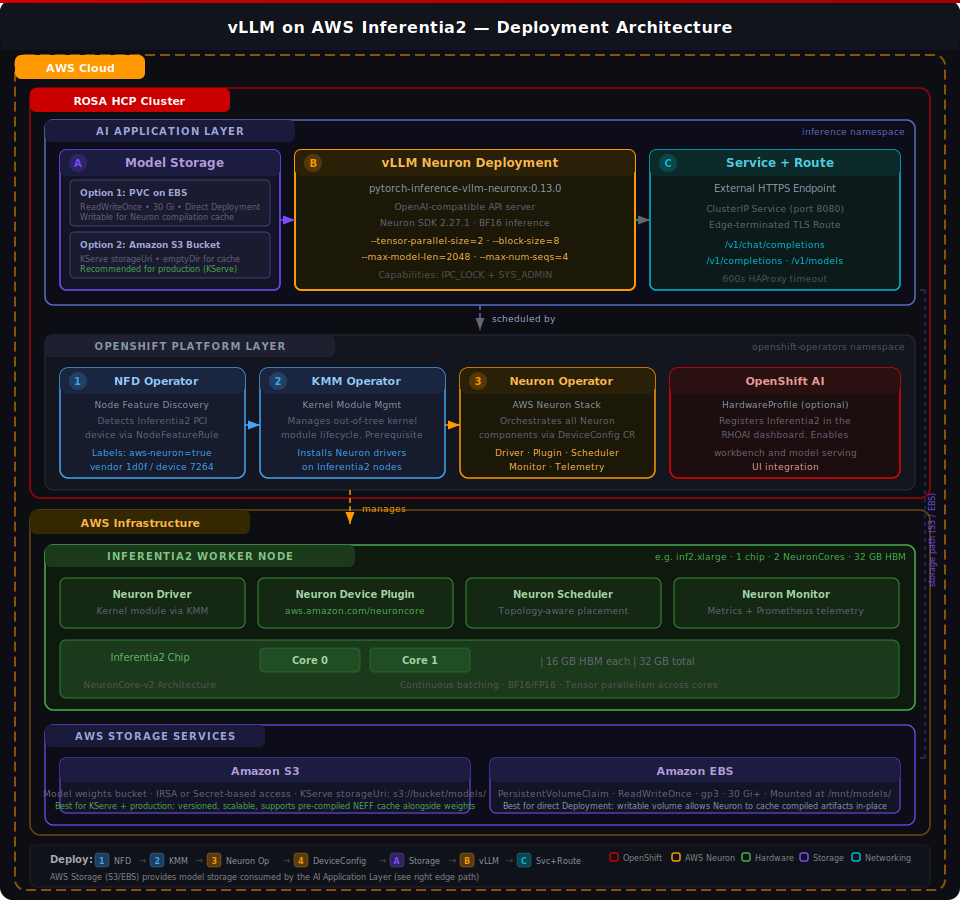

# Deploying LLM Inference with vLLM on AWS Inferentia2 (ROSA / OpenShift)

A step-by-step guide to running LLM inference using vLLM on AWS Inferentia2 nodes within a Red Hat OpenShift Service on AWS (ROSA) cluster, leveraging the AWS Neuron SDK, Neuron Operator, and OpenShift AI.

---

## Section 1: Overview

### What This Guide Covers

This guide walks through deploying a HuggingFace-compatible language model on **vLLM** running on an **AWS Inferentia2** accelerator node within a **ROSA HCP** (Hosted Control Plane) cluster. The deployment uses the **AWS Neuron SDK** to compile and execute the model on NeuronCores, exposed via an **OpenAI-compatible API** endpoint.

### Architecture Summary



The architecture is organized into four layers within an **AWS Cloud** boundary. The **ROSA HCP Cluster** encompasses the top two application/platform layers, while the **AWS Infrastructure** (Inferentia2 hardware and storage) sits outside the cluster boundary:

| Layer (top → bottom) | Boundary | Components | Purpose |
|----------------------|----------|-----------|---------|
| **AI Application Layer** | ROSA HCP | Model Storage (PVC on EBS **or** S3 bucket), vLLM Neuron Deployment, Service + Route | Store model weights, run vLLM inference on NeuronCores via the Neuron SDK, and expose an OpenAI-compatible HTTPS endpoint. S3 is recommended for production with KServe; PVC on EBS is best for direct Deployments. |
| **OpenShift Platform Layer** | ROSA HCP | NFD Operator, KMM Operator, AWS Neuron Operator, DeviceConfig CR, OpenShift AI HardwareProfile | Detect Inferentia2 hardware, install Neuron kernel drivers, deploy the device plugin and scheduler, and optionally register the accelerator in the OpenShift AI dashboard. |
| **Inferentia2 Worker Node** | AWS Infra | Neuron Driver, Device Plugin, Scheduler, Monitor, NeuronCore-v2 hardware | Expose NeuronCores as schedulable Kubernetes resources (`aws.amazon.com/neuroncore`), handle topology-aware pod placement, and emit health/telemetry metrics. |
| **AWS Storage Services** | AWS Infra | Amazon S3 (model bucket), Amazon EBS (PersistentVolume) | Provide persistent model storage. S3 supports KServe `storageUri`, versioning, and pre-compiled NEFF cache. EBS provides writable ReadWriteOnce PVCs for direct Deployments. |

### Component Roles

| Component | Role |
|-----------|------|
| **Node Feature Discovery (NFD)** | Detects PCI hardware on nodes. A custom `NodeFeatureRule` labels Inferentia2 nodes based on the Neuron PCI vendor/device IDs. |
| **Kernel Module Management (KMM)** | Manages out-of-tree kernel module lifecycle. Used by the Neuron Operator to install Neuron drivers on Inferentia nodes. |
| **AWS Neuron Operator** | Orchestrates all Neuron components via a single `DeviceConfig` CR — installs drivers (via KMM), device plugin, custom scheduler, and telemetry. |
| **DeviceConfig CR** | The single custom resource that tells the Neuron Operator which images to use for drivers, device plugin, scheduler, and monitoring. Applied to nodes matching the NFD label. |
| **Neuron Device Plugin** | Exposes `aws.amazon.com/neuron` (chips) and `aws.amazon.com/neuroncore` (cores) as schedulable Kubernetes resources. |
| **Neuron Scheduler** | Custom scheduler extension that understands NeuronCore topology for optimal pod placement. |
| **Neuron Monitor** | Collects health metrics and telemetry from Neuron devices and exports them to Prometheus for observability. |
| **vLLM with Neuron Plugin** | vLLM V1 with the `vllm-neuron` plugin. Runs inference on NeuronCores via the Neuron SDK. Serves an OpenAI-compatible API. |
| **HardwareProfile (OpenShift AI)** | Registers the Inferentia2 accelerator in the OpenShift AI dashboard, enabling it for workbenches and model serving. |

### Deployment Order (High Level)

The components have strict dependency ordering:

1. **Add Inferentia2 machine pool** — provision the hardware node
2. **Create NFD rule** — detect and label the Neuron PCI device on the node
3. **Install KMM Operator** — prerequisite for the Neuron Operator to deploy kernel modules
4. **Install AWS Neuron Operator** — installs the operator controller
5. **Create DeviceConfig CR** — triggers driver installation, device plugin, and scheduler deployment
6. **Create namespace and PVC** — prepare storage for model files
7. **Download model** — pull model weights from HuggingFace into the PVC
8. **Create HardwareProfile** — register Inferentia2 in OpenShift AI dashboard (optional, recommended)
9. **Deploy vLLM** — create Deployment, Service, and Route for the inference endpoint
10. **Verify and test** — confirm the model is serving and responding

### Key Technical Notes

- **Neuron Compilation**: The first startup of vLLM on Neuron compiles the model ahead-of-time for the specific NeuronCore configuration. This takes **15–45+ minutes** depending on model size. Subsequent restarts use cached artifacts.
- **No `--device=neuron` flag**: vLLM 0.13.0+ with the Neuron plugin auto-detects Neuron hardware. Do not pass `--device=neuron` — it will cause an unrecognized argument error.
- **`--block-size=8` is required**: vLLM on Neuron requires an explicit block size when prefix caching is enabled.
- **Model Storage Options**: For direct Deployments, use a **PVC on EBS** (ReadWriteOnce) so the Neuron compiler can write cached artifacts in-place. For **KServe**, use an **S3 bucket** with `storageUri` — KServe downloads model files to a writable `emptyDir`, and setting `NEURON_COMPILE_CACHE_URL` to a separate `emptyDir` keeps the Neuron cache writable. See Section 3 for detailed KServe approaches.
- **Security Capabilities**: The Neuron runtime requires `IPC_LOCK` and `SYS_ADMIN` Linux capabilities. These must be granted in the container's `securityContext`.
- **Container Image**: Use the AWS Neuron Deep Learning Container (DLC) from `public.ecr.aws/neuron/pytorch-inference-vllm-neuronx`. The image is large (~15–20 GB); first pull takes time.

### Inferentia2 Instance Types

| Instance | Inf2 Chips | NeuronCores | HBM | vCPUs | RAM |
|----------|-----------|-------------|-----|-------|-----|
| `inf2.xlarge` | 1 | 2 | 32 GB | 4 | 16 GB |
| `inf2.8xlarge` | 1 | 2 | 32 GB | 32 | 128 GB |
| `inf2.24xlarge` | 6 | 12 | 192 GB | 96 | 384 GB |
| `inf2.48xlarge` | 12 | 24 | 384 GB | 192 | 768 GB |

> **Sizing guideline**: Each NeuronCore-v2 has access to 16 GB of HBM. For a model in BF16, estimate ~2× the parameter count in GB for weights. For example, a 1B model needs ~2 GB, a 7B model needs ~14 GB, and an 8B model needs ~16 GB. Choose an instance with enough HBM to hold the model weights plus KV-cache overhead.

---

## Section 2: Step-by-Step Deployment Instructions

### Prerequisites

- A running **ROSA HCP cluster** (OpenShift 4.17+)
- **OpenShift AI** installed with KServe, NFD, and related operators
- `oc` CLI authenticated to the cluster
- `rosa` CLI authenticated with AWS credentials
- AWS region set (e.g. `export AWS_DEFAULT_REGION=ap-northeast-2`)

### Variables Used in This Guide

Replace these placeholders with your actual values:

| Variable | Description | Example |
|----------|-------------|---------|
| `<CLUSTER_NAME>` | ROSA cluster name | `ocbcrosaai` |
| `<MACHINEPOOL_NAME>` | Machine pool name (max 15 chars) | `inf-gpu-pool` |
| `<INSTANCE_TYPE>` | Inferentia2 instance type | `inf2.xlarge` |
| `<NAMESPACE>` | Namespace for inference workloads | `neuron-inference` |
| `<PVC_NAME>` | PersistentVolumeClaim name | `model-storage-pvc` |
| `<PVC_SIZE>` | Storage size for model files | `30Gi` |
| `<MODEL_REPO>` | HuggingFace model repository | `TinyLlama/TinyLlama-1.1B-Chat-v1.0` |
| `<MODEL_DIR>` | Directory name for model on PVC | `tinyllama-1.1b-chat` |
| `<MODEL_NAME>` | Served model name for the API | `my-model` |
| `<TP_SIZE>` | Tensor parallel size (= number of NeuronCores) | `2` |
| `<MAX_MODEL_LEN>` | Maximum sequence length | `2048` |
| `<HF_TOKEN>` | HuggingFace token (only for gated models) | `hf_abc123...` |

---

### Step 1: Add Inferentia2 Machine Pool

Create a machine pool with Inferentia2 instances in your ROSA cluster.

> **Note**: Machine pool names must be 15 characters or fewer.

```bash
rosa create machinepool \
  --cluster=<CLUSTER_NAME> \
  --name=<MACHINEPOOL_NAME> \
  --instance-type=<INSTANCE_TYPE> \
  --replicas=1
```

Wait for the node to become `Ready`:

```bash
watch "oc get nodes -l node.kubernetes.io/instance-type=<INSTANCE_TYPE>"
```

This typically takes 5–10 minutes.

---

### Step 2: Create NFD Rule for Neuron Device Detection

Node Feature Discovery must detect the Neuron PCI device and label the node. The Inferentia2 PCI device has vendor ID `1d0f` (Amazon) and device ID `7264`.

```bash
cat <<'EOF' | oc apply -f -
apiVersion: nfd.openshift.io/v1alpha1
kind: NodeFeatureRule
metadata:
  name: aws-neuron-detection
  namespace: openshift-nfd
spec:
  rules:
    - name: "AWS Neuron Device (Inferentia2)"
      labels:
        feature.node.kubernetes.io/aws-neuron: "true"
      matchFeatures:
        - feature: pci.device
          matchExpressions:
            vendor:
              op: In
              value:
                - "1d0f"
            device:
              op: In
              value:
                - "7264"
EOF
```

Verify the label is applied to the Inferentia node:

```bash
oc get nodes -l feature.node.kubernetes.io/aws-neuron=true
```

You should see your Inferentia2 node listed.

---

### Step 3: Install Kernel Module Management (KMM) Operator

The KMM Operator is a prerequisite for the Neuron Operator. It manages the lifecycle of out-of-tree kernel modules (Neuron drivers).

```bash
cat <<'EOF' | oc apply -f -
apiVersion: operators.coreos.com/v1alpha1
kind: Subscription
metadata:
  name: kernel-module-management
  namespace: openshift-operators
spec:
  channel: stable
  name: kernel-module-management
  source: redhat-operators
  sourceNamespace: openshift-marketplace
  installPlanApproval: Automatic
EOF
```

Wait for the operator to install:

```bash
oc get csv -n openshift-operators -w | grep kmm
```

Expected output should show `Succeeded` status (e.g., `kernel-module-management.v2.5.1`).

---

### Step 4: Install AWS Neuron Operator

Install the AWS Neuron Operator from the OperatorHub community catalog.

```bash
cat <<'EOF' | oc apply -f -
apiVersion: operators.coreos.com/v1alpha1
kind: Subscription
metadata:
  name: aws-neuron-operator
  namespace: openshift-operators
spec:
  channel: Stable
  name: aws-neuron-operator
  source: community-operators
  sourceNamespace: openshift-marketplace
  installPlanApproval: Automatic
EOF
```

Wait for the operator to install:

```bash
oc get csv -n openshift-operators -w | grep neuron
```

Expected output should show `Succeeded` status.

---

### Step 5: Create DeviceConfig Custom Resource

The `DeviceConfig` CR tells the Neuron Operator which container images to use for drivers, device plugin, scheduler, and monitoring. It targets nodes labeled by the NFD rule.

> **Important**: The API version is `k8s.aws/v1alpha1` (not `v1`). The image tags below were validated at time of writing; check [AWS Neuron ECR](https://gallery.ecr.aws/neuron) for latest versions.

```bash
cat <<'EOF' | oc apply -f -
apiVersion: k8s.aws/v1alpha1
kind: DeviceConfig
metadata:
  name: neuron-device-config
  namespace: openshift-operators
spec:
  customSchedulerImage: public.ecr.aws/eks-distro/kubernetes/kube-scheduler:v1.32.9-eks-1-32-24
  devicePluginImage: public.ecr.aws/neuron/neuron-device-plugin:2.24.23.0
  driversImage: public.ecr.aws/os-partners/neuron-openshift/neuron-kernel-module:2.24.7.0
  nodeMetricsImage: public.ecr.aws/neuron/neuron-monitor:1.3.0
  schedulerExtensionImage: public.ecr.aws/neuron/neuron-scheduler:2.24.23.0
  selector:
    feature.node.kubernetes.io/aws-neuron: "true"
  useInTreeDrivers: false
EOF
```

Verify the Neuron resources are exposed on the node:

```bash
oc describe node <INFERENTIA_NODE_NAME> | grep -E "neuron|Allocatable" -A5
```

You should see:
```
  aws.amazon.com/neuron:      1
  aws.amazon.com/neuroncore:  2
```

Also verify the Neuron pods are running:

```bash
oc get pods -n openshift-operators | grep neuron
```

You should see device-plugin, scheduler, and monitor pods.

---

### Step 6: Create Namespace and PVC for Model Storage

```bash
oc new-project <NAMESPACE>
```

Create a PersistentVolumeClaim to store the model files:

```bash
cat <<EOF | oc apply -f -
apiVersion: v1
kind: PersistentVolumeClaim
metadata:
  name: <PVC_NAME>
  namespace: <NAMESPACE>
spec:
  accessModes:
    - ReadWriteOnce
  resources:
    requests:
      storage: <PVC_SIZE>
EOF
```

---

### Step 7: Download the Model

Use a Kubernetes Job to download model weights from HuggingFace into the PVC. The job must be scheduled on the Inferentia node (since the PVC uses `ReadWriteOnce` and will be bound to that node's availability zone).

**For public (non-gated) models:**

```bash
cat <<EOF | oc apply -f -
apiVersion: batch/v1
kind: Job
metadata:
  name: download-model
  namespace: <NAMESPACE>
spec:
  template:
    spec:
      nodeSelector:
        node.kubernetes.io/instance-type: <INSTANCE_TYPE>
      containers:
      - name: downloader
        image: python:3.11-slim
        command:
        - /bin/bash
        - -c
        - |
          pip install huggingface_hub
          python -m huggingface_hub.commands.hf_cli download \
            <MODEL_REPO> \
            --local-dir /models/<MODEL_DIR>
        volumeMounts:
        - name: model-storage
          mountPath: /models
      volumes:
      - name: model-storage
        persistentVolumeClaim:
          claimName: <PVC_NAME>
      restartPolicy: Never
  backoffLimit: 2
EOF
```

**For gated models** (e.g., Llama 3.1), add the `HF_TOKEN` environment variable:

```bash
        env:
        - name: HF_TOKEN
          value: "<HF_TOKEN>"
```

Monitor the download:

```bash
oc logs -f job/download-model -n <NAMESPACE>
```

Wait for the job to complete:

```bash
oc get job download-model -n <NAMESPACE> -w
```

---

### Step 8: Create HardwareProfile for OpenShift AI Dashboard (Optional)

This step registers the Inferentia2 accelerator in the OpenShift AI dashboard. It uses the `HardwareProfile` CRD (which replaces the deprecated `AcceleratorProfile` in OpenShift AI 3.x).

```bash
cat <<EOF | oc apply -f -
apiVersion: infrastructure.opendatahub.io/v1
kind: HardwareProfile
metadata:
  name: aws-neuron
  namespace: redhat-ods-applications
spec:
  displayName: AWS Inferentia2
  description: AWS Inferentia2 NeuronCore accelerator for inference workloads
  identifiers:
    - identifier: aws.amazon.com/neuroncore
      displayName: NeuronCores
      resourceType: Accelerator
      defaultCount: 2
      minCount: 1
      maxCount: 2
    - identifier: cpu
      displayName: CPU
      resourceType: CPU
      defaultCount: 4
      minCount: 1
    - identifier: memory
      displayName: Memory
      resourceType: Memory
      defaultCount: 12Gi
      minCount: 4Gi
  scheduling:
    type: Node
    node:
      nodeSelector:
        node.kubernetes.io/instance-type: <INSTANCE_TYPE>
      tolerations: []
EOF
```

> **Note**: Adjust `defaultCount`, `maxCount` for NeuronCores based on your instance type. `inf2.xlarge` has 2 NeuronCores, `inf2.24xlarge` has 12, `inf2.48xlarge` has 24.

---

### Step 9: Deploy vLLM on Inferentia2

This is the core deployment. We use a standard OpenShift `Deployment` (not a KServe `InferenceService`) because:
- KServe mounts PVCs as **read-only**, but the Neuron compiler writes compiled model artifacts during first startup
- A direct Deployment gives full control over volume mounts, environment variables, and scheduling

#### 9a. Create the Deployment

```bash
cat <<EOF | oc apply -f -
apiVersion: apps/v1
kind: Deployment
metadata:
  name: vllm-neuron
  namespace: <NAMESPACE>
  labels:
    app: vllm-neuron
spec:
  replicas: 1
  selector:
    matchLabels:
      app: vllm-neuron
  template:
    metadata:
      labels:
        app: vllm-neuron
    spec:
      serviceAccountName: default
      nodeSelector:
        node.kubernetes.io/instance-type: <INSTANCE_TYPE>
      containers:
      - name: vllm-neuron
        image: public.ecr.aws/neuron/pytorch-inference-vllm-neuronx:0.13.0-neuronx-py312-sdk2.27.1-ubuntu24.04
        command:
        - python
        - -m
        - vllm.entrypoints.openai.api_server
        args:
        - --port=8080
        - --model=/mnt/models/<MODEL_DIR>
        - --served-model-name=<MODEL_NAME>
        - --tensor-parallel-size=<TP_SIZE>
        - --max-model-len=<MAX_MODEL_LEN>
        - --max-num-seqs=4
        - --block-size=8
        env:
        - name: HF_HOME
          value: /tmp/hf_home
        - name: NEURON_COMPILE_CACHE_URL
          value: /tmp/neuron_cache
        - name: FI_EFA_USE_DEVICE_RDMA
          value: "1"
        - name: FI_PROVIDER
          value: "efa"
        - name: NEURON_RT_VISIBLE_CORES
          value: "0-1"
        ports:
        - containerPort: 8080
          protocol: TCP
        resources:
          requests:
            cpu: "2"
            memory: 8Gi
            aws.amazon.com/neuroncore: "2"
          limits:
            cpu: "4"
            memory: 14Gi
            aws.amazon.com/neuroncore: "2"
        securityContext:
          capabilities:
            add:
            - IPC_LOCK
            - SYS_ADMIN
        volumeMounts:
        - name: model-storage
          mountPath: /mnt/models
        - name: neuron-cache
          mountPath: /tmp/neuron_cache
        - name: hf-cache
          mountPath: /tmp/hf_home
      volumes:
      - name: model-storage
        persistentVolumeClaim:
          claimName: <PVC_NAME>
          readOnly: false
      - name: neuron-cache
        emptyDir:
          sizeLimit: 10Gi
      - name: hf-cache
        emptyDir:
          sizeLimit: 1Gi
EOF
```

**Key configuration details:**

| Parameter | Value | Explanation |
|-----------|-------|-------------|
| `--tensor-parallel-size` | `<TP_SIZE>` | Must equal the number of NeuronCores requested. For `inf2.xlarge` = 2. |
| `--max-model-len` | `<MAX_MODEL_LEN>` | Maximum sequence length. Keep lower on smaller instances to fit in HBM. |
| `--max-num-seqs` | `4` | Maximum concurrent sequences. Reduce on smaller instances. |
| `--block-size` | `8` | Required by vLLM on Neuron when prefix caching is enabled. |
| `NEURON_COMPILE_CACHE_URL` | `/tmp/neuron_cache` | Where compiled Neuron artifacts are cached. Backed by emptyDir. |
| `NEURON_RT_VISIBLE_CORES` | `0-1` | Specifies which NeuronCores are visible to the runtime. |
| `neuron-cache` volume | `emptyDir: 10Gi` | Temporary storage for Neuron compilation cache. |
| `model-storage` volume | PVC (read-write) | Model files. Must be read-write for Neuron to write compilation artifacts. |

> **First startup takes 15–45+ minutes** as the Neuron compiler compiles the model for your specific NeuronCore configuration. Monitor progress with `oc logs -f deployment/vllm-neuron`.

#### 9b. Create the Service

```bash
cat <<EOF | oc apply -f -
apiVersion: v1
kind: Service
metadata:
  name: vllm-neuron
  namespace: <NAMESPACE>
  labels:
    app: vllm-neuron
spec:
  selector:
    app: vllm-neuron
  ports:
    - name: http
      protocol: TCP
      port: 8080
      targetPort: 8080
  type: ClusterIP
EOF
```

#### 9c. Create the Route (HTTPS Endpoint)

```bash
cat <<EOF | oc apply -f -
apiVersion: route.openshift.io/v1
kind: Route
metadata:
  name: vllm-neuron
  namespace: <NAMESPACE>
  annotations:
    haproxy.router.openshift.io/timeout: 600s
spec:
  to:
    kind: Service
    name: vllm-neuron
  port:
    targetPort: http
  tls:
    termination: edge
    insecureEdgeTerminationPolicy: Redirect
EOF
```

> **Note**: The 600s timeout accommodates long-running inference requests during Neuron compilation warm-up.

---

### Step 10: Verify and Test

#### 10a. Check Deployment Status

```bash
oc get deployment vllm-neuron -n <NAMESPACE>
oc get pods -n <NAMESPACE> -l app=vllm-neuron
```

Monitor startup logs (especially important for first-time Neuron compilation):

```bash
oc logs -f deployment/vllm-neuron -n <NAMESPACE>
```

Look for: `Application startup complete` or `Uvicorn running on http://0.0.0.0:8080`

#### 10b. Get the Route URL

```bash
ROUTE=$(oc get route vllm-neuron -n <NAMESPACE> -o jsonpath='{.spec.host}')
echo "Endpoint: https://$ROUTE"
```

#### 10c. List Available Models

```bash
curl -sk https://$ROUTE/v1/models | python3 -m json.tool
```

#### 10d. Test Inference (Non-Streaming)

```bash
curl -sk https://$ROUTE/v1/chat/completions \
  -H "Content-Type: application/json" \
  -d '{
    "model": "<MODEL_NAME>",
    "messages": [{"role": "user", "content": "What is Kubernetes?"}],
    "max_tokens": 100
  }' | python3 -m json.tool
```

#### 10e. Test Inference (Streaming)

```bash
curl -sk https://$ROUTE/v1/chat/completions \
  -H "Content-Type: application/json" \
  -d '{
    "model": "<MODEL_NAME>",
    "messages": [{"role": "user", "content": "What is Kubernetes?"}],
    "max_tokens": 100,
    "stream": true
  }'
```

---

## Appendix A: Component Dependency Map

```
NFD Operator (pre-installed with OpenShift AI)
  └── NodeFeatureRule (Step 2: detects Neuron PCI device, labels node)
        │
        ├── KMM Operator (Step 3: manages out-of-tree kernel modules)
        │     │
        │     └── AWS Neuron Operator (Step 4: orchestrates Neuron stack)
        │           │
        │           └── DeviceConfig CR (Step 5)
        │                 ├── Neuron Kernel Driver (via KMM)
        │                 ├── Neuron Device Plugin (exposes aws.amazon.com/neuroncore)
        │                 ├── Neuron Scheduler Extension
        │                 └── Neuron Monitor (telemetry)
        │
        └── HardwareProfile (Step 8: OpenShift AI dashboard integration)

Model Storage (Steps 6-7: PVC + download job)
  │
  └── vLLM Neuron Deployment (Step 9)
        ├── Service (ClusterIP)
        └── Route (HTTPS edge-terminated)
```

## Appendix B: Troubleshooting

| Symptom | Cause | Fix |
|---------|-------|-----|
| `unrecognized arguments: --device=neuron` | vLLM 0.13.0+ auto-detects Neuron; `--device` flag removed | Remove `--device=neuron` from container args |
| `ValidationError: block_size must be set` | vLLM on Neuron requires explicit block size | Add `--block-size=8` to container args |
| `Read-only file system: /mnt/models/neuron-compiled-artifacts` | KServe InferenceService mounts PVC as read-only | Use a standard Deployment instead of KServe InferenceService |
| `no matches for kind "DeviceConfig" in version "k8s.aws/v1"` | Wrong API version | Use `k8s.aws/v1alpha1` |
| DeviceConfig creation fails with "Required value" errors | Missing required image fields | Include all 5 image fields: `customSchedulerImage`, `devicePluginImage`, `driversImage`, `nodeMetricsImage`, `schedulerExtensionImage` |
| `AcceleratorProfile` rejected by webhook | Deprecated in OpenShift AI 3.x | Use `HardwareProfile` (`infrastructure.opendatahub.io/v1`) instead |
| `huggingface-cli: command not found` in download job | CLI not on PATH in minimal Python image | Use `python -m huggingface_hub.commands.hf_cli` instead |
| Pod stuck in Pending with `neuroncore` resource error | Neuron device plugin not running or DeviceConfig not applied | Verify DeviceConfig exists and device-plugin pod is running |
| First startup takes 30+ minutes | Normal — Neuron ahead-of-time compilation | Wait for compilation to finish; check logs for progress |

## Section 3: Serving Models with KServe on Inferentia2

### Background: Why Step 9 Uses a Direct Deployment

In Section 2 (Step 9), we deployed vLLM using a standard OpenShift `Deployment` instead of a KServe `InferenceService`. The reason: KServe mounts model PVCs (via `storageUri: pvc://`) as **read-only**, but the Neuron compiler needs to **write** compiled NEFF (Neuron Executable File Format) artifacts during the first startup. The container crashed with `Read-only file system` errors.

However, this limitation can be worked around. The Neuron compiler doesn't need to write to the model directory specifically — it writes to whatever path is set in `NEURON_COMPILE_CACHE_URL`. As long as that path points to a writable volume, the model files themselves can be read-only.

This section describes three approaches for serving models via KServe on Inferentia2 nodes.

---

### Why Neuron Compilation Happens (and What It Produces)

Before diving into the approaches, it helps to understand why compilation is required. Unlike GPUs, where PyTorch operations map to pre-compiled CUDA kernels at runtime, Inferentia2's NeuronCores execute only pre-compiled binary programs. When vLLM starts on Neuron for the first time:

1. **Model Loading** — vLLM loads the PyTorch model weights and architecture from disk
2. **Graph Tracing / HLO Generation** — The Neuron SDK traces the computational graph and produces HLO (High-Level Operations) intermediate representations, specific to your configuration (tensor-parallel size, max sequence length, block size, batch size, data type)
3. **Neuron Compiler (`neuron_cc`)** — Each HLO module is compiled into a NEFF binary: operations are fused, mapped to NeuronCore engines (Tensor/Vector/Scalar), memory layout is planned for HBM, and an execution schedule is generated
4. **Tensor Parallel Distribution** — For multi-core configurations, weight matrices are sharded across NeuronCores with collective communication operations baked into the NEFF
5. **NEFF Caching** — Compiled artifacts are written to `NEURON_COMPILE_CACHE_URL`. On subsequent restarts with the same configuration, cached NEFFs are loaded directly (startup drops from 15–45 min to a few minutes)
6. **Runtime Initialization** — NEFFs are loaded onto NeuronCores, KV-cache is allocated in HBM, and the API server starts

Recompilation is required whenever you change the model, `--tensor-parallel-size`, `--max-model-len`, `--max-num-seqs`, `--block-size`, or upgrade the Neuron SDK version. Same model + same config = cache hit, no recompilation.

---

### Approach A: S3 Model Storage + KServe (Recommended)

**Status:** Untested — to be validated on the cluster.

This is the cleanest and most cloud-native approach. When KServe uses `storageUri: s3://...`, the storage initializer (init container) downloads the model from S3 into a **shared emptyDir volume** — which is inherently **writable**. The read-only PVC problem doesn't exist.

#### Why This Approach Works

- S3 is the natural model registry on AWS — versioned, durable, cheap
- KServe handles S3 download natively (supports IAM roles via IRSA)
- The downloaded model lands in a writable emptyDir, so Neuron can compile freely
- A separate emptyDir handles the compilation cache via `NEURON_COMPILE_CACHE_URL`
- You get all KServe benefits: canary rollouts, autoscaling, traffic splitting, model versioning

#### Step A1: Upload Model to S3

Upload the model files from HuggingFace (or from your existing PVC) to an S3 bucket:

```bash
# Option 1: Download locally and upload
pip install huggingface_hub
python -m huggingface_hub.commands.hf_cli download \
  TinyLlama/TinyLlama-1.1B-Chat-v1.0 \
  --local-dir /tmp/tinyllama-1.1b-chat

aws s3 sync /tmp/tinyllama-1.1b-chat s3://<BUCKET_NAME>/models/tinyllama-1.1b-chat/

# Option 2: Copy from existing PVC (run as a Job on the cluster)
# See Step 7 pattern but replace the download command with:
# aws s3 sync /models/<MODEL_DIR> s3://<BUCKET_NAME>/models/<MODEL_DIR>/
```

#### Step A2: Configure S3 Access for KServe

KServe needs AWS credentials to pull from S3. The recommended approach on ROSA is IRSA (IAM Roles for Service Accounts):

```bash
# Create a ServiceAccount with S3 read access annotation
cat <<EOF | oc apply -f -
apiVersion: v1
kind: ServiceAccount
metadata:
  name: kserve-neuron-sa
  namespace: <NAMESPACE>
  annotations:
    eks.amazonaws.com/role-arn: arn:aws:iam::<ACCOUNT_ID>:role/<S3_READ_ROLE>
EOF
```

Alternatively, create a Secret with AWS credentials (simpler for testing):

```bash
cat <<EOF | oc apply -f -
apiVersion: v1
kind: Secret
metadata:
  name: s3-credentials
  namespace: <NAMESPACE>
  annotations:
    serving.kserve.io/s3-endpoint: s3.amazonaws.com
    serving.kserve.io/s3-region: <AWS_REGION>
    serving.kserve.io/s3-usehttps: "1"
type: Opaque
stringData:
  AWS_ACCESS_KEY_ID: "<ACCESS_KEY>"
  AWS_SECRET_ACCESS_KEY: "<SECRET_KEY>"
---
apiVersion: v1
kind: ServiceAccount
metadata:
  name: kserve-neuron-sa
  namespace: <NAMESPACE>
secrets:
  - name: s3-credentials
EOF
```

#### Step A3: Create the ServingRuntime for vLLM-Neuron

```bash
cat <<'EOF' | oc apply -f -
apiVersion: serving.kserve.io/v1alpha1
kind: ServingRuntime
metadata:
  name: vllm-neuron-runtime
  namespace: <NAMESPACE>
spec:
  supportedModelFormats:
    - name: pytorch
      version: "1"
      autoSelect: true
  multiModel: false
  containers:
    - name: kserve-container
      image: public.ecr.aws/neuron/pytorch-inference-vllm-neuronx:0.13.0-neuronx-py312-sdk2.27.1-ubuntu24.04
      command:
        - python
        - -m
        - vllm.entrypoints.openai.api_server
      args:
        - --port=8080
        - --model=/mnt/models
        - --served-model-name=<MODEL_NAME>
        - --tensor-parallel-size=<TP_SIZE>
        - --max-model-len=<MAX_MODEL_LEN>
        - --max-num-seqs=4
        - --block-size=8
      env:
        - name: HF_HOME
          value: /tmp/hf_home
        - name: NEURON_COMPILE_CACHE_URL
          value: /tmp/neuron_cache
        - name: FI_EFA_USE_DEVICE_RDMA
          value: "1"
        - name: FI_PROVIDER
          value: "efa"
        - name: NEURON_RT_VISIBLE_CORES
          value: "0-1"
      ports:
        - containerPort: 8080
          protocol: TCP
      resources:
        requests:
          cpu: "2"
          memory: 8Gi
          aws.amazon.com/neuroncore: "2"
        limits:
          cpu: "4"
          memory: 14Gi
          aws.amazon.com/neuroncore: "2"
      securityContext:
        capabilities:
          add:
            - IPC_LOCK
            - SYS_ADMIN
      volumeMounts:
        - name: neuron-cache
          mountPath: /tmp/neuron_cache
        - name: hf-cache
          mountPath: /tmp/hf_home
  volumes:
    - name: neuron-cache
      emptyDir:
        sizeLimit: 10Gi
    - name: hf-cache
      emptyDir:
        sizeLimit: 1Gi
EOF
```

#### Step A4: Create the InferenceService

```bash
cat <<EOF | oc apply -f -
apiVersion: serving.kserve.io/v1beta1
kind: InferenceService
metadata:
  name: <MODEL_NAME>-neuron
  namespace: <NAMESPACE>
  annotations:
    serving.kserve.io/deploymentMode: RawDeployment
spec:
  predictor:
    serviceAccountName: kserve-neuron-sa
    model:
      modelFormat:
        name: pytorch
      runtime: vllm-neuron-runtime
      storageUri: s3://<BUCKET_NAME>/models/<MODEL_DIR>
    nodeSelector:
      node.kubernetes.io/instance-type: <INSTANCE_TYPE>
EOF
```

#### Step A5: Verify

```bash
# Check InferenceService status
oc get inferenceservice <MODEL_NAME>-neuron -n <NAMESPACE>

# Monitor startup (including Neuron compilation)
oc logs -f -l serving.kserve.io/inferenceservice=<MODEL_NAME>-neuron -n <NAMESPACE>

# Test once ready
ISVC_URL=$(oc get inferenceservice <MODEL_NAME>-neuron -n <NAMESPACE> -o jsonpath='{.status.url}')
curl -sk $ISVC_URL/v1/models | python3 -m json.tool
```

#### Trade-offs

| Aspect | Detail |
|--------|--------|
| **Model download** | Re-downloaded from S3 on every pod restart. For a 16 GB model, adds 3–5 min to startup. |
| **Compilation** | Still happens on first deploy with a new model/config. 15–45 min. |
| **Subsequent restarts** | Model download (3–5 min) + compilation (15–45 min) unless NEFF cache is also in S3 (see Approach B). |
| **Cost** | S3 storage is cheap (~$0.025/GB/month). Data transfer within same region is free. |

---

### Approach B: Pre-Compilation Pipeline + S3 + KServe (Best for Production)

**Status:** Untested — to be validated on the cluster.

This approach eliminates the 15–45 minute compilation wait by pre-compiling the model and uploading the NEFF cache to S3 alongside the weights. On KServe startup, the storage initializer downloads both model + cache, and Neuron skips compilation entirely.

#### Why This Approach Works

- Compilation is a one-time CI/CD step, not a runtime cost
- Pod startup is just model download (3–5 min) — no compilation wait
- Pre-compiled artifacts are versioned in S3 alongside the model
- Fits naturally into GitOps / pipeline-driven model deployment

#### Step B1: Run the Pre-Compilation Job

This Job starts vLLM on the Inferentia node, waits for compilation to finish, then uploads the NEFF cache to S3:

```bash
cat <<'EOF' | oc apply -f -
apiVersion: batch/v1
kind: Job
metadata:
  name: neuron-precompile-<MODEL_DIR>
  namespace: <NAMESPACE>
spec:
  template:
    spec:
      nodeSelector:
        node.kubernetes.io/instance-type: <INSTANCE_TYPE>
      containers:
      - name: compiler
        image: public.ecr.aws/neuron/pytorch-inference-vllm-neuronx:0.13.0-neuronx-py312-sdk2.27.1-ubuntu24.04
        command:
        - /bin/bash
        - -c
        - |
          set -e
          echo "=== Starting Neuron pre-compilation ==="
          
          # Start vLLM in background to trigger compilation
          python -m vllm.entrypoints.openai.api_server \
            --model /mnt/models/<MODEL_DIR> \
            --served-model-name=<MODEL_NAME> \
            --tensor-parallel-size=<TP_SIZE> \
            --max-model-len=<MAX_MODEL_LEN> \
            --max-num-seqs=4 \
            --block-size=8 \
            --port=8080 &
          VLLM_PID=$!
          
          # Wait for compilation to finish (poll health endpoint)
          echo "Waiting for Neuron compilation to complete..."
          ATTEMPTS=0
          MAX_ATTEMPTS=120  # 60 minutes max (30s intervals)
          until curl -sf http://localhost:8080/health > /dev/null 2>&1; do
            ATTEMPTS=$((ATTEMPTS + 1))
            if [ $ATTEMPTS -ge $MAX_ATTEMPTS ]; then
              echo "ERROR: Compilation timed out after 60 minutes"
              kill $VLLM_PID 2>/dev/null
              exit 1
            fi
            echo "  Compilation in progress... (attempt $ATTEMPTS/$MAX_ATTEMPTS)"
            sleep 30
          done
          
          echo "=== Compilation complete. Uploading NEFF cache to S3 ==="
          
          # Install AWS CLI and upload
          pip install -q awscli
          aws s3 sync /tmp/neuron_cache \
            s3://<BUCKET_NAME>/models/<MODEL_DIR>-compiled/neuron_cache/ \
            --region <AWS_REGION>
          
          echo "=== NEFF cache uploaded to s3://<BUCKET_NAME>/models/<MODEL_DIR>-compiled/neuron_cache/ ==="
          
          # Clean shutdown
          kill $VLLM_PID 2>/dev/null
          wait $VLLM_PID 2>/dev/null || true
          echo "Done."
        env:
        - name: HF_HOME
          value: /tmp/hf_home
        - name: NEURON_COMPILE_CACHE_URL
          value: /tmp/neuron_cache
        - name: FI_EFA_USE_DEVICE_RDMA
          value: "1"
        - name: FI_PROVIDER
          value: "efa"
        - name: NEURON_RT_VISIBLE_CORES
          value: "0-1"
        - name: AWS_ACCESS_KEY_ID
          value: "<ACCESS_KEY>"
        - name: AWS_SECRET_ACCESS_KEY
          value: "<SECRET_KEY>"
        - name: AWS_DEFAULT_REGION
          value: "<AWS_REGION>"
        resources:
          requests:
            cpu: "2"
            memory: 8Gi
            aws.amazon.com/neuroncore: "2"
          limits:
            cpu: "4"
            memory: 14Gi
            aws.amazon.com/neuroncore: "2"
        securityContext:
          capabilities:
            add:
            - IPC_LOCK
            - SYS_ADMIN
        volumeMounts:
        - name: model-storage
          mountPath: /mnt/models
        - name: neuron-cache
          mountPath: /tmp/neuron_cache
        - name: hf-cache
          mountPath: /tmp/hf_home
      volumes:
      - name: model-storage
        persistentVolumeClaim:
          claimName: <PVC_NAME>
      - name: neuron-cache
        emptyDir:
          sizeLimit: 10Gi
      - name: hf-cache
        emptyDir:
          sizeLimit: 1Gi
      restartPolicy: Never
  backoffLimit: 1
EOF
```

> **Note**: For production, use a Kubernetes Secret or IRSA for AWS credentials instead of inline environment variables.

Monitor the job:

```bash
oc logs -f job/neuron-precompile-<MODEL_DIR> -n <NAMESPACE>
```

#### Step B2: Update the ServingRuntime to Load Pre-Compiled Cache

Modify the `ServingRuntime` from Approach A to include an init container that downloads the NEFF cache from S3 before the main container starts:

```bash
cat <<'EOF' | oc apply -f -
apiVersion: serving.kserve.io/v1alpha1
kind: ServingRuntime
metadata:
  name: vllm-neuron-precompiled-runtime
  namespace: <NAMESPACE>
spec:
  supportedModelFormats:
    - name: pytorch
      version: "1"
      autoSelect: true
  multiModel: false
  containers:
    - name: kserve-container
      image: public.ecr.aws/neuron/pytorch-inference-vllm-neuronx:0.13.0-neuronx-py312-sdk2.27.1-ubuntu24.04
      command:
        - python
        - -m
        - vllm.entrypoints.openai.api_server
      args:
        - --port=8080
        - --model=/mnt/models
        - --served-model-name=<MODEL_NAME>
        - --tensor-parallel-size=<TP_SIZE>
        - --max-model-len=<MAX_MODEL_LEN>
        - --max-num-seqs=4
        - --block-size=8
      env:
        - name: HF_HOME
          value: /tmp/hf_home
        - name: NEURON_COMPILE_CACHE_URL
          value: /tmp/neuron_cache
        - name: FI_EFA_USE_DEVICE_RDMA
          value: "1"
        - name: FI_PROVIDER
          value: "efa"
        - name: NEURON_RT_VISIBLE_CORES
          value: "0-1"
      ports:
        - containerPort: 8080
          protocol: TCP
      resources:
        requests:
          cpu: "2"
          memory: 8Gi
          aws.amazon.com/neuroncore: "2"
        limits:
          cpu: "4"
          memory: 14Gi
          aws.amazon.com/neuroncore: "2"
      securityContext:
        capabilities:
          add:
            - IPC_LOCK
            - SYS_ADMIN
      volumeMounts:
        - name: neuron-cache
          mountPath: /tmp/neuron_cache
        - name: hf-cache
          mountPath: /tmp/hf_home
  volumes:
    - name: neuron-cache
      emptyDir:
        sizeLimit: 10Gi
    - name: hf-cache
      emptyDir:
        sizeLimit: 1Gi
EOF
```

> **Open question (to be validated):** KServe's storage initializer downloads the S3 contents to `/mnt/models`. If you structure S3 to include both the model weights and a `neuron_cache/` subdirectory, you may be able to set `NEURON_COMPILE_CACHE_URL=/mnt/models/neuron_cache` and avoid a separate init container entirely — provided the KServe emptyDir is writable (which it should be for S3-sourced models). This needs testing.

#### Step B3: Deploy InferenceService

Same as Approach A (Step A4), just reference the precompiled runtime:

```bash
cat <<EOF | oc apply -f -
apiVersion: serving.kserve.io/v1beta1
kind: InferenceService
metadata:
  name: <MODEL_NAME>-neuron
  namespace: <NAMESPACE>
  annotations:
    serving.kserve.io/deploymentMode: RawDeployment
spec:
  predictor:
    serviceAccountName: kserve-neuron-sa
    model:
      modelFormat:
        name: pytorch
      runtime: vllm-neuron-precompiled-runtime
      storageUri: s3://<BUCKET_NAME>/models/<MODEL_DIR>
    nodeSelector:
      node.kubernetes.io/instance-type: <INSTANCE_TYPE>
EOF
```

#### When to Re-Run the Pre-Compilation Job

| Change | Recompile Required? |
|--------|-------------------|
| Different model | Yes |
| Different `--tensor-parallel-size` | Yes |
| Different `--max-model-len` | Yes |
| Different `--max-num-seqs` | Yes |
| Different `--block-size` | Yes |
| Different Neuron SDK version (container image) | Yes |
| Same model + same config + same SDK | No — cached NEFFs are reused |

#### Trade-offs

| Aspect | Detail |
|--------|--------|
| **Startup time** | Model download only (3–5 min for 16 GB). No compilation wait. |
| **Operational complexity** | Requires a compilation step in CI/CD pipeline. |
| **Storage** | NEFF cache adds ~5–15 GB to S3 storage per model configuration. |
| **Portability** | NEFFs are tied to Neuron SDK version + NeuronCore count + compile-time params. |

---

### Approach C: EFS-Backed ReadWriteMany PVC + KServe

**Status:** Untested — to be validated on the cluster.

Instead of S3, use an Amazon EFS filesystem with a `ReadWriteMany` PVC. The model files are pre-loaded on the PVC and the Neuron compilation cache is directed to a separate writable emptyDir.

#### Why This Approach Works

- EFS supports `ReadWriteMany`, so the PVC can be shared across pods
- Even if KServe mounts the model PVC as read-only, the compilation cache goes to a separate writable emptyDir via `NEURON_COMPILE_CACHE_URL`
- No S3 setup needed — model files are on a persistent, always-mounted volume
- No re-download on pod restart — model is already on the PVC

#### Step C1: Install the EFS CSI Driver

If not already installed on your ROSA cluster:

```bash
# Check if EFS CSI driver is available
oc get csidriver efs.csi.aws.com

# If not present, install the AWS EFS CSI Driver Operator from OperatorHub
cat <<'EOF' | oc apply -f -
apiVersion: operators.coreos.com/v1alpha1
kind: Subscription
metadata:
  name: aws-efs-csi-driver-operator
  namespace: openshift-cluster-csi-drivers
spec:
  channel: stable
  name: aws-efs-csi-driver-operator
  source: redhat-operators
  sourceNamespace: openshift-marketplace
  installPlanApproval: Automatic
EOF
```

#### Step C2: Create EFS Filesystem and StorageClass

```bash
# Create an EFS filesystem in your VPC (via AWS CLI)
EFS_ID=$(aws efs create-file-system \
  --performance-mode generalPurpose \
  --throughput-mode bursting \
  --tags Key=Name,Value=rosa-model-storage \
  --region <AWS_REGION> \
  --query 'FileSystemId' --output text)

echo "EFS ID: $EFS_ID"

# Create mount targets in each subnet used by your cluster
aws efs create-mount-target \
  --file-system-id $EFS_ID \
  --subnet-id <SUBNET_ID> \
  --security-groups <SECURITY_GROUP_ID> \
  --region <AWS_REGION>

# Create the StorageClass
cat <<EOF | oc apply -f -
apiVersion: storage.k8s.io/v1
kind: StorageClass
metadata:
  name: efs-sc
provisioner: efs.csi.aws.com
parameters:
  provisioningMode: efs-ap
  fileSystemId: $EFS_ID
  directoryPerms: "700"
EOF
```

#### Step C3: Create the EFS PVC and Download Model

```bash
cat <<EOF | oc apply -f -
apiVersion: v1
kind: PersistentVolumeClaim
metadata:
  name: efs-model-storage
  namespace: <NAMESPACE>
spec:
  accessModes:
    - ReadWriteMany
  storageClassName: efs-sc
  resources:
    requests:
      storage: 50Gi
EOF
```

Download the model onto the EFS PVC using the same Job pattern from Step 7, but targeting the EFS PVC:

```bash
cat <<EOF | oc apply -f -
apiVersion: batch/v1
kind: Job
metadata:
  name: download-model-efs
  namespace: <NAMESPACE>
spec:
  template:
    spec:
      nodeSelector:
        node.kubernetes.io/instance-type: <INSTANCE_TYPE>
      containers:
      - name: downloader
        image: python:3.11-slim
        command:
        - /bin/bash
        - -c
        - |
          pip install huggingface_hub
          python -m huggingface_hub.commands.hf_cli download \
            <MODEL_REPO> \
            --local-dir /models/<MODEL_DIR>
        volumeMounts:
        - name: model-storage
          mountPath: /models
      volumes:
      - name: model-storage
        persistentVolumeClaim:
          claimName: efs-model-storage
      restartPolicy: Never
  backoffLimit: 2
EOF
```

#### Step C4: Deploy with KServe

Use the same `ServingRuntime` from Approach A, then create the `InferenceService` pointing to the EFS PVC:

```bash
cat <<EOF | oc apply -f -
apiVersion: serving.kserve.io/v1beta1
kind: InferenceService
metadata:
  name: <MODEL_NAME>-neuron
  namespace: <NAMESPACE>
  annotations:
    serving.kserve.io/deploymentMode: RawDeployment
spec:
  predictor:
    model:
      modelFormat:
        name: pytorch
      runtime: vllm-neuron-runtime
      storageUri: pvc://efs-model-storage/<MODEL_DIR>
    nodeSelector:
      node.kubernetes.io/instance-type: <INSTANCE_TYPE>
EOF
```

> **Key assumption (to be validated):** This approach relies on the Neuron SDK writing compilation artifacts **only** to `NEURON_COMPILE_CACHE_URL` (the writable emptyDir) and **not** to the model directory. If the SDK or vLLM writes additional files to the model path, the read-only PVC mount will still fail. This must be tested.

#### Trade-offs

| Aspect | Detail |
|--------|--------|
| **Startup time** | No model download (already on PVC). Compilation on first deploy (15–45 min). |
| **I/O performance** | EFS latency (~2–5 ms per op) is higher than EBS. May slow model loading. |
| **Cost** | EFS is ~$0.30/GB/month vs EBS at ~$0.08/GB/month. Marginal for model-sized data. |
| **Multi-pod** | ReadWriteMany allows multiple pods to mount the same model PVC simultaneously. |

---

### Comparison: Which KServe Approach to Choose

| Criteria | Approach A (S3) | Approach B (Pre-Compile + S3) | Approach C (EFS PVC) |
|----------|----------------|-------------------------------|---------------------|
| **Startup time** | Download + compile (20–50 min) | Download only (3–5 min) | Compile only (15–45 min) |
| **Operational complexity** | Low | Medium (CI/CD step) | Medium (EFS setup) |
| **Model versioning** | S3 versioning | S3 versioning | Manual PVC management |
| **Cost** | S3 ($0.025/GB/mo) | S3 ($0.025/GB/mo) | EFS ($0.30/GB/mo) |
| **Re-download on restart** | Yes | Yes | No |
| **Re-compile on restart** | Yes (no cache) | No (cache in S3) | Yes (emptyDir lost) |
| **Best for** | Getting started | Production at scale | Teams already using EFS |

**Recommendation:** Start with **Approach A** (S3 + KServe) for initial validation. Graduate to **Approach B** (pre-compilation pipeline) when you need fast, predictable startup times in production. Use **Approach C** (EFS) only if you have an existing EFS-based workflow or need multi-pod concurrent access to the same model files.

---

### Open Questions (To Be Validated)

These items need practical testing on the cluster:

1. **KServe emptyDir writability**: Confirm that when using `storageUri: s3://...`, the shared volume at `/mnt/models` is writable by the serving container (not just the init container).
2. **Neuron write isolation**: Verify that setting `NEURON_COMPILE_CACHE_URL` to a separate path prevents ALL writes to the model directory. If vLLM or the Neuron SDK writes additional files (tokenizer cache, config files) to the model path, read-only PVC mounts will still fail.
3. **NEFF cache in S3 bundle**: Test whether placing pre-compiled NEFF artifacts inside the S3 model directory (e.g., `s3://bucket/model/neuron_cache/`) and pointing `NEURON_COMPILE_CACHE_URL=/mnt/models/neuron_cache` allows Neuron to skip compilation entirely.
4. **KServe annotations**: Validate whether `serving.kserve.io/deploymentMode: RawDeployment` is required for Inferentia2 workloads, or if the Serverless (Knative) mode also works with NeuronCore resource requests.
5. **Security context propagation**: Confirm that `IPC_LOCK` and `SYS_ADMIN` capabilities set in the `ServingRuntime` are propagated correctly to the running pod by KServe.

---

## Appendix C: Useful Commands

```bash
# Check Neuron resources on a node
oc describe node <NODE> | grep -E "neuron|Allocatable" -A5

# List all Neuron-related pods
oc get pods -n openshift-operators | grep neuron

# Check operator status
oc get csv -n openshift-operators | grep -E "neuron|kmm"

# View NFD labels on a node
oc get node <NODE> -o json | jq '.metadata.labels | with_entries(select(.key | contains("neuron")))'

# Monitor vLLM startup
oc logs -f deployment/vllm-neuron -n <NAMESPACE>

# Check if model endpoint is healthy
curl -sk https://<ROUTE>/health

# Quick inference test
curl -sk https://<ROUTE>/v1/completions \
  -H "Content-Type: application/json" \
  -d '{"model": "<MODEL_NAME>", "prompt": "Hello", "max_tokens": 50}'
```

## Appendix D: References

- [Run cost-effective AI workloads on OpenShift with AWS Neuron Operator](https://developers.redhat.com/articles/2025/12/02/cost-effective-ai-workloads-openshift-aws-neuron-operator)
- [AWS Neuron Documentation](https://awsdocs-neuron.readthedocs-hosted.com/en/latest/)
- [vLLM Neuron Installation Guide](https://docs.vllm.ai/en/latest/getting_started/neuron-installation.html)
- [AWS Neuron DLC Container Images](https://gallery.ecr.aws/neuron)
- [AWS Neuron Operator GitHub](https://github.com/aws-neuron/operator-for-ai-chips-on-aws)
- [Neuron KMM Kernel Modules GitHub](https://github.com/aws-neuron/kmod-with-kmm-for-ai-chips-on-aws)
