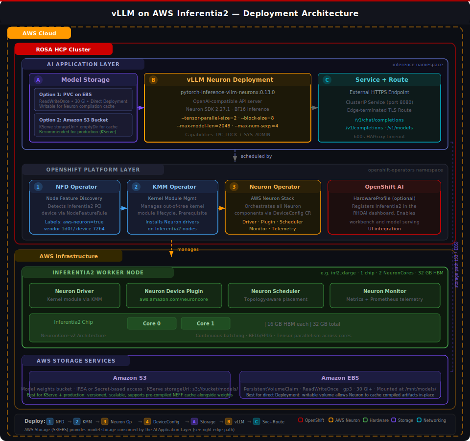

# Deploying LLM Inference with vLLM on AWS Inferentia2 and Trainium (ROSA / OpenShift)

A step-by-step guide to running LLM inference using vLLM on **AWS Inferentia2** and **AWS Trainium** nodes within a Red Hat OpenShift Service on AWS (ROSA) cluster, leveraging the AWS Neuron SDK, Neuron Operator, and OpenShift AI.

---

## Section 1: Overview

### What This Guide Covers

This guide walks through deploying a HuggingFace-compatible language model on **vLLM** running on an **AWS Inferentia2** accelerator node within a **ROSA HCP** (Hosted Control Plane) cluster. The deployment uses the **AWS Neuron SDK** to compile and execute the model on NeuronCores, exposed via an **OpenAI-compatible API** endpoint.

### Architecture Summary



The architecture is organized into four layers within an **AWS Cloud** boundary. The **ROSA HCP Cluster** encompasses the top two application/platform layers, while the **AWS Infrastructure** (Inferentia2 hardware and storage) sits outside the cluster boundary:

| Layer (top → bottom) | Boundary | Components | Purpose |
|----------------------|----------|-----------|---------|
| **AI Application Layer** | ROSA HCP | Model Storage (EBS gp3 PVC), vLLM Neuron Deployment, Service + Route | Store model weights and NEFF compilation cache on EBS gp3 PVC, run vLLM inference on NeuronCores via the Neuron SDK, and expose an OpenAI-compatible HTTPS endpoint. EBS is the recommended primary storage; S3 serves as optional backup for disaster recovery. |
| **OpenShift Platform Layer** | ROSA HCP | NFD Operator, KMM Operator, AWS Neuron Operator, DeviceConfig CR, OpenShift AI HardwareProfile | Detect Inferentia2 hardware, install Neuron kernel drivers, deploy the device plugin and scheduler, and optionally register the accelerator in the OpenShift AI dashboard. |
| **Inferentia2 Worker Node** | AWS Infra | Neuron Driver, Device Plugin, Scheduler, Monitor, NeuronCore-v2 hardware | Expose NeuronCores as schedulable Kubernetes resources (`aws.amazon.com/neuroncore`), handle topology-aware pod placement, and emit health/telemetry metrics. |
| **AWS Storage Services** | AWS Infra | Amazon EBS (PersistentVolume), Amazon S3 (backup) | EBS gp3 PVC provides primary storage for model weights and NEFF cache — <1 ms latency, full POSIX writes, persistent across restarts. S3 optionally stores model backups and pre-compiled NEFFs for disaster recovery. Storage cost is <0.5% of total project cost. |

### Component Roles

| Component | Role |
|-----------|------|
| **Node Feature Discovery (NFD)** | Detects PCI hardware on nodes. A custom `NodeFeatureRule` labels Inferentia2 nodes based on the Neuron PCI vendor/device IDs. |
| **Kernel Module Management (KMM)** | Manages out-of-tree kernel module lifecycle. Used by the Neuron Operator to install Neuron drivers on Inferentia nodes. |
| **AWS Neuron Operator** | Orchestrates all Neuron components via a single `DeviceConfig` CR — installs drivers (via KMM), device plugin, custom scheduler, and telemetry. |
| **DeviceConfig CR** | The single custom resource that tells the Neuron Operator which images to use for drivers, device plugin, scheduler, and monitoring. Applied to nodes matching the NFD label. |
| **Neuron Device Plugin** | Exposes `aws.amazon.com/neuron` (chips) and `aws.amazon.com/neuroncore` (cores) as schedulable Kubernetes resources. |
| **Neuron Scheduler** | Custom scheduler extension that understands NeuronCore topology for optimal pod placement. |
| **Neuron Monitor** | Collects health metrics and telemetry from Neuron devices and exports them to Prometheus for observability. |
| **vLLM with Neuron Plugin** | vLLM V1 with the `vllm-neuron` plugin. Runs inference on NeuronCores via the Neuron SDK. Serves an OpenAI-compatible API. |
| **HardwareProfile (OpenShift AI)** | Registers the Inferentia2 accelerator in the OpenShift AI dashboard, enabling it for workbenches and model serving. |

### Deployment Order (High Level)

The components have strict dependency ordering:

1. **Provision ROSA HCP cluster** — create the ROSA cluster in the target AWS region
2. **Add Inferentia2 machine pool** — provision the hardware node(s)
3. **Install NFD Operator + create NFD rule** — detect and label the Neuron PCI device on nodes
4. **Install KMM Operator** — prerequisite for the Neuron Operator to deploy kernel modules
5. **Install AWS Neuron Operator + create DeviceConfig CR** — installs drivers, device plugin, scheduler
6. **Install RHOAI Operator + create DataScienceCluster** — provides KServe, dashboard, model registry/catalog, workbenches
7. **Register ServingRuntime Template + HardwareProfile** — make Inferentia2 runtime and accelerator visible in the OpenShift AI dashboard
8. **Create namespace and PVC** — prepare EBS gp3 storage for model files + NEFF cache
9. **Download model** — pull model weights from HuggingFace into the PVC
10. **Create ServingRuntime + InferenceService** — deploy via KServe with `storage.kserve.io/readonly: "false"` for single-PVC read-write access, with correct dashboard labels
11. **Create Route** — expose the model endpoint externally (targetPort: 8080)
12. **Verify dashboard integration** — confirm runtime, model, and accelerator appear in OpenShift AI dashboard
13. **Deploy developer IDE** — code-server workbench (single user) or OpenShift Dev Spaces (multi-user, 10+ developers)

For NVIDIA GPU deployments, replace steps 3–5 with the NVIDIA GPU Operator installation.

### Cluster Resource Sizing (Measured April 2026)

The following resource requirements were measured on a running ROSA HCP 4.21.6 cluster with RHOAI 3.3, serving Qwen3-Coder-30B-A3B on a single `inf2.24xlarge` node.

#### Cluster Topology

| Machine Pool | Instance Type | Count | vCPUs | RAM | Accelerator | Purpose |
|-------------|--------------|-------|-------|-----|-------------|---------|
| `workers-0/1/2` | `m5.xlarge` | 3 | 4 each | 16 GiB each | — | ROSA platform, RHOAI, operators, workbenches |
| `inf2-24xl-a` | `inf2.24xlarge` | 1 | 96 | 384 GiB | 12 NeuronCores | LLM inference |

**Allocatable per node** (after OS/kubelet overhead):

| Node Type | CPU Allocatable | Memory Allocatable |
|-----------|----------------|-------------------|
| `m5.xlarge` | 3.5 cores | 14.2 GiB |
| `inf2.24xlarge` | 95.5 cores | 368.9 GiB |

#### Component Resource Requests (CPU / Memory)

| Category | Component | Pods | CPU Requests | Memory Requests | Runs On |
|----------|-----------|------|-------------|-----------------|---------|
| **RHOAI Dashboard** | `rhods-dashboard` (2 replicas × 5 containers) | 2 | 5,000m | 10,240 Mi (10 GiB) | Any worker |
| **RHOAI Controllers** | kserve-controller, model-registry-operator, notebook-controller, odh-model-controller, odh-notebook-controller | 5 | 1,210m | 1,032 Mi (1 GiB) | Any worker |
| **RHOAI Operator** | `rhods-operator` (3 replicas) | 3 | 1,500m | 768 Mi | Any worker |
| **Model Registry** | `model-catalog` + `model-catalog-postgres` | 2 | 450m | 768 Mi | Any worker |
| **RHOAI Subtotal** | | **12** | **8,160m (8.2 cores)** | **12,808 Mi (12.5 GiB)** | **m5.xlarge** |
| | | | | | |
| **Neuron Stack** | neuron-scheduler, scheduler-extension, device-plugin, KMM, GPU operator, Service Mesh operator | 7 | 140m | 256 Mi | Mixed |
| **OpenShift Ingress** | Router pods (Gateway API) | 6 | 1,400m | 2,944 Mi (2.9 GiB) | m5.xlarge |
| **OpenShift Networking** | OVN-Kubernetes, Multus, DNS, network-operator | 28 | 780m | 9,004 Mi (8.8 GiB) | All nodes |
| **OpenShift Monitoring** | Prometheus, Alertmanager, etc. | 21 | 292m | 3,532 Mi (3.5 GiB) | m5.xlarge |
| **OpenShift Console** | Console pods | 4 | 40m | 300 Mi | m5.xlarge |
| **Platform Subtotal** | | **66** | **2,652m (2.7 cores)** | **16,036 Mi (15.7 GiB)** | **m5.xlarge** |
| | | | | | |
| **LLM Inference** | vLLM KServe predictor | 1 | 48,000m (48 cores) | 131,072 Mi (128 GiB) | inf2.24xlarge |
| **Code-Server** | code-server-workbench | 1 | 500m | 1,024 Mi (1 GiB) | m5.xlarge |

#### Per-Node Utilization Summary

| Node (Type) | CPU Requests | CPU Allocatable | CPU % | MEM Requests | MEM Allocatable | MEM % |
|-------------|-------------|----------------|-------|-------------|-----------------|-------|
| inf2.24xlarge | 59.4 cores | 95.5 cores | 62% | 152 GiB | 368.9 GiB | 41% |
| m5.xlarge (highest) | 5.7 cores | 3.5 cores | **162%** ⚠️ | 13.9 GiB | 14.2 GiB | **98%** ⚠️ |
| m5.xlarge (mid) | 1.9 cores | 3.5 cores | 54% | 7.5 GiB | 14.2 GiB | 53% |
| m5.xlarge (lowest) | 1.7 cores | 3.5 cores | 51% | 6.3 GiB | 14.2 GiB | 45% |

> **Warning**: One `m5.xlarge` node is severely overcommitted (162% CPU, 98% memory) due to the RHOAI operator replicas and monitoring stack. Actual CPU usage is low (~150m vs 5,671m requested), so the cluster functions but has no scheduling headroom. For production, upgrade general-purpose workers to `m5.2xlarge` (8 vCPU, 32 GiB) or add a 4th `m5.xlarge`.

#### Sizing Recommendations

| Deployment Scale | Worker Pool (General Purpose) | Accelerator Pool | Total Monthly Cost (On-Demand) |
|-----------------|------------------------------|-------------------|-------------------------------|
| **Minimal (current)** | 3× `m5.xlarge` (4 vCPU, 16 GiB) | 1× `inf2.24xlarge` | ~$4,300 |
| **Recommended (headroom)** | 3× `m5.2xlarge` (8 vCPU, 32 GiB) | 1× `inf2.24xlarge` | ~$4,700 |
| **With Dev Spaces (3 users)** | 3× `m5.2xlarge` + 1× `m5.xlarge` | 1× `inf2.24xlarge` | ~$4,900 |
| **With Dev Spaces (100 users)** | 3× `m5.2xlarge` + autoscaling `m5.xlarge` pool (5–25 nodes) | 1× `inf2.24xlarge` | ~$5,500–$9,100 |

**Key sizing rules:**
- **RHOAI platform**: ~8.2 cores + 12.5 GiB fixed overhead (dashboard is the largest consumer at 5 cores + 10 GiB due to 2 HA replicas × 5 sidecar containers)
- **OpenShift platform**: ~2.7 cores + 15.7 GiB across networking, monitoring, ingress, console
- **Per LLM node**: 48 cores + 128 GiB (for Qwen3-Coder-30B on inf2.24xlarge with tp=8) — this runs on the Inferentia node itself
- **Per Dev Spaces workspace**: ~2 cores + 4 GiB (VS Code + extensions); plan one `m5.xlarge` per 2–3 concurrent workspaces
- **Dev Spaces control plane**: ~2 cores + 8 GiB fixed overhead (Che server, gateway, dashboard, plugin registry, DevWorkspace controller)

### Key Technical Notes

- **Neuron Compilation**: The first startup of vLLM on Neuron compiles the model ahead-of-time for the specific NeuronCore configuration. This takes **15–45+ minutes** for dense models and **30–60+ minutes** for MoE models. Subsequent restarts use cached artifacts.
- **No `--device=neuron` flag**: vLLM 0.13.0+ with the Neuron plugin auto-detects Neuron hardware. Do not pass `--device=neuron` — it will cause an unrecognized argument error.
- **`--block-size`**: vLLM on Neuron requires an explicit block size. Use `--block-size=8` for dense models (when prefix caching is enabled) or `--block-size=32` for MoE models.
- **Model Storage**: Use a **single EBS gp3 PVC per node** (ReadWriteOnce) to hold both model weights and the Neuron compilation cache (NEFF). Storage cost is <0.5% of total project cost, so optimize for performance: EBS gp3 provides <1 ms latency, full POSIX write support (required by the Neuron compiler), and persistent NEFF cache that survives pod restarts. For production, provision 1,000 MiB/s throughput ($35/node/month) to cut model load time from ~9 min to ~1 min. Optionally back up model weights and pre-compiled NEFFs to S3 for disaster recovery. See the [Storage Options Comparison](inferentia_vllm_test_results.md#storage-options-comparison-ebs-vs-efs-vs-s3) for the full EBS vs EFS vs S3 analysis.
- **Security Capabilities**: The Neuron runtime requires `IPC_LOCK` and `SYS_ADMIN` Linux capabilities. These must be granted in the container's `securityContext`.
- **Container Image**: Use the AWS Neuron Deep Learning Container (DLC) from `public.ecr.aws/neuron/pytorch-inference-vllm-neuronx`. The image is large (~15–20 GB); first pull takes time. Use SDK 2.28.0+ for MoE model support.
- **NeuronCore Utilization**: Not all NeuronCores on an instance may be usable. The `tp_degree` must evenly divide the model's `hidden_size` and `num_attention_heads`. Since most LLMs use power-of-2 dimensions (e.g., 2048, 4096), and `inf2.24xlarge` has 12 cores / `inf2.48xlarge` has 24 cores (neither a power of 2), the maximum usable TP degree is typically 8 or 16 respectively — leaving 33% of cores idle. Models with `hidden_size` divisible by 24 (e.g., 6144) can use all cores. See the [NeuronCore Utilization Analysis](inferentia_vllm_test_results.md#neuroncore-utilization-analysis).
- **Neuron Scheduler + OVN Annotation Conflict**: On ROSA HCP with OVN-Kubernetes CNI, the `neuron-scheduler` causes `FailedCreatePodSandBox: timed out waiting for annotations` errors. The root cause is that the neuron-scheduler extension overwrites OVN's `k8s.ovn.org/pod-networks` annotation when writing `AWS_NEURON_IDS`, `NEURON_ALLOCATED`, and `NEURON_ALLOC_TIME`. Without the OVN annotation, the CNI plugin cannot configure pod networking. This affects every pod using the neuron-scheduler for multi-core allocation, regardless of workload type.
  - **Production fix (verified)**: Deploy a **MutatingAdmissionWebhook** that intercepts pod UPDATE operations and restores `k8s.ovn.org/pod-networks` when the neuron-scheduler overwrites it. Tested and confirmed working -- see [live test results in private_code_assistant.md](private_code_assistant.md#appendix-b-ovn-annotation-fix----live-test-results-april-2-2026). Alternative fixes (Kyverno, hostNetwork) were also tested: Kyverno was blocked by TLS init issues on OpenShift; hostNetwork bypassed CNI but caused port conflicts.
  - **Quick workaround**: Wait for `NEURON_ALLOCATED=true` annotation to appear on the pod, then force-restart the `ovnkube-node` pod on the Inferentia node. Reliable for single clean pod creation, but requires manual intervention each time.
  - **Long-term solution**: The **AWS Neuron DRA (Dynamic Resource Allocation) driver** (Neuron SDK 2.28.0+, March 2026) would eliminate the neuron-scheduler entirely. DRA uses Kubernetes-native `ResourceClaim` objects for device allocation instead of pod annotations, removing the root cause. DRA is GA in OpenShift 4.21 / Kubernetes 1.34. **However, live testing on April 6, 2026 confirmed DRA driver v1.0.0 does NOT support Inferentia2** — the driver binary rejects `inf2.24xlarge` with `unsupported instance type`. Only Trainium instances are functional. See the [deep-dive analysis in private_code_assistant.md](private_code_assistant.md#appendix-a-neuron-scheduler--ovn-kubernetes-annotation-conflict----deep-dive) for root cause details, live DRA validation results, upstream status, and all fix options.

### MoE (Mixture-of-Experts) Model Notes

Deploying MoE models (e.g., Qwen3-Coder-30B-A3B, Qwen3-235B-A22B) on Inferentia2 requires additional configuration beyond dense model deployments:

- **`VLLM_NEURON_FRAMEWORK=neuronx-distributed-inference`**: This environment variable is **mandatory** for MoE models. It tells vLLM to use the NxD Inference library which supports expert parallelism.
- **`--additional-config`**: MoE models require Neuron override configuration passed via the `--additional-config` flag. This includes `tp_degree`, `moe_tp_degree`, `moe_ep_degree`, bucketing, and kernel optimization flags. See Step 9 for the full configuration.
- **Batch size >= 16**: Qwen3 MoE has a documented hard requirement of `batch_size >= 16` in the Neuron config. Set `--max-num-seqs=16` accordingly.
- **Chunked prefill is NOT supported**: Always pass `--no-enable-chunked-prefill` on Neuron.
- **Prefix caching**: Disable with `--no-enable-prefix-caching` for MoE models.
- **`--num-gpu-blocks-override`**: Required to avoid scheduler mismatch when chunked prefill and prefix caching are both disabled. Set to match `--max-num-seqs`.
- **Expert parallelism**: The constraint `moe_tp_degree × moe_ep_degree = tp_degree` must hold. Additionally, `tp_degree` must evenly divide the model's `hidden_size` and `num_attention_heads`. For Qwen3-Coder-30B-A3B (`hidden_size=2048`, `num_attention_heads=16`), only power-of-2 TP degrees work: `tp_degree=8` on `inf2.24xlarge` (with `moe_tp_degree=1, moe_ep_degree=8`), or `tp_degree=16` on `inf2.48xlarge` (with `moe_tp_degree=2, moe_ep_degree=8`). Note: `tp_degree=24` is **not valid** for this model because 2048 is not divisible by 24 — see the [NeuronCore Utilization Analysis](inferentia_vllm_test_results.md#neuroncore-utilization-analysis) for details.
- **Memory**: All expert weights must reside in HBM even though only a subset are active per token. A 30B-parameter MoE model requires ~61 GB in BF16 — `inf2.24xlarge` (192 GB HBM) is the minimum viable instance.
- **Neuron scheduler**: Use `schedulerName: neuron-scheduler` in the pod spec for topology-aware placement across NeuronCores.
- **Shared memory**: Mount `/dev/shm` as an emptyDir with `medium: Memory` for inter-process communication during MoE inference.

### Inferentia2 Instance Types

| Instance | Inf2 Chips | NeuronCores | HBM | vCPUs | RAM |
|----------|-----------|-------------|-----|-------|-----|
| `inf2.xlarge` | 1 | 2 | 32 GB | 4 | 16 GB |
| `inf2.8xlarge` | 1 | 2 | 32 GB | 32 | 128 GB |
| `inf2.24xlarge` | 6 | 12 | 192 GB | 96 | 384 GB |
| `inf2.48xlarge` | 12 | 24 | 384 GB | 192 | 768 GB |

> **Sizing guideline**: Each NeuronCore-v2 has access to 16 GB of HBM. For a model in BF16, estimate ~2× the parameter count in GB for weights. For example, a 1B model needs ~2 GB, a 7B model needs ~14 GB, and an 8B model needs ~16 GB. Choose an instance with enough HBM to hold the model weights plus KV-cache overhead.

### Data Parallelism: Running Multiple vLLM Instances on One Node

Due to tensor parallelism divisibility constraints (see [NeuronCore Utilization Analysis](inferentia_vllm_test_results.md#neuroncore-utilization-analysis)), most LLMs cannot use all NeuronCores on `inf2.24xlarge` (12 cores) or `inf2.48xlarge` (24 cores). A single 30B+ model with tp=8 leaves 4 idle cores on `inf2.24xlarge` (33% waste) and tp=16 leaves 8 idle on `inf2.48xlarge` (33% waste).

For **smaller models (≤13B parameters)** that fit in fewer NeuronCores, **data parallelism** eliminates this waste entirely: run multiple independent vLLM replicas on the same node, each pinned to a different set of NeuronCores.

#### Example: 3× Llama-3.1-8B on inf2.48xlarge

An 8B dense model in BF16 needs ~16 GB HBM and runs at tp=8 (8 NeuronCores, 128 GB HBM). An `inf2.48xlarge` has 24 NeuronCores and 384 GB HBM — enough for **3 independent replicas**:

| Replica | NeuronCores | `NEURON_RT_VISIBLE_CORES` | HBM Used |
|---------|-------------|--------------------------|----------|
| vllm-replica-1 | 0–7 | `0-7` | ~128 GB |
| vllm-replica-2 | 8–15 | `8-15` | ~128 GB |
| vllm-replica-3 | 16–23 | `16-23` | ~128 GB |
| **Total** | **24 of 24 (0% waste)** | | **~384 GB** |

Each replica is a separate Kubernetes `Deployment` with its own `Service`, all scheduled on the same Inferentia node via `nodeSelector`. A load balancer distributes requests across the three replicas.

#### When Data Parallelism Works (and When It Doesn't)

| Model Size | tp Required | Replicas on inf2.24xlarge (12 cores) | Replicas on inf2.48xlarge (24 cores) | Core Utilization |
|---|---|---|---|---|
| 1–4B | tp=2 | **6 replicas** (2 cores each) | **12 replicas** | **100%** |
| 7–8B | tp=2 or tp=4 | 6 or **3 replicas** | 12 or **6 replicas** | **100%** |
| 8–13B | tp=4 or tp=8 | 3 or **1 replica** (+ 4 idle) | 6 or **3 replicas** | 100% or 67% |
| 30–34B (dense) | tp=8 | **1 replica** (4 cores idle) | **2 replicas** (tp=8 each, 8 idle) | **67%** |
| 30B+ MoE | tp=8 or tp=16 | **1 replica** (4 idle) | **1 replica** (8 idle) | **67%** |

**Data parallelism is ideal when:** the model is small enough that `tp × replicas ≤ total NeuronCores`. For 7–8B models on `inf2.48xlarge`, this triples throughput per node with zero additional hardware cost.

**Data parallelism is not feasible for 30B+ models** because:
1. **HBM capacity**: A 32B dense model in BF16 needs ~64 GB for weights alone, plus KV-cache. On `inf2.24xlarge` (192 GB HBM), a single replica at tp=8 consumes nearly all usable HBM.
2. **Minimum tp degree**: 30B+ models require tp=8 minimum for the weight shards to fit in per-core HBM (16 GB/core × 8 = 128 GB, with KV-cache headroom). Running tp=4 would require >16 GB per core.
3. **Core count math**: Even on `inf2.48xlarge` (24 cores), two replicas at tp=8 = 16 cores, leaving 8 idle (same 33% waste). Three replicas at tp=8 = 24 cores, but 3 × 64 GB = 192 GB weights exceeds the available HBM after KV-cache allocation.

#### OpenShift Deployment Pattern

Each replica is a separate `Deployment` with distinct `NEURON_RT_VISIBLE_CORES`:

```bash
for i in 1 2 3; do
  CORE_START=$(( (i-1) * 8 ))
  CORE_END=$(( i * 8 - 1 ))
  cat <<EOF | oc apply -f -
apiVersion: apps/v1
kind: Deployment
metadata:
  name: vllm-neuron-replica-${i}
  namespace: <NAMESPACE>
  labels:
    app: vllm-neuron
    replica: "${i}"
spec:
  replicas: 1
  selector:
    matchLabels:
      app: vllm-neuron
      replica: "${i}"
  template:
    metadata:
      labels:
        app: vllm-neuron
        replica: "${i}"
    spec:
      nodeSelector:
        node.kubernetes.io/instance-type: inf2.48xlarge
      containers:
      - name: vllm-neuron
        image: public.ecr.aws/neuron/pytorch-inference-vllm-neuronx:0.13.0-neuronx-py312-sdk2.28.0-ubuntu24.04
        env:
        - name: NEURON_RT_VISIBLE_CORES
          value: "${CORE_START}-${CORE_END}"
        - name: NEURON_COMPILE_CACHE_URL
          value: /mnt/models/neuron-cache
        # ... remaining env vars, command, volumes as per Step 9a
        resources:
          requests:
            aws.amazon.com/neuroncore: "8"
          limits:
            aws.amazon.com/neuroncore: "8"
EOF
done
```

A single `Service` with `selector: app: vllm-neuron` (without the `replica` label) will automatically load-balance across all three pods via Kubernetes round-robin.

#### Load Balancing Options for Data-Parallel Replicas

For data-parallel vLLM replicas on Inferentia2, there are three load balancing approaches, ranging from simple to LLM-optimized:

**Option 1: Kubernetes Service (Default — Round-Robin)**

The simplest approach. A single `Service` with a selector matching all replicas distributes traffic via kube-proxy round-robin (or IPVS). This is what the deployment pattern above uses.

| Aspect | Detail |
|--------|--------|
| **Setup** | Zero additional configuration — standard `Service` |
| **Routing intelligence** | None — stateless round-robin across endpoints |
| **KV-cache awareness** | No — sequential requests from the same user may hit different replicas |
| **When to use** | Small teams, single-turn requests, no conversational context reuse |

**Option 2: KServe InferenceService with Replicas**

KServe can manage multiple replicas of the same model via the `InferenceService` CRD with `spec.predictor.minReplicas` / `maxReplicas`. Traffic is distributed via Knative Serving (if Serverless mode) or the Kubernetes Service (if RawDeployment mode). KServe adds canary rollouts, autoscaling (HPA or KPA), and traffic splitting between model versions.

| Aspect | Detail |
|--------|--------|
| **Setup** | KServe + ServingRuntime + InferenceService (see Section 3, Approach A/B) |
| **Routing intelligence** | Basic — Knative queue-proxy or Service round-robin |
| **KV-cache awareness** | No |
| **When to use** | Production deployments needing autoscaling, canary rollouts, or model versioning |
| **Limitation for Inferentia2** | KServe's read-only PVC mount conflicts with NEFF cache writes (workarounds in Section 3) |

**Option 3: llm-d with Gateway API Inference Extension (Future — LLM-Optimized)**

[llm-d](https://github.com/llm-d/llm-d) is a CNCF Sandbox project (donated by IBM, Red Hat, and Google at KubeCon EU 2026) that provides **LLM-aware request routing** for Kubernetes. It integrates with KServe via the new `LLMInferenceService` CRD and uses the **Gateway API Inference Extension** with an **External Processing Pod (EPP)** that makes routing decisions based on:

- **KV-cache / prefix-aware routing**: Routes multi-turn requests to the replica that already has the conversation's KV-cache in memory, avoiding redundant prefill computation.
- **Load-aware scheduling**: Routes to the least-loaded replica based on active request count, queue depth, and NeuronCore utilization — not just round-robin.
- **Disaggregated prefill/decode**: Can separate prefill (context encoding) and decode (token generation) across different replicas or even different instance types.

| Aspect | Detail |
|--------|--------|
| **Setup** | llm-d + Gateway API (e.g., kgateway/Envoy) + EPP + `LLMInferenceService` CRD |
| **Routing intelligence** | **High** — KV-cache-aware, load-aware, prefix-aware |
| **KV-cache awareness** | **Yes** — primary differentiator over Options 1 and 2 |
| **When to use** | Multi-turn conversational workloads, multi-model serving at scale, cost optimization through cache reuse |
| **Maturity** | CNCF Sandbox (March 2026). Red Hat is a core contributor and integrates llm-d into OpenShift AI. AWS has published integration patterns for llm-d on EKS with Inferentia/Trainium. |
| **Limitation** | Not yet validated on Inferentia2 + ROSA. Requires Gateway API support in OpenShift (available in OpenShift 4.16+ via `gateway.networking.k8s.io` CRDs). |

**Recommendation:**

- **Today**: Use **Option 1** (Kubernetes Service round-robin) for data-parallel replicas. It works immediately with zero additional components and is sufficient for single-turn code completion workloads.
- **Near-term**: Evaluate **Option 2** (KServe) when the `ServingRuntime` for vLLM-Neuron is validated (see [Future Improvements](#future-improvements-required), item 3).
- **Future**: Adopt **Option 3** (llm-d) when CNCF graduation progresses and OpenShift AI integrates `LLMInferenceService` with Inferentia2 support. The KV-cache-aware routing provides measurable benefits for multi-turn workloads — Red Hat benchmarks show [significant latency reduction for multi-turn conversations](https://developers.redhat.com/articles/2026/01/13/accelerate-multi-turn-workloads-llm-d) by routing to the replica that already holds the conversation's KV-cache.

---

## Section 2: Step-by-Step Deployment Instructions

### Prerequisites

- A running **ROSA HCP cluster** (OpenShift 4.17+)
- **OpenShift AI** installed with KServe, NFD, and related operators
- `oc` CLI authenticated to the cluster
- `rosa` CLI authenticated with AWS credentials
- AWS region set (e.g. `export AWS_DEFAULT_REGION=ap-northeast-2`)

### Variables Used in This Guide

Replace these placeholders with your actual values:

| Variable | Description | Example |
|----------|-------------|---------|
| `<CLUSTER_NAME>` | ROSA cluster name | `ocbcrosaai` |
| `<MACHINEPOOL_NAME>` | Machine pool name (max 15 chars) | `inf-gpu-pool` |
| `<INSTANCE_TYPE>` | Inferentia2 instance type | `inf2.xlarge` |
| `<NAMESPACE>` | Namespace for inference workloads | `neuron-inference` |
| `<PVC_NAME>` | PersistentVolumeClaim name | `model-storage-pvc` |
| `<PVC_SIZE>` | Storage size for model weights + NEFF cache | `30Gi` (small), `50Gi` (7B), `200Gi` (30B+) |
| `<MODEL_REPO>` | HuggingFace model repository | `TinyLlama/TinyLlama-1.1B-Chat-v1.0` |
| `<MODEL_DIR>` | Directory name for model on PVC | `tinyllama-1.1b-chat` |
| `<MODEL_NAME>` | Served model name for the API | `my-model` |
| `<TP_SIZE>` | Tensor parallel size (= number of NeuronCores) | `2` (dense) / `12` (MoE on inf2.24xlarge) |
| `<MAX_MODEL_LEN>` | Maximum sequence length | `2048` (dense) / `16384` (MoE) |
| `<MAX_NUM_SEQS>` | Maximum concurrent sequences | `4` (dense) / `16` (MoE, minimum for Qwen3 MoE) |
| `<BLOCK_SIZE>` | vLLM block size | `8` (dense) / `32` (MoE) |
| `<HF_TOKEN>` | HuggingFace token (only for gated models) | `hf_abc123...` |

---

### Step 1: Add Inferentia2 Machine Pool

Create a machine pool with Inferentia2 instances in your ROSA cluster.

> **Note**: Machine pool names must be 15 characters or fewer.

```bash
rosa create machinepool \
  --cluster=<CLUSTER_NAME> \
  --name=<MACHINEPOOL_NAME> \
  --instance-type=<INSTANCE_TYPE> \
  --replicas=1
```

Wait for the node to become `Ready`:

```bash
watch "oc get nodes -l node.kubernetes.io/instance-type=<INSTANCE_TYPE>"
```

This typically takes 5–10 minutes.

---

### Step 2: Create NFD Rule for Neuron Device Detection

Node Feature Discovery must detect the Neuron PCI device and label the node. The Inferentia2 PCI device has vendor ID `1d0f` (Amazon) and device ID `7264`.

```bash
cat <<'EOF' | oc apply -f -
apiVersion: nfd.openshift.io/v1alpha1
kind: NodeFeatureRule
metadata:
  name: aws-neuron-detection
  namespace: openshift-nfd
spec:
  rules:
    - name: "AWS Neuron Device (Inferentia2)"
      labels:
        feature.node.kubernetes.io/aws-neuron: "true"
      matchFeatures:
        - feature: pci.device
          matchExpressions:
            vendor:
              op: In
              value:
                - "1d0f"
            device:
              op: In
              value:
                - "7264"
EOF
```

Verify the label is applied to the Inferentia node:

```bash
oc get nodes -l feature.node.kubernetes.io/aws-neuron=true
```

You should see your Inferentia2 node listed.

---

### Step 3: Install Kernel Module Management (KMM) Operator

The KMM Operator is a prerequisite for the Neuron Operator. It manages the lifecycle of out-of-tree kernel modules (Neuron drivers).

```bash
cat <<'EOF' | oc apply -f -
apiVersion: operators.coreos.com/v1alpha1
kind: Subscription
metadata:
  name: kernel-module-management
  namespace: openshift-operators
spec:
  channel: stable
  name: kernel-module-management
  source: redhat-operators
  sourceNamespace: openshift-marketplace
  installPlanApproval: Automatic
EOF
```

Wait for the operator to install:

```bash
oc get csv -n openshift-operators -w | grep kmm
```

Expected output should show `Succeeded` status (e.g., `kernel-module-management.v2.5.1`).

---

### Step 4: Install AWS Neuron Operator

Install the AWS Neuron Operator from the OperatorHub community catalog.

```bash
cat <<'EOF' | oc apply -f -
apiVersion: operators.coreos.com/v1alpha1
kind: Subscription
metadata:
  name: aws-neuron-operator
  namespace: openshift-operators
spec:
  channel: Stable
  name: aws-neuron-operator
  source: community-operators
  sourceNamespace: openshift-marketplace
  installPlanApproval: Automatic
EOF
```

Wait for the operator to install:

```bash
oc get csv -n openshift-operators -w | grep neuron
```

Expected output should show `Succeeded` status.

---

### Step 5: Create DeviceConfig Custom Resource

The `DeviceConfig` CR tells the Neuron Operator which container images to use for drivers, device plugin, scheduler, and monitoring. It targets nodes labeled by the NFD rule.

> **Important**: The API version is `k8s.aws/v1alpha1` (not `v1`). The image tags below were validated at time of writing; check [AWS Neuron ECR](https://gallery.ecr.aws/neuron) for latest versions.

```bash
cat <<'EOF' | oc apply -f -
apiVersion: k8s.aws/v1alpha1
kind: DeviceConfig
metadata:
  name: neuron-device-config
  namespace: openshift-operators
spec:
  customSchedulerImage: public.ecr.aws/eks-distro/kubernetes/kube-scheduler:v1.32.9-eks-1-32-24
  devicePluginImage: public.ecr.aws/neuron/neuron-device-plugin:2.24.23.0
  driversImage: public.ecr.aws/os-partners/neuron-openshift/neuron-kernel-module:2.24.7.0
  nodeMetricsImage: public.ecr.aws/neuron/neuron-monitor:1.3.0
  schedulerExtensionImage: public.ecr.aws/neuron/neuron-scheduler:2.24.23.0
  selector:
    feature.node.kubernetes.io/aws-neuron: "true"
  useInTreeDrivers: false
EOF
```

Verify the Neuron resources are exposed on the node:

```bash
oc describe node <INFERENTIA_NODE_NAME> | grep -E "neuron|Allocatable" -A5
```

You should see:
```
  aws.amazon.com/neuron:      1
  aws.amazon.com/neuroncore:  2
```

Also verify the Neuron pods are running:

```bash
oc get pods -n openshift-operators | grep neuron
```

You should see device-plugin, scheduler, and monitor pods.

---

### Step 5b: Install OpenShift AI (RHOAI) Operator and Configure Dashboard

This step installs RHOAI 3.3, creates the DataScienceCluster, registers a custom ServingRuntime template for Inferentia2 in the dashboard, and creates a HardwareProfile. All of these are required for the Neuron runtime and models to appear correctly in the OpenShift AI dashboard.

> **Dashboard visibility rules (RHOAI 3.3):**
>
> | Resource | Where it appears | Required labels / annotations | Namespace |
> |----------|-----------------|-------------------------------|-----------|
> | **ServingRuntime Template** | Model Resources > Serving Runtimes | OpenShift `Template` with label `opendatahub.io/dashboard: "true"` | `redhat-ods-applications` |
> | **ServingRuntime** (instance) | Used by InferenceService | Labels: `opendatahub.io/dashboard: "true"`, `opendatahub.io/template-name: <template-name>` | Project namespace |
> | **InferenceService** | AI Hub > Deployments | Label `opendatahub.io/dashboard: "true"` | Project namespace |
> | **HardwareProfile** | Model serving accelerator picker | Label `app.opendatahub.io/hardwareprofile: "true"`, annotation `opendatahub.io/display-name` | `redhat-ods-applications` |
> | **Dashboard URL** | Browser access | Gateway API route (not a direct Route to the dashboard pod) | `openshift-ingress` |

#### Step 5b-1: Install the RHOAI Operator

```bash
cat <<EOF | oc apply -f -
apiVersion: operators.coreos.com/v1alpha1
kind: Subscription
metadata:
  name: rhods-operator
  namespace: openshift-operators
spec:
  channel: stable-3.3
  installPlanApproval: Automatic
  name: rhods-operator
  source: redhat-operators
  sourceNamespace: openshift-marketplace
EOF

echo "Waiting for RHOAI operator to install..."
sleep 120
oc get csv -n openshift-operators | grep rhods
```

#### Step 5b-2: Create the DataScienceCluster

Enable the core components for LLM inference serving. Disable unused components to reduce resource overhead.

| Component | State | Purpose |
|-----------|-------|---------|
| **dashboard** | Managed | OpenShift AI web UI |
| **kserve** | Managed | Model serving via InferenceService / ServingRuntime |
| **modelregistry** | Managed | Model catalog — stores model metadata, versions, and artifacts |
| **workbenches** | Managed | Jupyter / IDE workbench support |
| codeflare, datasciencepipelines, kueue, modelmeshserving, ray, trainingoperator, trustyai | Removed | Not needed for inference-only deployments |

> **Note on Models as Service (MaaS):** MaaS (`kserve.modelsAsService`) provides one-click model deployment APIs but requires the **Red Hat Connectivity Link** operator (Kuadrant `AuthPolicy` CRD). If Connectivity Link is not installed, leave MaaS as `Removed` to avoid errors.

```bash
cat <<EOF | oc apply -f -
apiVersion: datasciencecluster.opendatahub.io/v1
kind: DataScienceCluster
metadata:
  name: default-dsc
spec:
  components:
    codeflare:
      managementState: Removed
    dashboard:
      managementState: Managed
    datasciencepipelines:
      managementState: Removed
    kserve:
      managementState: Managed
      serving:
        ingressGateway:
          certificate:
            type: SelfSigned
        managementState: Managed
        name: knative-serving
    kueue:
      managementState: Removed
    modelmeshserving:
      managementState: Removed
    modelregistry:
      managementState: Managed
    ray:
      managementState: Removed
    trainingoperator:
      managementState: Removed
    trustyai:
      managementState: Removed
    workbenches:
      managementState: Managed
EOF
```

Wait for components to deploy and enable the Model Catalog UI:

```bash
echo "Waiting for components..."
sleep 120

# Verify key components are ready
oc get datasciencecluster default-dsc -o jsonpath='{range .status.conditions[*]}{.type}: {.status}{"\n"}{end}' | grep -E "DashboardReady|KserveReady|ModelRegistryReady|WorkbenchesReady"

# Enable the Model Catalog in the dashboard
oc patch odhdashboardconfig odh-dashboard-config -n redhat-ods-applications \
  --type merge -p '{"spec":{"dashboardConfig":{"disableModelCatalog":false}}}'
```

Verify the Model Catalog pods are running:

```bash
oc get pods -n rhoai-model-registries
# Expected: model-catalog and model-catalog-postgres pods Running
```

#### Step 5b-3: Verify the Dashboard URL

RHOAI 3.3 uses a **Gateway API** approach — the dashboard is served through a gateway route in `openshift-ingress`, not a direct route to the dashboard pod. Creating a manual route to the dashboard service will result in "unauthorized" errors.

```bash
DASHBOARD_URL=$(oc get route data-science-gateway -n openshift-ingress -o jsonpath='{.spec.host}')
echo "Dashboard: https://$DASHBOARD_URL"
```

Login with the same cluster-admin credentials used for the OpenShift console.

#### Step 5b-4: Register the vLLM Neuron ServingRuntime Template

The dashboard's **Model Resources > Serving Runtimes** page shows OpenShift `Template` objects from `redhat-ods-applications` — not namespace-level `ServingRuntime` instances. RHOAI ships built-in templates for NVIDIA GPU, AMD GPU, Intel Gaudi, and CPU runtimes. To add Inferentia2, create a custom template:

```bash
cat <<'EOF' | oc apply -f -
apiVersion: template.openshift.io/v1
kind: Template
metadata:
  name: vllm-neuron-runtime-template
  namespace: redhat-ods-applications
  labels:
    app: odh-dashboard
    opendatahub.io/dashboard: "true"
  annotations:
    description: "vLLM ServingRuntime for AWS Inferentia2 (Neuron SDK). Supports dense and MoE models on NeuronCores."
    openshift.io/display-name: "vLLM AWS Inferentia2 (Neuron) ServingRuntime for KServe"
    openshift.io/provider-display-name: "Custom"
    opendatahub.io/apiProtocol: REST
    opendatahub.io/model-type: '["generative"]'
    opendatahub.io/modelServingSupport: '["single"]'
    tags: "rhoai,kserve,servingruntime,inferentia,neuron,vllm"
objects:
- apiVersion: serving.kserve.io/v1alpha1
  kind: ServingRuntime
  metadata:
    name: vllm-neuron-runtime
    annotations:
      opendatahub.io/recommended-accelerators: '["aws.amazon.com/neuroncore"]'
      opendatahub.io/runtime-version: "v0.13.0"
      openshift.io/display-name: "vLLM AWS Inferentia2 (Neuron) ServingRuntime for KServe"
    labels:
      opendatahub.io/dashboard: "true"
  spec:
    annotations:
      prometheus.io/port: "8080"
      prometheus.io/path: "/metrics"
    supportedModelFormats:
      - name: pytorch
        version: "1"
        autoSelect: true
    multiModel: false
    containers:
      - name: kserve-container
        image: public.ecr.aws/neuron/pytorch-inference-vllm-neuronx:0.13.0-neuronx-py312-sdk2.28.0-ubuntu24.04
        ports:
          - containerPort: 8080
            name: http
            protocol: TCP
        command:
          - /bin/bash
          - -c
          - |
            mkdir -p /mnt/models/neuron-cache/compiled /tmp/hf-home
            vllm serve \
              --model="/mnt/models" \
              --served-model-name="${SERVED_MODEL_NAME:-model}" \
              --tensor-parallel-size="${TP_SIZE:-2}" \
              --max-num-seqs="${MAX_NUM_SEQS:-4}" \
              --max-model-len="${MAX_MODEL_LEN:-2048}" \
              --block-size="${BLOCK_SIZE:-8}" \
              --no-enable-chunked-prefill \
              --no-enable-prefix-caching \
              --port=8080
        env:
          - name: VLLM_NEURON_FRAMEWORK
            value: neuronx-distributed-inference
          - name: NEURON_COMPILE_CACHE_URL
            value: /mnt/models/neuron-cache
          - name: NEURON_COMPILED_ARTIFACTS
            value: /mnt/models/neuron-cache/compiled
          - name: HF_HOME
            value: /tmp/hf-home
          - name: NEURON_RT_VISIBLE_CORES
            value: "0-1"
          - name: FI_EFA_USE_DEVICE_RDMA
            value: "1"
          - name: FI_PROVIDER
            value: "efa"
          - name: SERVED_MODEL_NAME
            value: "model"
          - name: TP_SIZE
            value: "2"
          - name: MAX_NUM_SEQS
            value: "4"
          - name: MAX_MODEL_LEN
            value: "2048"
          - name: BLOCK_SIZE
            value: "8"
        resources:
          requests:
            cpu: "4"
            memory: 16Gi
            aws.amazon.com/neuroncore: "2"
          limits:
            cpu: "8"
            memory: 32Gi
            aws.amazon.com/neuroncore: "2"
        securityContext:
          capabilities:
            add:
              - IPC_LOCK
              - SYS_ADMIN
        readinessProbe:
          httpGet:
            path: /v1/models
            port: 8080
          initialDelaySeconds: 30
          periodSeconds: 30
          failureThreshold: 120
          timeoutSeconds: 10
        livenessProbe:
          httpGet:
            path: /health
            port: 8080
          initialDelaySeconds: 2400
          periodSeconds: 60
          failureThreshold: 10
          timeoutSeconds: 10
        volumeMounts:
          - name: hf-cache
            mountPath: /tmp/hf-home
          - name: dshm
            mountPath: /dev/shm
    volumes:
      - name: hf-cache
        emptyDir:
          sizeLimit: 2Gi
      - name: dshm
        emptyDir:
          medium: Memory
          sizeLimit: 16Gi
EOF
```

> **Note:** This template provides a generic starting point. When creating an InferenceService in a project namespace, the actual `ServingRuntime` will be instantiated from this template. Override the environment variables (`TP_SIZE`, `MAX_MODEL_LEN`, etc.) in the project-level ServingRuntime to match your specific model and instance type.

Verify the template appears alongside the built-in runtimes:

```bash
oc get template -n redhat-ods-applications -o custom-columns='NAME:.metadata.name,DISPLAY:.metadata.annotations.openshift\.io/display-name' | grep -i "vllm\|neuron"
```

#### Step 5b-5: Create Inferentia2 HardwareProfile

The HardwareProfile registers Inferentia2 as an accelerator option in the OpenShift AI dashboard (visible in model serving accelerator pickers and workbench configuration).

```bash
cat <<EOF | oc apply -f -
apiVersion: infrastructure.opendatahub.io/v1
kind: HardwareProfile
metadata:
  name: inferentia2-inf2-24xlarge
  namespace: redhat-ods-applications
  labels:
    app.opendatahub.io/hardwareprofile: "true"
  annotations:
    opendatahub.io/display-name: "AWS Inferentia2 (inf2.24xlarge) - 12 NeuronCores"
    opendatahub.io/description: "AWS Inferentia2 inf2.24xlarge instance with 12 NeuronCores, 384 GiB RAM. Suitable for 7B-34B dense models and 30B+ MoE models (tp=8 or tp=12)."
    opendatahub.io/disabled: "false"
    opendatahub.io/dashboard-feature-visibility: '["servingRuntimes","notebookController"]'
spec:
  identifiers:
    - displayName: NeuronCores
      identifier: aws.amazon.com/neuroncore
      defaultCount: 8
      maxCount: 12
      minCount: 2
  nodeSelector:
    node.kubernetes.io/instance-type: inf2.24xlarge
  tolerations:
    - key: aws.amazon.com/neuron
      operator: Exists
      effect: NoSchedule
EOF
```

Create additional profiles for other instance types as needed:

```bash
# For inf2.48xlarge (24 NeuronCores)
cat <<EOF | oc apply -f -
apiVersion: infrastructure.opendatahub.io/v1
kind: HardwareProfile
metadata:
  name: inferentia2-inf2-48xlarge
  namespace: redhat-ods-applications
  labels:
    app.opendatahub.io/hardwareprofile: "true"
  annotations:
    opendatahub.io/display-name: "AWS Inferentia2 (inf2.48xlarge) - 24 NeuronCores"
    opendatahub.io/description: "AWS Inferentia2 inf2.48xlarge instance with 24 NeuronCores, 768 GiB RAM. Suitable for large dense (70B+) and MoE models (tp=16 or tp=24)."
    opendatahub.io/disabled: "false"
    opendatahub.io/dashboard-feature-visibility: '["servingRuntimes","notebookController"]'
spec:
  identifiers:
    - displayName: NeuronCores
      identifier: aws.amazon.com/neuroncore
      defaultCount: 16
      maxCount: 24
      minCount: 2
  nodeSelector:
    node.kubernetes.io/instance-type: inf2.48xlarge
  tolerations:
    - key: aws.amazon.com/neuron
      operator: Exists
      effect: NoSchedule
EOF
```

**Key HardwareProfile fields:**

| Field | Purpose |
|-------|---------|
| `app.opendatahub.io/hardwareprofile: "true"` (label) | **Required** — makes the profile visible in the dashboard |
| `opendatahub.io/display-name` (annotation) | Name shown in the dashboard accelerator picker |
| `opendatahub.io/description` (annotation) | Description shown in the dashboard |
| `opendatahub.io/disabled: "false"` (annotation) | Must be `"false"` to appear as selectable |
| `opendatahub.io/dashboard-feature-visibility` (annotation) | Controls where the profile appears (`servingRuntimes`, `notebookController`) |
| `spec.identifiers` | Defines the accelerator resource and count ranges |
| `spec.nodeSelector` | Constrains to the correct instance type |
| `spec.tolerations` | Matches taints on Inferentia nodes |

---

### Step 6: Create Namespace and PVC for Model Storage

```bash
oc new-project <NAMESPACE>
```

Create a PersistentVolumeClaim to store both model weights and the Neuron compilation cache (NEFF). A single EBS gp3 PVC per Inferentia node is the recommended approach — storage cost is <0.5% of total infrastructure cost, so the priority is performance and simplicity over storage savings.

**PVC Sizing Guide:**

| Model Size (BF16) | Model Weights | NEFF Cache | Recommended PVC Size |
|---|---|---|---|
| Small (1–4B) | 2–8 GB | 5–10 GB | **30 Gi** |
| Medium (7–8B) | 14–16 GB | 10–20 GB | **50 Gi** |
| Large dense (30–34B) | 57–68 GB | 20–40 GB | **200 Gi** |
| Large MoE (30B+ total) | 57–65 GB | 20–40 GB | **200 Gi** |

> **Why one PVC for both model and NEFF cache?** The Neuron compiler writes NEFF artifacts with random I/O patterns (create, write, rename) that require full POSIX semantics. EBS gp3 provides this natively. Storing the NEFF cache on the same PVC as the model weights means it persists across pod restarts — the pod can skip the 6–20 min compilation step and start serving in 2–5 min (or ~1 min with provisioned throughput).

**For development / testing** (baseline gp3 — 3,000 IOPS, 125 MiB/s, included in volume price):

```bash
cat <<EOF | oc apply -f -
apiVersion: v1
kind: PersistentVolumeClaim
metadata:
  name: <PVC_NAME>
  namespace: <NAMESPACE>
spec:
  accessModes:
    - ReadWriteOnce
  resources:
    requests:
      storage: <PVC_SIZE>
EOF
```

**For production** (provisioned throughput — 1,000 MiB/s, cuts model load from ~9 min to ~1 min, $35/node/month extra):

```bash
cat <<EOF | oc apply -f -
apiVersion: v1
kind: PersistentVolumeClaim
metadata:
  name: <PVC_NAME>
  namespace: <NAMESPACE>
spec:
  accessModes:
    - ReadWriteOnce
  storageClassName: gp3-high-throughput
  resources:
    requests:
      storage: <PVC_SIZE>
EOF
```

The `gp3-high-throughput` StorageClass must be created first (one-time setup per cluster):

```bash
cat <<EOF | oc apply -f -
apiVersion: storage.k8s.io/v1
kind: StorageClass
metadata:
  name: gp3-high-throughput
provisioner: ebs.csi.aws.com
parameters:
  type: gp3
  iops: "3000"
  throughput: "1000"
  encrypted: "true"
reclaimPolicy: Delete
volumeBindingMode: WaitForFirstConsumer
allowVolumeExpansion: true
EOF
```

> **Cost impact**: Provisioning 1,000 MiB/s throughput adds $35/month per 200 GB volume. For a 4-node deployment at $20,945/month total project cost, this is an extra $140/month (0.67%) — negligible for the startup time improvement.

---

### Step 7: Download the Model

Use a Kubernetes Job to download model weights from HuggingFace into the PVC. The job must be scheduled on the Inferentia node (since the PVC uses `ReadWriteOnce` and will be bound to that node's availability zone).

**For public (non-gated) models:**

> **Note**: The `python:3.11-slim` image runs under OpenShift's restricted SCC with a random UID. The `HOME=/tmp` and `PYTHONUSERBASE=/tmp/.local` workaround avoids `Permission denied` errors when installing pip packages. For large MoE models (~61 GB+), set resource requests and PVC size appropriately (e.g., `200Gi`).

```bash
cat <<EOF | oc apply -f -
apiVersion: batch/v1
kind: Job
metadata:
  name: download-model
  namespace: <NAMESPACE>
spec:
  backoffLimit: 3
  template:
    spec:
      restartPolicy: OnFailure
      containers:
      - name: downloader
        image: python:3.11-slim
        resources:
          requests:
            cpu: "4"
            memory: "8Gi"
          limits:
            cpu: "8"
            memory: "16Gi"
        command:
        - /bin/bash
        - -c
        - |
          set -e
          export HOME=/tmp
          export PYTHONUSERBASE=/tmp/.local
          export PATH=/tmp/.local/bin:\$PATH

          pip install --user huggingface_hub

          python3 -c "
          from huggingface_hub import snapshot_download
          snapshot_download(
              repo_id='<MODEL_REPO>',
              local_dir='/models/<MODEL_DIR>',
              ignore_patterns=['*.gguf', '*.md', '.gitattributes']
          )
          print('Download complete.')
          "

          ls -lh /models/<MODEL_DIR>/
          echo "Model files downloaded successfully."
        volumeMounts:
        - name: model-storage
          mountPath: /models
      volumes:
      - name: model-storage
        persistentVolumeClaim:
          claimName: <PVC_NAME>
EOF
```

**For gated models** (e.g., Llama 3.1), add the `HF_TOKEN` environment variable:

```bash
        env:
        - name: HF_TOKEN
          value: "<HF_TOKEN>"
```

Monitor the download:

```bash
oc logs -f job/download-model -n <NAMESPACE>
```

Wait for the job to complete:

```bash
oc get job download-model -n <NAMESPACE> -w
```

---

### Step 8: Verify OpenShift AI Dashboard Integration

At this point, the HardwareProfile and ServingRuntime Template were already created in Step 5b. Verify they are visible in the dashboard:

```bash
# Verify HardwareProfile appears
oc get hardwareprofile -n redhat-ods-applications -o custom-columns='NAME:.metadata.name,DISPLAY:.metadata.annotations.opendatahub\.io/display-name,DISABLED:.metadata.annotations.opendatahub\.io/disabled'

# Verify ServingRuntime Template appears
oc get template -n redhat-ods-applications -o custom-columns='NAME:.metadata.name,DISPLAY:.metadata.annotations.openshift\.io/display-name' | grep -i neuron

# Verify Dashboard is accessible
DASHBOARD=$(oc get route data-science-gateway -n openshift-ingress -o jsonpath='{.spec.host}')
curl -sk "https://$DASHBOARD" -o /dev/null -w "HTTP %{http_code}\n"
```

In the browser, navigate to:
- **Model Resources > Serving Runtimes** — should show "vLLM AWS Inferentia2 (Neuron) ServingRuntime for KServe"
- **Settings > Hardware Profiles** — should show "AWS Inferentia2 (inf2.24xlarge)" (and inf2.48xlarge if created)

> **Troubleshooting:** If the runtime doesn't appear, verify the Template exists in `redhat-ods-applications` with the `opendatahub.io/dashboard: "true"` label. Namespace-level `ServingRuntime` instances do NOT appear on this page — only OpenShift Templates do. See Step 5b-4 for the template creation.

---

### Step 9: Deploy vLLM on Inferentia2

There are two deployment methods:
- **9-KServe (Recommended):** Deploy via KServe `InferenceService` with a `ServingRuntime`. Requires RHOAI 3.3+ (KServe 0.14+) for the `storage.kserve.io/readonly: "false"` annotation that enables read-write PVC access.
- **9-Direct (Legacy):** Deploy via a standard OpenShift `Deployment`. Use this if KServe is not available or you need full control over the pod spec.

Choose **9a (Dense)** or **9a (MoE)** for the model-specific configuration within either method.

#### Step 9-KServe: Deploy via KServe InferenceService

**Step 9-KServe-1: Create the ServingRuntime**

The ServingRuntime defines the vLLM-Neuron container, probes, and volumes. KServe will inject the model PVC mount at `/mnt/models` based on `storageUri`. Adjust `--tensor-parallel-size`, `--max-model-len`, and resource requests for your instance type and model.

> **Dashboard visibility:** The ServingRuntime must have both `opendatahub.io/dashboard: "true"` and `opendatahub.io/template-name: vllm-neuron-runtime-template` labels to be linked to the Template created in Step 5b-4. Without `template-name`, the runtime works but won't be associated with the template in the dashboard.

```bash
cat <<'EOF' | oc apply -f -
apiVersion: serving.kserve.io/v1alpha1
kind: ServingRuntime
metadata:
  name: vllm-neuron-runtime
  namespace: <NAMESPACE>
  labels:
    opendatahub.io/dashboard: "true"
    opendatahub.io/template-name: vllm-neuron-runtime-template
  annotations:
    openshift.io/display-name: "vLLM Neuron Runtime (Inferentia2)"
    opendatahub.io/recommended-accelerators: '["aws.amazon.com/neuroncore"]'
spec:
  annotations:
    prometheus.io/port: "8080"
    prometheus.io/path: "/metrics"
  supportedModelFormats:
    - name: pytorch
      version: "1"
      autoSelect: true
  multiModel: false
  containers:
    - name: kserve-container
      image: public.ecr.aws/neuron/pytorch-inference-vllm-neuronx:0.13.0-neuronx-py312-sdk2.28.0-ubuntu24.04
      ports:
        - containerPort: 8080
          name: http
          protocol: TCP
      command:
        - /bin/bash
        - -c
        - |
          mkdir -p /mnt/models/neuron-cache/compiled /tmp/hf-home

          # For MoE models, include the NEURON_CONFIG override:
          # NEURON_CONFIG='{"override_neuron_config":{...}}'
          # --additional-config="${NEURON_CONFIG}"

          vllm serve \
            --model="/mnt/models" \
            --served-model-name="<MODEL_NAME>" \
            --tensor-parallel-size=<TP_SIZE> \
            --max-num-seqs=<MAX_NUM_SEQS> \
            --max-model-len=<MAX_MODEL_LEN> \
            --block-size=<BLOCK_SIZE> \
            --no-enable-chunked-prefill \
            --no-enable-prefix-caching \
            --port=8080
      env:
        - name: VLLM_NEURON_FRAMEWORK
          value: neuronx-distributed-inference
        - name: NEURON_COMPILE_CACHE_URL
          value: /mnt/models/neuron-cache
        - name: NEURON_COMPILED_ARTIFACTS
          value: /mnt/models/neuron-cache/compiled
        - name: HF_HOME
          value: /tmp/hf-home
        - name: NEURON_RT_VISIBLE_CORES
          value: "0-<TP_SIZE-1>"
        - name: FI_EFA_USE_DEVICE_RDMA
          value: "1"
        - name: FI_PROVIDER
          value: "efa"
      resources:
        requests:
          cpu: "48"
          memory: 128Gi
          aws.amazon.com/neuroncore: "<TP_SIZE>"
        limits:
          cpu: "72"
          memory: 256Gi
          aws.amazon.com/neuroncore: "<TP_SIZE>"
      securityContext:
        capabilities:
          add:
            - IPC_LOCK
            - SYS_ADMIN
      readinessProbe:
        httpGet:
          path: /v1/models
          port: 8080
        initialDelaySeconds: 30
        periodSeconds: 30
        failureThreshold: 120
        timeoutSeconds: 10
      livenessProbe:
        httpGet:
          path: /health
          port: 8080
        initialDelaySeconds: 2400
        periodSeconds: 60
        failureThreshold: 10
        timeoutSeconds: 10
      volumeMounts:
        - name: hf-cache
          mountPath: /tmp/hf-home
        - name: dshm
          mountPath: /dev/shm
  volumes:
    - name: hf-cache
      emptyDir:
        sizeLimit: 2Gi
    - name: dshm
      emptyDir:
        medium: Memory
        sizeLimit: 16Gi
EOF
```

**Step 9-KServe-2: Create the InferenceService**

The `storage.kserve.io/readonly: "false"` annotation is the key — it tells KServe to mount the model PVC as read-write, allowing the Neuron compiler to write NEFF cache artifacts to `/mnt/models/neuron-cache`.

```bash
cat <<'EOF' | oc apply -f -
apiVersion: serving.kserve.io/v1beta1
kind: InferenceService
metadata:
  name: <MODEL_NAME>
  namespace: <NAMESPACE>
  annotations:
    serving.kserve.io/deploymentMode: RawDeployment
    storage.kserve.io/readonly: "false"
    serving.kserve.io/autoscalerClass: none
  labels:
    opendatahub.io/dashboard: "true"
spec:
  predictor:
    minReplicas: 1
    maxReplicas: 1
    schedulerName: neuron-scheduler
    model:
      modelFormat:
        name: pytorch
      runtime: vllm-neuron-runtime
      storageUri: pvc://<PVC_NAME>/<MODEL_DIR>
    nodeSelector:
      node.kubernetes.io/instance-type: <INSTANCE_TYPE>
    tolerations:
      - key: aws.amazon.com/neuron
        operator: Exists
        effect: NoSchedule
EOF
```

**Key KServe annotations:**

| Annotation | Value | Purpose |
|-----------|-------|---------|
| `serving.kserve.io/deploymentMode` | `RawDeployment` | Creates a standard Deployment (not Knative), required for Neuron scheduler |
| `storage.kserve.io/readonly` | `"false"` | **Required** — mounts model PVC as read-write for NEFF cache writes (KServe 0.14+) |
| `serving.kserve.io/autoscalerClass` | `none` | Disables HPA autoscaling (Inferentia nodes are scarce, control manually) |

**Key spec fields:**

| Field | Value | Purpose |
|-------|-------|---------|
| `schedulerName` | `neuron-scheduler` | Uses the Neuron-aware scheduler for NeuronCore topology placement |
| `storageUri` | `pvc://<PVC_NAME>/<MODEL_DIR>` | KServe mounts the PVC at `/mnt/models`, with the model subdirectory as root |
| `minReplicas` / `maxReplicas` | `1` / `1` | Fixed replicas; scale manually for Inferentia nodes |

> **OVN-Kubernetes annotation conflict:** After creating the InferenceService, the pod may get stuck in `ContainerCreating` with `FailedCreatePodSandBox: timed out waiting for annotations`. This is caused by the `neuron-scheduler` overwriting OVN's `k8s.ovn.org/pod-networks` annotation.
>
> **Recommended fix:** Deploy the MutatingAdmissionWebhook documented in [private_code_assistant.md Appendix B](private_code_assistant.md#appendix-b-ovn-annotation-fix----live-test-results-april-2-2026). The webhook automatically restores the OVN annotation when the neuron-scheduler overwrites it, requiring no manual intervention.
>
> **Quick workaround** (if webhook is not deployed): Wait for `NEURON_ALLOCATED=true`, then restart the `ovnkube-node` pod:
>
> ```bash
> NODE=$(oc get pod -n <NAMESPACE> -l serving.kserve.io/inferenceservice=<MODEL_NAME> -o jsonpath='{.items[0].spec.nodeName}')
> OVN_POD=$(oc get pod -n openshift-ovn-kubernetes -l app=ovnkube-node --field-selector spec.nodeName=$NODE -o name)
> oc delete $OVN_POD -n openshift-ovn-kubernetes --grace-period=0 --force
> ```
>
> **Long-term:** Migrate to the [Neuron DRA driver](https://awsdocs-neuron.readthedocs-hosted.com/en/latest/containers/neuron-dra.html), which eliminates the neuron-scheduler and its annotation-based allocation entirely. See Section 4 for details.

Monitor first startup (compilation takes 10–45 min for the first run):

```bash
oc logs -f -n <NAMESPACE> -l serving.kserve.io/inferenceservice=<MODEL_NAME> -c kserve-container
```

Once the InferenceService shows `READY=True`, the model is serving. KServe creates a headless Service (ClusterIP: None) automatically. Create a Route to expose it externally — the `targetPort` must be `8080` (the container port), not the service port name:

```bash
cat <<EOF | oc apply -f -
apiVersion: route.openshift.io/v1
kind: Route
metadata:
  name: <MODEL_NAME>
  namespace: <NAMESPACE>
spec:
  to:
    kind: Service
    name: <MODEL_NAME>-predictor
    weight: 100
  port:
    targetPort: 8080
  tls:
    termination: edge
    insecureEdgeTerminationPolicy: Redirect
EOF
```

> **Why not `oc create route`?** The KServe predictor service is headless (ClusterIP: None) and exposes port 80 → targetPort 8080. Using `--port=http` or `--port=80` may not correctly target the container's port 8080. The YAML above explicitly sets `targetPort: 8080` which works reliably with headless services.

---

#### Step 9-Direct (Legacy): Deploy via OpenShift Deployment

Use this approach if KServe is not available or you need direct pod control.

Choose **9a (Dense)** for standard models (Llama, Mistral, Qwen3 dense) or **9a (MoE)** for Mixture-of-Experts models (Qwen3-Coder, Qwen3-235B-A22B).

#### 9a. Create the Deployment — Dense Models

For dense (non-MoE) models on `inf2.xlarge`, `inf2.8xlarge`, or `inf2.24xlarge`:

```bash
cat <<EOF | oc apply -f -
apiVersion: apps/v1
kind: Deployment
metadata:
  name: vllm-neuron
  namespace: <NAMESPACE>
  labels:
    app: vllm-neuron
spec:
  replicas: 1
  selector:
    matchLabels:
      app: vllm-neuron
  template:
    metadata:
      labels:
        app: vllm-neuron
    spec:
      serviceAccountName: default
      nodeSelector:
        node.kubernetes.io/instance-type: <INSTANCE_TYPE>
      containers:
      - name: vllm-neuron
        image: public.ecr.aws/neuron/pytorch-inference-vllm-neuronx:0.13.0-neuronx-py312-sdk2.28.0-ubuntu24.04
        command:
        - /bin/bash
        - -c
        - |
          mkdir -p /mnt/models/neuron-cache /tmp/hf-home

          vllm serve \
            --model="/mnt/models/<MODEL_DIR>" \
            --served-model-name="<MODEL_NAME>" \
            --tensor-parallel-size=<TP_SIZE> \
            --max-model-len=<MAX_MODEL_LEN> \
            --max-num-seqs=4 \
            --block-size=8 \
            --port=8080
        env:
        - name: HF_HOME
          value: /tmp/hf-home
        - name: NEURON_COMPILE_CACHE_URL
          value: /mnt/models/neuron-cache
        - name: NEURON_COMPILED_ARTIFACTS
          value: /mnt/models/neuron-cache/compiled
        - name: FI_EFA_USE_DEVICE_RDMA
          value: "1"
        - name: FI_PROVIDER
          value: "efa"
        - name: NEURON_RT_VISIBLE_CORES
          value: "0-1"
        ports:
        - containerPort: 8080
          protocol: TCP
        resources:
          requests:
            cpu: "2"
            memory: 8Gi
            aws.amazon.com/neuroncore: "2"
          limits:
            cpu: "4"
            memory: 14Gi
            aws.amazon.com/neuroncore: "2"
        securityContext:
          capabilities:
            add:
            - IPC_LOCK
            - SYS_ADMIN
        volumeMounts:
        - name: model-storage
          mountPath: /mnt/models
        - name: hf-cache
          mountPath: /tmp/hf-home
        readinessProbe:
          httpGet:
            path: /v1/models
            port: 8080
          initialDelaySeconds: 900
          periodSeconds: 30
          timeoutSeconds: 10
          failureThreshold: 60
        livenessProbe:
          httpGet:
            path: /health
            port: 8080
          initialDelaySeconds: 1200
          periodSeconds: 60
          timeoutSeconds: 10
          failureThreshold: 10
      volumes:
      - name: model-storage
        persistentVolumeClaim:
          claimName: <PVC_NAME>
          readOnly: false
      - name: hf-cache
        emptyDir:
          sizeLimit: 1Gi
EOF
```

**Key configuration details (Dense):**

| Parameter | Value | Explanation |
|-----------|-------|-------------|
| `--tensor-parallel-size` | `<TP_SIZE>` | Must equal the number of NeuronCores requested. `inf2.xlarge` = 2, `inf2.24xlarge` = 8 (for 30B+ models). |
| `--max-model-len` | `<MAX_MODEL_LEN>` | Maximum sequence length. Keep lower on smaller instances to fit in HBM. |
| `--max-num-seqs` | `4` | Maximum concurrent sequences. Reduce on smaller instances. |
| `--block-size` | `8` | Required by vLLM on Neuron when prefix caching is enabled. |
| `NEURON_COMPILE_CACHE_URL` | `/mnt/models/neuron-cache` | **On the EBS PVC** — persists across pod restarts, eliminates recompilation (saves 6–20 min). |
| `NEURON_COMPILED_ARTIFACTS` | `/mnt/models/neuron-cache/compiled` | Explicit path for pre-compiled traced model artifacts on the PVC. |
| `NEURON_RT_VISIBLE_CORES` | `0-1` | Specifies which NeuronCores are visible. Adjust for larger instances (e.g., `0-7` for tp=8). |
| `model-storage` volume | **EBS gp3 PVC** (read-write) | Holds model weights + NEFF cache. Baseline: 3,000 IOPS, 125 MiB/s. Production: provision 1,000 MiB/s for faster model loading. |

> **First startup takes 6–20 minutes** (dense 30B+ models) as the Neuron compiler generates HLO and compiles NEFF binaries. Subsequent restarts with the same config load cached NEFFs from the PVC in **2–5 min** (or ~1 min with provisioned throughput). Monitor with `oc logs -f deployment/vllm-neuron`.

#### 9a (alt). Create the Deployment — MoE Models

For Mixture-of-Experts models (e.g., Qwen3-Coder-30B-A3B-Instruct) on `inf2.24xlarge` or `inf2.48xlarge`. MoE models require the NxD Inference framework, explicit MoE parallelism configuration, and a minimum batch size of 16.

**Step 1: Create the Neuron override ConfigMap**

This ConfigMap contains the MoE-specific Neuron configuration. Adjust `tp_degree` and expert parallelism to match your instance type. The constraint `moe_tp_degree × moe_ep_degree = tp_degree` must hold.

```bash
cat <<'EOF' | oc apply -f -
apiVersion: v1
kind: ConfigMap
metadata:
  name: vllm-neuron-config
  namespace: <NAMESPACE>
data:
  neuron-config.json: |
    {
      "override_neuron_config": {
        "tp_degree": 12,
        "moe_tp_degree": 1,
        "moe_ep_degree": 12,
        "batch_size": 16,
        "ctx_batch_size": 1,
        "max_context_length": 16384,
        "seq_len": 16384,
        "is_continuous_batching": true,
        "fused_qkv": true,
        "use_index_calc_kernel": true,
        "moe_mask_padded_tokens": true,
        "blockwise_matmul_config": {
          "use_shard_on_intermediate_dynamic_while": true,
          "skip_dma_token": true
        },
        "enable_bucketing": true,
        "context_encoding_buckets": [4096, 8192, 16384],
        "token_generation_buckets": [4096, 8192, 16384],
        "flash_decoding_enabled": false,
        "sequence_parallel_enabled": true,
        "qkv_kernel_enabled": true,
        "qkv_nki_kernel_enabled": true,
        "qkv_cte_nki_kernel_fuse_rope": true,
        "attn_kernel_enabled": true,
        "async_mode": true,
        "on_device_sampling_config": {
          "do_sample": true,
          "temperature": 0.7,
          "top_k": 20,
          "top_p": 0.8
        }
      }
    }
EOF
```

> **Adjusting for `inf2.48xlarge`** (24 NeuronCores): Due to tensor parallelism divisibility constraints (see NeuronCore Utilization notes above), most models with power-of-2 `hidden_size` (e.g., 2048, 4096) can only use 16 of 24 cores. Set `tp_degree: 16`, `moe_tp_degree: 2`, `moe_ep_degree: 8`, `NEURON_RT_VISIBLE_CORES: "0-15"`, and request `aws.amazon.com/neuroncore: "16"`. Increase `max_context_length`/`seq_len` to `16384` or `32768`. For models with `hidden_size` divisible by 24 (e.g., StarCoder2-15B with `hidden_size=6144`), you can use all 24 cores: set `tp_degree: 24`.

**Step 2: Create the MoE Deployment**

```bash
cat <<'EOF' | oc apply -f -
apiVersion: apps/v1
kind: Deployment
metadata:
  name: vllm-neuron
  namespace: <NAMESPACE>
  labels:
    app: vllm-neuron
spec:
  replicas: 1
  selector:
    matchLabels:
      app: vllm-neuron
  template:
    metadata:
      labels:
        app: vllm-neuron
    spec:
      schedulerName: neuron-scheduler
      nodeSelector:
        node.kubernetes.io/instance-type: <INSTANCE_TYPE>
      tolerations:
        - key: aws.amazon.com/neuron
          operator: Exists
          effect: NoSchedule
      containers:
      - name: vllm-neuron
        image: public.ecr.aws/neuron/pytorch-inference-vllm-neuronx:0.13.0-neuronx-py312-sdk2.28.0-ubuntu24.04
        ports:
        - containerPort: 8080
          name: http
          protocol: TCP
        env:
        - name: VLLM_NEURON_FRAMEWORK
          value: "neuronx-distributed-inference"
        - name: NEURON_COMPILE_CACHE_URL
          value: "/mnt/models/neuron-cache"
        - name: NEURON_COMPILED_ARTIFACTS
          value: "/mnt/models/neuron-cache/compiled"
        - name: HF_HOME
          value: "/tmp/hf-home"
        command:
        - /bin/bash
        - -c
        - |
          mkdir -p /mnt/models/neuron-cache/compiled /tmp/hf-home

          NEURON_CONFIG=$(cat /config/neuron-config.json)

          vllm serve \
            --model="/mnt/models/<MODEL_DIR>" \
            --served-model-name="<MODEL_NAME>" \
            --tensor-parallel-size=<TP_SIZE> \
            --max-num-seqs=<MAX_NUM_SEQS> \
            --max-model-len=<MAX_MODEL_LEN> \
            --block-size=<BLOCK_SIZE> \
            --num-gpu-blocks-override=<MAX_NUM_SEQS> \
            --additional-config="${NEURON_CONFIG}" \
            --no-enable-chunked-prefill \
            --no-enable-prefix-caching \
            --port=8080
        resources:
          requests:
            cpu: "64"
            memory: 256Gi
            aws.amazon.com/neuroncore: "<TP_SIZE>"
          limits:
            cpu: "96"
            memory: 384Gi
            aws.amazon.com/neuroncore: "<TP_SIZE>"
        securityContext:
          capabilities:
            add:
            - IPC_LOCK
            - SYS_ADMIN
        volumeMounts:
        - name: model-storage
          mountPath: /mnt/models
        - name: neuron-config
          mountPath: /config
        - name: dshm
          mountPath: /dev/shm
        readinessProbe:
          httpGet:
            path: /v1/models
            port: 8080
          initialDelaySeconds: 1800
          periodSeconds: 30
          timeoutSeconds: 10
          failureThreshold: 60
        livenessProbe:
          httpGet:
            path: /health
            port: 8080
          initialDelaySeconds: 2400
          periodSeconds: 60
          timeoutSeconds: 10
          failureThreshold: 10
      volumes:
      - name: model-storage
        persistentVolumeClaim:
          claimName: <PVC_NAME>
          readOnly: false
      - name: neuron-config
        configMap:
          name: vllm-neuron-config
      - name: dshm
        emptyDir:
          medium: Memory
          sizeLimit: 16Gi
EOF
```

**Key configuration details (MoE):**

| Parameter | Value | Explanation |
|-----------|-------|-------------|
| `VLLM_NEURON_FRAMEWORK` | `neuronx-distributed-inference` | **Required** for MoE models. Enables the NxD Inference library. |
| `--additional-config` | JSON with `override_neuron_config` | Passes MoE parallelism, bucketing, and kernel flags to the Neuron compiler. |
| `--tensor-parallel-size` | `<TP_SIZE>` | Must equal total NeuronCores. `inf2.24xlarge` = 12, `inf2.48xlarge` = 24. |
| `--max-num-seqs` | `16` | Minimum for Qwen3 MoE (batch_size >= 16 is a hard requirement). |
| `--block-size` | `32` | Required block size for MoE models on Neuron. |
| `--num-gpu-blocks-override` | `16` | Must match `--max-num-seqs` when chunked prefill and prefix caching are off. |
| `--no-enable-chunked-prefill` | — | Chunked prefill is not supported on Neuron. |
| `--no-enable-prefix-caching` | — | Disable for MoE models on Neuron. |
| `schedulerName` | `neuron-scheduler` | Neuron's topology-aware scheduler for optimal NeuronCore placement. |
| `NEURON_COMPILE_CACHE_URL` | `/mnt/models/neuron-cache` | **On the EBS PVC** — persists across pod restarts, eliminates recompilation (saves 15–45 min). |
| `NEURON_COMPILED_ARTIFACTS` | `/mnt/models/neuron-cache/compiled` | Explicit path for pre-compiled traced model artifacts on the PVC. |
| `model-storage` volume | **EBS gp3 PVC** (read-write) | Holds model weights + NEFF cache. Baseline: 3,000 IOPS, 125 MiB/s. Production: provision 1,000 MiB/s for faster model loading. |
| `/dev/shm` volume | `emptyDir: Memory, 16Gi` | Shared memory for inter-process communication during MoE inference. |

> **First startup takes 15–45+ minutes** for MoE models as the Neuron compiler compiles expert routing, attention, and FFN graphs. Subsequent restarts with the same config load cached NEFFs from the EBS PVC in **2–5 min** (or ~1 min with provisioned throughput). The `readinessProbe` is configured with a 30-minute initial delay and the `livenessProbe` with 40 minutes to accommodate first-time compilation. Monitor progress with `oc logs -f deployment/vllm-neuron`.

#### 9b. Create the Service

```bash
cat <<EOF | oc apply -f -
apiVersion: v1
kind: Service
metadata:
  name: vllm-neuron
  namespace: <NAMESPACE>
  labels:
    app: vllm-neuron
spec:
  selector:
    app: vllm-neuron
  ports:
    - name: http
      protocol: TCP
      port: 8080
      targetPort: 8080
  type: ClusterIP
EOF
```

#### 9c. Create the Route (HTTPS Endpoint)

```bash
cat <<EOF | oc apply -f -
apiVersion: route.openshift.io/v1
kind: Route
metadata:
  name: vllm-neuron
  namespace: <NAMESPACE>
  annotations:
    haproxy.router.openshift.io/timeout: 600s
spec:
  to:
    kind: Service
    name: vllm-neuron
  port:
    targetPort: http
  tls:
    termination: edge
    insecureEdgeTerminationPolicy: Redirect
EOF
```

> **Note**: The 600s timeout accommodates long-running inference requests during Neuron compilation warm-up.

---

### Step 10: Verify and Test

#### 10a. Check Deployment Status

```bash
oc get deployment vllm-neuron -n <NAMESPACE>
oc get pods -n <NAMESPACE> -l app=vllm-neuron
```

Monitor startup logs (especially important for first-time Neuron compilation):

```bash
oc logs -f deployment/vllm-neuron -n <NAMESPACE>
```

Look for: `Application startup complete` or `Uvicorn running on http://0.0.0.0:8080`

#### 10b. Get the Route URL

```bash
ROUTE=$(oc get route vllm-neuron -n <NAMESPACE> -o jsonpath='{.spec.host}')
echo "Endpoint: https://$ROUTE"
```

#### 10c. List Available Models

```bash
curl -sk https://$ROUTE/v1/models | python3 -m json.tool
```

#### 10d. Test Inference (Non-Streaming)

```bash
curl -sk https://$ROUTE/v1/chat/completions \
  -H "Content-Type: application/json" \
  -d '{
    "model": "<MODEL_NAME>",
    "messages": [{"role": "user", "content": "What is Kubernetes?"}],
    "max_tokens": 100
  }' | python3 -m json.tool
```

#### 10e. Test Inference (Streaming)

```bash
curl -sk https://$ROUTE/v1/chat/completions \
  -H "Content-Type: application/json" \
  -d '{
    "model": "<MODEL_NAME>",
    "messages": [{"role": "user", "content": "What is Kubernetes?"}],
    "max_tokens": 100,
    "stream": true
  }'
```

---

## Appendix A: Component Dependency Map

```
NFD Operator (pre-installed with OpenShift AI)
  └── NodeFeatureRule (Step 2: detects Neuron PCI device, labels node)
        │
        ├── KMM Operator (Step 3: manages out-of-tree kernel modules)
        │     │
        │     └── AWS Neuron Operator (Step 4: orchestrates Neuron stack)
        │           │
        │           └── DeviceConfig CR (Step 5)
        │                 ├── Neuron Kernel Driver (via KMM)
        │                 ├── Neuron Device Plugin (exposes aws.amazon.com/neuroncore)
        │                 ├── Neuron Scheduler Extension
        │                 └── Neuron Monitor (telemetry)
        │
        └── HardwareProfile (Step 8: OpenShift AI dashboard integration)

Model Storage (Steps 6-7: PVC + download job)
  │
  └── vLLM Neuron Deployment (Step 9)
        ├── Service (ClusterIP)
        └── Route (HTTPS edge-terminated)
```

## Appendix B: Troubleshooting

| Symptom | Cause | Fix |
|---------|-------|-----|
| `unrecognized arguments: --device=neuron` | vLLM 0.13.0+ auto-detects Neuron; `--device` flag removed | Remove `--device=neuron` from container args |
| `ValidationError: block_size must be set` | vLLM on Neuron requires explicit block size | Add `--block-size=8` to container args |
| `Read-only file system: /mnt/models/neuron-compiled-artifacts` | KServe InferenceService mounts PVC as read-only | Use a standard Deployment instead of KServe InferenceService |
| `no matches for kind "DeviceConfig" in version "k8s.aws/v1"` | Wrong API version | Use `k8s.aws/v1alpha1` |
| DeviceConfig creation fails with "Required value" errors | Missing required image fields | Include all 5 image fields: `customSchedulerImage`, `devicePluginImage`, `driversImage`, `nodeMetricsImage`, `schedulerExtensionImage` |
| `AcceleratorProfile` rejected by webhook | Deprecated in OpenShift AI 3.x | Use `HardwareProfile` (`infrastructure.opendatahub.io/v1`) instead |
| `huggingface-cli: command not found` in download job | CLI not on PATH in minimal Python image | Use `python -m huggingface_hub.commands.hf_cli` instead |
| Pod stuck in Pending with `neuroncore` resource error | Neuron device plugin not running or DeviceConfig not applied | Verify DeviceConfig exists and device-plugin pod is running |
| First startup takes 30+ minutes | Normal — Neuron ahead-of-time compilation | Wait for compilation to finish; check logs for progress |
| `FailedCreatePodSandBox: timed out waiting for annotations` | Race condition between `neuron-scheduler` Bind and OVN-Kubernetes network annotation | **Recommended**: Deploy MutatingAdmissionWebhook to preserve OVN annotation (see [private_code_assistant.md Appendix B](private_code_assistant.md#appendix-b-ovn-annotation-fix----live-test-results-april-2-2026)). **Quick workaround**: Force-restart `ovnkube-node` after `NEURON_ALLOCATED=true`. **Long-term**: Migrate to Neuron DRA driver to eliminate the neuron-scheduler entirely. |
| `UnexpectedAdmissionError: requested Neuron resources are invalid without k8s-neuron-scheduler` | Pod uses `schedulerName: default-scheduler` but requests `aws.amazon.com/neuroncore` | The Neuron device plugin enforces use of `neuron-scheduler`. Set `schedulerName: neuron-scheduler` in pod spec. |
| Only 8 of 12 (or 16 of 24) NeuronCores used | `tp_degree` must divide model's `hidden_size` and `num_attention_heads`; 12 and 24 are not powers of 2 | This is a fundamental constraint. Use `tp_degree=8` on inf2.24xlarge or `tp_degree=16` on inf2.48xlarge for models with power-of-2 hidden dimensions. See [NeuronCore Utilization Analysis](inferentia_vllm_test_results.md#neuroncore-utilization-analysis). |

## Section 3: Serving Models with KServe on Inferentia2

### Background: KServe PVC Read-Write Support (v0.14+)

Prior to KServe v0.14 (October 2024), KServe always mounted model PVCs (via `storageUri: pvc://`) as **read-only**. This conflicted with the Neuron compiler's need to **write** NEFF artifacts during first startup. The workaround was either a dual-PVC approach (model RO + NEFF cache RW) or bypassing KServe entirely with a plain Deployment.

**KServe v0.14.0** introduced the `storage.kserve.io/readonly: "false"` annotation ([PR #3885](https://github.com/kserve/kserve/pull/3885), [Issue #3687](https://github.com/kserve/kserve/issues/3687)), which allows PVC model volumes to be mounted **read-write**. RHOAI 3.3 bundles KServe 0.15, which includes this feature.

**Recommended approach (single PVC):** Use one EBS gp3 PVC per node with `storage.kserve.io/readonly: "false"`. The Neuron compiler writes NEFF cache to a subdirectory on the same PVC (`/mnt/models/neuron-cache`). This is simpler than dual-PVC, and the NEFF cache persists across pod restarts.

This section describes the recommended KServe-based deployment approach, followed by alternative approaches for older KServe versions.

---

### Why Neuron Compilation Happens (and What It Produces)

Before diving into the approaches, it helps to understand why compilation is required. Unlike GPUs, where PyTorch operations map to pre-compiled CUDA kernels at runtime, Inferentia2's NeuronCores execute only pre-compiled binary programs. When vLLM starts on Neuron for the first time:

1. **Model Loading** — vLLM loads the PyTorch model weights and architecture from disk
2. **Graph Tracing / HLO Generation** — The Neuron SDK traces the computational graph and produces HLO (High-Level Operations) intermediate representations, specific to your configuration (tensor-parallel size, max sequence length, block size, batch size, data type)
3. **Neuron Compiler (`neuron_cc`)** — Each HLO module is compiled into a NEFF binary: operations are fused, mapped to NeuronCore engines (Tensor/Vector/Scalar), memory layout is planned for HBM, and an execution schedule is generated
4. **Tensor Parallel Distribution** — For multi-core configurations, weight matrices are sharded across NeuronCores with collective communication operations baked into the NEFF
5. **NEFF Caching** — Compiled artifacts are written to `NEURON_COMPILE_CACHE_URL`. On subsequent restarts with the same configuration, cached NEFFs are loaded directly (startup drops from 15–45 min to a few minutes)
6. **Runtime Initialization** — NEFFs are loaded onto NeuronCores, KV-cache is allocated in HBM, and the API server starts

Recompilation is required whenever you change the model, `--tensor-parallel-size`, `--max-model-len`, `--max-num-seqs`, `--block-size`, or upgrade the Neuron SDK version. Same model + same config = cache hit, no recompilation.

---

### Recommended Approach: Single PVC with Read-Write Annotation (Validated)

**Status:** Validated on cluster (April 2026) — RHOAI 3.3 / KServe 0.15

This is the recommended approach for RHOAI 3.3+ deployments. Uses a single EBS gp3 PVC mounted read-write by KServe via the `storage.kserve.io/readonly: "false"` annotation. The Neuron compiler writes NEFF cache artifacts to a subdirectory on the same PVC (`/mnt/models/neuron-cache`), which persists across pod restarts.

**Why this approach is best:**
- **Simplest architecture** — one PVC per node, no dual-PVC complexity
- **NEFF cache persists** — warm restarts in ~9 min (baseline) or ~3-4 min (provisioned throughput) vs. 15-45 min cold compilation
- **Native KServe integration** — model appears in OpenShift AI dashboard, supports canary rollouts and traffic management
- **Cost-effective** — storage is <0.5% of total infrastructure cost

The deployment steps for this approach are covered in **Step 9-KServe** above (Section 2). The `ServingRuntime` and `InferenceService` templates include all required configurations.

---

### Alternative Approach A: S3 Model Storage + KServe

**Status:** Untested — alternative for S3-based model registries.

This approach uses S3 as the model source. When KServe uses `storageUri: s3://...`, the storage initializer downloads the model into a writable emptyDir. However, this means the model is re-downloaded on every pod restart (30-60 min for large models), and NEFF cache is lost unless a separate persistent volume is used.

#### Why This Approach Works

- S3 is the natural model registry on AWS — versioned, durable, cheap
- KServe handles S3 download natively (supports IAM roles via IRSA)
- The downloaded model lands in a writable emptyDir, so Neuron can compile freely
- A separate emptyDir handles the compilation cache via `NEURON_COMPILE_CACHE_URL`
- You get all KServe benefits: canary rollouts, autoscaling, traffic splitting, model versioning

#### Step A1: Upload Model to S3

Upload the model files from HuggingFace (or from your existing PVC) to an S3 bucket:

```bash
# Option 1: Download locally and upload
pip install huggingface_hub
python -m huggingface_hub.commands.hf_cli download \
  TinyLlama/TinyLlama-1.1B-Chat-v1.0 \
  --local-dir /tmp/tinyllama-1.1b-chat

aws s3 sync /tmp/tinyllama-1.1b-chat s3://<BUCKET_NAME>/models/tinyllama-1.1b-chat/

# Option 2: Copy from existing PVC (run as a Job on the cluster)
# See Step 7 pattern but replace the download command with:
# aws s3 sync /models/<MODEL_DIR> s3://<BUCKET_NAME>/models/<MODEL_DIR>/
```

#### Step A2: Configure S3 Access for KServe

KServe needs AWS credentials to pull from S3. The recommended approach on ROSA is IRSA (IAM Roles for Service Accounts):

```bash
# Create a ServiceAccount with S3 read access annotation
cat <<EOF | oc apply -f -
apiVersion: v1
kind: ServiceAccount
metadata:
  name: kserve-neuron-sa
  namespace: <NAMESPACE>
  annotations:
    eks.amazonaws.com/role-arn: arn:aws:iam::<ACCOUNT_ID>:role/<S3_READ_ROLE>
EOF
```

Alternatively, create a Secret with AWS credentials (simpler for testing):

```bash
cat <<EOF | oc apply -f -
apiVersion: v1
kind: Secret
metadata:
  name: s3-credentials
  namespace: <NAMESPACE>
  annotations:
    serving.kserve.io/s3-endpoint: s3.amazonaws.com
    serving.kserve.io/s3-region: <AWS_REGION>
    serving.kserve.io/s3-usehttps: "1"
type: Opaque
stringData:
  AWS_ACCESS_KEY_ID: "<ACCESS_KEY>"
  AWS_SECRET_ACCESS_KEY: "<SECRET_KEY>"
---
apiVersion: v1
kind: ServiceAccount
metadata:
  name: kserve-neuron-sa
  namespace: <NAMESPACE>
secrets:
  - name: s3-credentials
EOF
```

#### Step A3: Create the ServingRuntime for vLLM-Neuron

```bash
cat <<'EOF' | oc apply -f -
apiVersion: serving.kserve.io/v1alpha1
kind: ServingRuntime
metadata:
  name: vllm-neuron-runtime
  namespace: <NAMESPACE>
spec:
  supportedModelFormats:
    - name: pytorch
      version: "1"
      autoSelect: true
  multiModel: false
  containers:
    - name: kserve-container
      image: public.ecr.aws/neuron/pytorch-inference-vllm-neuronx:0.13.0-neuronx-py312-sdk2.28.0-ubuntu24.04
        command:
        - python
        - -m
        - vllm.entrypoints.openai.api_server
      args:
        - --port=8080
        - --model=/mnt/models
        - --served-model-name=<MODEL_NAME>
        - --tensor-parallel-size=<TP_SIZE>
        - --max-model-len=<MAX_MODEL_LEN>
        - --max-num-seqs=4
        - --block-size=8
      env:
        - name: HF_HOME
          value: /tmp/hf_home
        - name: NEURON_COMPILE_CACHE_URL
          value: /tmp/neuron_cache
        - name: FI_EFA_USE_DEVICE_RDMA
          value: "1"
        - name: FI_PROVIDER
          value: "efa"
        - name: NEURON_RT_VISIBLE_CORES
          value: "0-1"
      ports:
        - containerPort: 8080
          protocol: TCP
      resources:
        requests:
          cpu: "2"
          memory: 8Gi
          aws.amazon.com/neuroncore: "2"
        limits:
          cpu: "4"
          memory: 14Gi
          aws.amazon.com/neuroncore: "2"
      securityContext:
        capabilities:
          add:
            - IPC_LOCK
            - SYS_ADMIN
      volumeMounts:
        - name: neuron-cache
          mountPath: /tmp/neuron_cache
        - name: hf-cache
          mountPath: /tmp/hf_home
  volumes:
    - name: neuron-cache
      emptyDir:
        sizeLimit: 10Gi
    - name: hf-cache
      emptyDir:
        sizeLimit: 1Gi
EOF
```

#### Step A4: Create the InferenceService

```bash
cat <<EOF | oc apply -f -
apiVersion: serving.kserve.io/v1beta1
kind: InferenceService
metadata:
  name: <MODEL_NAME>-neuron
  namespace: <NAMESPACE>
  annotations:
    serving.kserve.io/deploymentMode: RawDeployment
spec:
  predictor:
    serviceAccountName: kserve-neuron-sa
    model:
      modelFormat:
        name: pytorch
      runtime: vllm-neuron-runtime
      storageUri: s3://<BUCKET_NAME>/models/<MODEL_DIR>
    nodeSelector:
      node.kubernetes.io/instance-type: <INSTANCE_TYPE>
EOF
```

#### Step A5: Verify

```bash
# Check InferenceService status
oc get inferenceservice <MODEL_NAME>-neuron -n <NAMESPACE>

# Monitor startup (including Neuron compilation)
oc logs -f -l serving.kserve.io/inferenceservice=<MODEL_NAME>-neuron -n <NAMESPACE>

# Test once ready
ISVC_URL=$(oc get inferenceservice <MODEL_NAME>-neuron -n <NAMESPACE> -o jsonpath='{.status.url}')
curl -sk $ISVC_URL/v1/models | python3 -m json.tool
```

#### Trade-offs

| Aspect | Detail |
|--------|--------|
| **Model download** | Re-downloaded from S3 on every pod restart. For a 16 GB model, adds 3–5 min to startup. |
| **Compilation** | Still happens on first deploy with a new model/config. 15–45 min. |
| **Subsequent restarts** | Model download (3–5 min) + compilation (15–45 min) unless NEFF cache is also in S3 (see Approach B). |
| **Cost** | S3 storage is cheap (~$0.025/GB/month). Data transfer within same region is free. |

---

### Alternative Approach B: Pre-Compilation Pipeline + S3 + KServe

**Status:** Untested — alternative for zero-wait cold starts with S3.

This approach eliminates the 15–45 minute compilation wait by pre-compiling the model and uploading the NEFF cache to S3 alongside the weights. On KServe startup, the storage initializer downloads both model + cache, and Neuron skips compilation entirely.

#### Why This Approach Works

- Compilation is a one-time CI/CD step, not a runtime cost
- Pod startup is just model download (3–5 min) — no compilation wait
- Pre-compiled artifacts are versioned in S3 alongside the model
- Fits naturally into GitOps / pipeline-driven model deployment

#### Step B1: Run the Pre-Compilation Job

This Job starts vLLM on the Inferentia node, waits for compilation to finish, then uploads the NEFF cache to S3:

```bash
cat <<'EOF' | oc apply -f -
apiVersion: batch/v1
kind: Job
metadata:
  name: neuron-precompile-<MODEL_DIR>
  namespace: <NAMESPACE>
spec:
  template:
    spec:
      nodeSelector:
        node.kubernetes.io/instance-type: <INSTANCE_TYPE>
      containers:
      - name: compiler
        image: public.ecr.aws/neuron/pytorch-inference-vllm-neuronx:0.13.0-neuronx-py312-sdk2.27.1-ubuntu24.04
        command:
        - /bin/bash
        - -c
        - |
          set -e
          echo "=== Starting Neuron pre-compilation ==="
          
          # Start vLLM in background to trigger compilation
          python -m vllm.entrypoints.openai.api_server \
            --model /mnt/models/<MODEL_DIR> \
            --served-model-name=<MODEL_NAME> \
            --tensor-parallel-size=<TP_SIZE> \
            --max-model-len=<MAX_MODEL_LEN> \
            --max-num-seqs=4 \
            --block-size=8 \
            --port=8080 &
          VLLM_PID=$!
          
          # Wait for compilation to finish (poll health endpoint)
          echo "Waiting for Neuron compilation to complete..."
          ATTEMPTS=0
          MAX_ATTEMPTS=120  # 60 minutes max (30s intervals)
          until curl -sf http://localhost:8080/health > /dev/null 2>&1; do
            ATTEMPTS=$((ATTEMPTS + 1))
            if [ $ATTEMPTS -ge $MAX_ATTEMPTS ]; then
              echo "ERROR: Compilation timed out after 60 minutes"
              kill $VLLM_PID 2>/dev/null
              exit 1
            fi
            echo "  Compilation in progress... (attempt $ATTEMPTS/$MAX_ATTEMPTS)"
            sleep 30
          done
          
          echo "=== Compilation complete. Uploading NEFF cache to S3 ==="
          
          # Install AWS CLI and upload
          pip install -q awscli
          aws s3 sync /tmp/neuron_cache \
            s3://<BUCKET_NAME>/models/<MODEL_DIR>-compiled/neuron_cache/ \
            --region <AWS_REGION>
          
          echo "=== NEFF cache uploaded to s3://<BUCKET_NAME>/models/<MODEL_DIR>-compiled/neuron_cache/ ==="
          
          # Clean shutdown
          kill $VLLM_PID 2>/dev/null
          wait $VLLM_PID 2>/dev/null || true
          echo "Done."
        env:
        - name: HF_HOME
          value: /tmp/hf_home
        - name: NEURON_COMPILE_CACHE_URL
          value: /tmp/neuron_cache
        - name: FI_EFA_USE_DEVICE_RDMA
          value: "1"
        - name: FI_PROVIDER
          value: "efa"
        - name: NEURON_RT_VISIBLE_CORES
          value: "0-1"
        - name: AWS_ACCESS_KEY_ID
          value: "<ACCESS_KEY>"
        - name: AWS_SECRET_ACCESS_KEY
          value: "<SECRET_KEY>"
        - name: AWS_DEFAULT_REGION
          value: "<AWS_REGION>"
        resources:
          requests:
            cpu: "2"
            memory: 8Gi
            aws.amazon.com/neuroncore: "2"
          limits:
            cpu: "4"
            memory: 14Gi
            aws.amazon.com/neuroncore: "2"
        securityContext:
          capabilities:
            add:
            - IPC_LOCK
            - SYS_ADMIN
        volumeMounts:
        - name: model-storage
          mountPath: /mnt/models
        - name: neuron-cache
          mountPath: /tmp/neuron_cache
        - name: hf-cache
          mountPath: /tmp/hf_home
      volumes:
      - name: model-storage
        persistentVolumeClaim:
          claimName: <PVC_NAME>
      - name: neuron-cache
        emptyDir:
          sizeLimit: 10Gi
      - name: hf-cache
        emptyDir:
          sizeLimit: 1Gi
      restartPolicy: Never
  backoffLimit: 1
EOF
```

> **Note**: For production, use a Kubernetes Secret or IRSA for AWS credentials instead of inline environment variables.

Monitor the job:

```bash
oc logs -f job/neuron-precompile-<MODEL_DIR> -n <NAMESPACE>
```

#### Step B2: Update the ServingRuntime to Load Pre-Compiled Cache

Modify the `ServingRuntime` from Approach A to include an init container that downloads the NEFF cache from S3 before the main container starts:

```bash
cat <<'EOF' | oc apply -f -
apiVersion: serving.kserve.io/v1alpha1
kind: ServingRuntime
metadata:
  name: vllm-neuron-precompiled-runtime
  namespace: <NAMESPACE>
spec:
  supportedModelFormats:
    - name: pytorch
      version: "1"
      autoSelect: true
  multiModel: false
  containers:
    - name: kserve-container
      image: public.ecr.aws/neuron/pytorch-inference-vllm-neuronx:0.13.0-neuronx-py312-sdk2.28.0-ubuntu24.04
        command:
        - python
        - -m
        - vllm.entrypoints.openai.api_server
      args:
        - --port=8080
        - --model=/mnt/models
        - --served-model-name=<MODEL_NAME>
        - --tensor-parallel-size=<TP_SIZE>
        - --max-model-len=<MAX_MODEL_LEN>
        - --max-num-seqs=4
        - --block-size=8
      env:
        - name: HF_HOME
          value: /tmp/hf_home
        - name: NEURON_COMPILE_CACHE_URL
          value: /tmp/neuron_cache
        - name: FI_EFA_USE_DEVICE_RDMA
          value: "1"
        - name: FI_PROVIDER
          value: "efa"
        - name: NEURON_RT_VISIBLE_CORES
          value: "0-1"
      ports:
        - containerPort: 8080
          protocol: TCP
      resources:
        requests:
          cpu: "2"
          memory: 8Gi
          aws.amazon.com/neuroncore: "2"
        limits:
          cpu: "4"
          memory: 14Gi
          aws.amazon.com/neuroncore: "2"
      securityContext:
        capabilities:
          add:
            - IPC_LOCK
            - SYS_ADMIN
      volumeMounts:
        - name: neuron-cache
          mountPath: /tmp/neuron_cache
        - name: hf-cache
          mountPath: /tmp/hf_home
  volumes:
    - name: neuron-cache
      emptyDir:
        sizeLimit: 10Gi
    - name: hf-cache
      emptyDir:
        sizeLimit: 1Gi
EOF
```

> **Open question (to be validated):** KServe's storage initializer downloads the S3 contents to `/mnt/models`. If you structure S3 to include both the model weights and a `neuron_cache/` subdirectory, you may be able to set `NEURON_COMPILE_CACHE_URL=/mnt/models/neuron_cache` and avoid a separate init container entirely — provided the KServe emptyDir is writable (which it should be for S3-sourced models). This needs testing.

#### Step B3: Deploy InferenceService

Same as Approach A (Step A4), just reference the precompiled runtime:

```bash
cat <<EOF | oc apply -f -
apiVersion: serving.kserve.io/v1beta1
kind: InferenceService
metadata:
  name: <MODEL_NAME>-neuron
  namespace: <NAMESPACE>
  annotations:
    serving.kserve.io/deploymentMode: RawDeployment
spec:
  predictor:
    serviceAccountName: kserve-neuron-sa
    model:
      modelFormat:
        name: pytorch
      runtime: vllm-neuron-precompiled-runtime
      storageUri: s3://<BUCKET_NAME>/models/<MODEL_DIR>
    nodeSelector:
      node.kubernetes.io/instance-type: <INSTANCE_TYPE>
EOF
```

#### When to Re-Run the Pre-Compilation Job

| Change | Recompile Required? |
|--------|-------------------|
| Different model | Yes |
| Different `--tensor-parallel-size` | Yes |
| Different `--max-model-len` | Yes |
| Different `--max-num-seqs` | Yes |
| Different `--block-size` | Yes |
| Different Neuron SDK version (container image) | Yes |
| Same model + same config + same SDK | No — cached NEFFs are reused |

#### Trade-offs

| Aspect | Detail |
|--------|--------|
| **Startup time** | Model download only (3–5 min for 16 GB). No compilation wait. |
| **Operational complexity** | Requires a compilation step in CI/CD pipeline. |
| **Storage** | NEFF cache adds ~5–15 GB to S3 storage per model configuration. |
| **Portability** | NEFFs are tied to Neuron SDK version + NeuronCore count + compile-time params. |

---

### Alternative Approach C: EFS-Backed ReadWriteMany PVC + KServe

**Status:** Untested — to be validated on the cluster.

Instead of S3, use an Amazon EFS filesystem with a `ReadWriteMany` PVC. The model files are pre-loaded on the PVC and the Neuron compilation cache is directed to a separate writable emptyDir.

#### Why This Approach Works

- EFS supports `ReadWriteMany`, so the PVC can be shared across pods
- Even if KServe mounts the model PVC as read-only, the compilation cache goes to a separate writable emptyDir via `NEURON_COMPILE_CACHE_URL`
- No S3 setup needed — model files are on a persistent, always-mounted volume
- No re-download on pod restart — model is already on the PVC

#### Step C1: Install the EFS CSI Driver

If not already installed on your ROSA cluster:

```bash
# Check if EFS CSI driver is available
oc get csidriver efs.csi.aws.com

# If not present, install the AWS EFS CSI Driver Operator from OperatorHub
cat <<'EOF' | oc apply -f -
apiVersion: operators.coreos.com/v1alpha1
kind: Subscription
metadata:
  name: aws-efs-csi-driver-operator
  namespace: openshift-cluster-csi-drivers
spec:
  channel: stable
  name: aws-efs-csi-driver-operator
  source: redhat-operators
  sourceNamespace: openshift-marketplace
  installPlanApproval: Automatic
EOF
```

#### Step C2: Create EFS Filesystem and StorageClass

```bash
# Create an EFS filesystem in your VPC (via AWS CLI)
EFS_ID=$(aws efs create-file-system \
  --performance-mode generalPurpose \
  --throughput-mode bursting \
  --tags Key=Name,Value=rosa-model-storage \
  --region <AWS_REGION> \
  --query 'FileSystemId' --output text)

echo "EFS ID: $EFS_ID"

# Create mount targets in each subnet used by your cluster
aws efs create-mount-target \
  --file-system-id $EFS_ID \
  --subnet-id <SUBNET_ID> \
  --security-groups <SECURITY_GROUP_ID> \
  --region <AWS_REGION>

# Create the StorageClass
cat <<EOF | oc apply -f -
apiVersion: storage.k8s.io/v1
kind: StorageClass
metadata:
  name: efs-sc
provisioner: efs.csi.aws.com
parameters:
  provisioningMode: efs-ap
  fileSystemId: $EFS_ID
  directoryPerms: "700"
EOF
```

#### Step C3: Create the EFS PVC and Download Model

```bash
cat <<EOF | oc apply -f -
apiVersion: v1
kind: PersistentVolumeClaim
metadata:
  name: efs-model-storage
  namespace: <NAMESPACE>
spec:
  accessModes:
    - ReadWriteMany
  storageClassName: efs-sc
  resources:
    requests:
      storage: 50Gi
EOF
```

Download the model onto the EFS PVC using the same Job pattern from Step 7, but targeting the EFS PVC:

```bash
cat <<EOF | oc apply -f -
apiVersion: batch/v1
kind: Job
metadata:
  name: download-model-efs
  namespace: <NAMESPACE>
spec:
  template:
    spec:
      nodeSelector:
        node.kubernetes.io/instance-type: <INSTANCE_TYPE>
      containers:
      - name: downloader
        image: python:3.11-slim
        command:
        - /bin/bash
        - -c
        - |
          pip install huggingface_hub
          python -m huggingface_hub.commands.hf_cli download \
            <MODEL_REPO> \
            --local-dir /models/<MODEL_DIR>
        volumeMounts:
        - name: model-storage
          mountPath: /models
      volumes:
      - name: model-storage
        persistentVolumeClaim:
          claimName: efs-model-storage
      restartPolicy: Never
  backoffLimit: 2
EOF
```

#### Step C4: Deploy with KServe

Use the same `ServingRuntime` from Approach A, then create the `InferenceService` pointing to the EFS PVC:

```bash
cat <<EOF | oc apply -f -
apiVersion: serving.kserve.io/v1beta1
kind: InferenceService
metadata:
  name: <MODEL_NAME>-neuron
  namespace: <NAMESPACE>
  annotations:
    serving.kserve.io/deploymentMode: RawDeployment
spec:
  predictor:
    model:
      modelFormat:
        name: pytorch
      runtime: vllm-neuron-runtime
      storageUri: pvc://efs-model-storage/<MODEL_DIR>
    nodeSelector:
      node.kubernetes.io/instance-type: <INSTANCE_TYPE>
EOF
```

> **Key assumption (to be validated):** This approach relies on the Neuron SDK writing compilation artifacts **only** to `NEURON_COMPILE_CACHE_URL` (the writable emptyDir) and **not** to the model directory. If the SDK or vLLM writes additional files to the model path, the read-only PVC mount will still fail. This must be tested.

#### Trade-offs

| Aspect | Detail |
|--------|--------|
| **Startup time** | No model download (already on PVC). Compilation on first deploy (15–45 min). |
| **I/O performance** | EFS latency (~2–5 ms per op) is higher than EBS. May slow model loading. |
| **Cost** | EFS is ~$0.30/GB/month vs EBS at ~$0.08/GB/month. Marginal for model-sized data. |
| **Multi-pod** | ReadWriteMany allows multiple pods to mount the same model PVC simultaneously. |

---

### Comparison: Which Approach to Choose

| Criteria | **Single PVC + KServe (Recommended)** | Direct Deployment + EBS | Dual-PVC + KServe (Legacy) | Alt A: S3 + KServe | Alt B: Pre-Compile + S3 | Alt C: EFS + KServe |
|----------|--------------------------------------|------------------------|---------------------------|---------------------|------------------------|--------------------|
| **Startup time** | **10–20 min cold; ~9 min warm** | 6–20 min cold; 2–5 min warm | 6–20 min cold; ~9 min warm | Download + compile (11–28 min) | Download only (5–8 min) | 6–20 min cold |
| **Operational complexity** | **Low** | **Low** | Medium (two PVCs) | Low–Medium | Medium (CI/CD step) | Medium (EFS setup) |
| **Model versioning** | Manual PVC management | Manual PVC management | Manual PVC management | S3 versioning | S3 versioning | Manual PVC management |
| **Storage cost (per node/mo)** | **$16** (200 GB EBS) | $16 (200 GB EBS) | $20 (200 GB model + 50 GB cache) | $2.30/100 GB (S3) | $2.30/100 GB (S3) | $30/100 GB (EFS) |
| **Multi-node model sharing** | No (RWO) | No (RWO) | No (RWO per node) | Yes | Yes | Yes (RWX) |
| **Re-download on restart** | No | No | No | Yes | Yes | No |
| **Re-compile on restart** | **No** (NEFF on PVC) | **No** (NEFF on EBS) | **No** (NEFF on cache PVC) | Yes (emptyDir lost) | No (cache in S3) | Yes (emptyDir lost) |
| **NEFF cache persistent?** | **Yes** (same PVC) | **Yes** (same PVC) | **Yes** (dedicated PVC) | No (emptyDir) | Yes (S3 download) | No (emptyDir) |
| **KServe features** | **Canary, traffic split, dashboard** | None (plain Deployment) | Canary, traffic split, dashboard | Canary, traffic split | Canary, traffic split | Canary, traffic split |
| **OpenShift AI dashboard** | **Visible** | Not visible | Visible | Visible | Visible | Visible |
| **KServe version required** | **0.14+** (RHOAI 3.3+) | N/A | Any KServe version | Any | Any | Any |
| **Validated on cluster** | **Yes** (April 2026) | **Yes** (all runs) | **Yes** (Phase 1b) | Untested | Untested | Untested |
| **Best for** | **Production (recommended)** | Dev/test, no KServe needed | Pre-RHOAI 3.3 deployments | Quick KServe evaluation | CI/CD-driven pipelines | Existing EFS workflows |

**Recommendation:** For production KServe deployments on Inferentia2, use the **Single PVC with `storage.kserve.io/readonly: "false"`** approach. This requires RHOAI 3.3+ (KServe 0.14+) and provides the simplest architecture: one EBS gp3 PVC per node holds both model weights and NEFF cache. The Neuron compiler writes cache artifacts to `/mnt/models/neuron-cache`, which persists across pod restarts. Validated warm restart time is ~9 min (baseline EBS throughput) or ~3-4 min (provisioned 1,000 MiB/s throughput).

For deployments on older KServe versions (pre-0.14), use the **Dual-PVC** approach (model RO + NEFF cache RW). For initial bring-up without KServe, use a **Direct Deployment**.

---

### Storage Recommendation Based on Benchmark Data

The following analysis is grounded in data collected during three benchmark runs on `inf2.24xlarge` and `inf2.48xlarge` nodes (see [Inferentia vLLM Test Results](inferentia_vllm_test_results.md#storage-options-comparison-ebs-vs-efs-vs-s3) for full details).

#### Observed Storage Characteristics from Testing

| Metric | Observed Value | Run |
|--------|---------------|-----|
| Qwen3-32B NEFF compilation time | ~6 min (after 8s HLO generation) | Run 3, inf2.24xlarge |
| CodeLlama-34B NEFF compilation time | ~12 min (after 45s HLO generation) | Run 3, inf2.24xlarge |
| Qwen3-Coder-30B-A3B (MoE) compilation time | ~15–20 min | Run 1/2 |
| Model weight size range (BF16) | 57–68 GB | All runs |
| NEFF cache size per model config | 20–40 GB | All runs |
| EBS warm restart (model + cached NEFFs on disk) | 2–5 min | All runs |
| PVC-based model read vs S3 download | PVC: instant (already on disk) vs S3: ~60–90s per 8 GB | Appendix E, Lesson #5 |

During testing, all deployments used **EBS gp3 PVCs** in `ReadWriteOnce` mode. The Neuron compiler wrote NEFF artifacts directly to the PVC via `NEURON_COMPILE_CACHE_URL`. On pod restart with the same model and vLLM configuration, cached NEFFs were loaded from the PVC and compilation was skipped entirely — reducing cold start from 20–55 minutes to 2–5 minutes.

#### Three-Way Storage Comparison

| Dimension | EBS gp3 (PVC, RWO) | EFS Standard (PVC, RWX) | S3 Standard |
|---|---|---|---|
| **Cost per 100 GB/month** | **$8.00** | $30.00 (3.75× EBS) | **$2.30** (cheapest) |
| **Access mode** | ReadWriteOnce | **ReadWriteMany** | **ReadWriteMany** (via Mountpoint CSI or init container) |
| **Sequential read throughput** | 125 MiB/s baseline (up to 1,000 MiB/s provisioned) | Elastic: scales with load; ~100–500 MiB/s | **100+ Gbps** with multi-part parallel reads |
| **Write support** | **Full POSIX** | **Full POSIX** | No random writes; append-only via Mountpoint |
| **Read latency (first byte)** | **<1 ms** (block device) | 1–5 ms (NFS over network) | 5–20 ms (HTTP GET) |
| **Neuron NEFF cache writable?** | **Yes** — full POSIX, ideal for compilation | **Yes** — works but higher latency adds 1–3 min to compilation | **No** — Mountpoint cannot write NEFF cache |
| **Multi-node model sharing** | No — one pod per volume | **Yes** — multiple pods across nodes | **Yes** — any number of pods |
| **Cold start (no cache)** | Compile only: 6–20 min | Compile only: 7–23 min (EFS I/O overhead) | Download (5–8 min) + compile (6–20 min) = 11–28 min |
| **Warm restart (NEFF cached)** | **2–5 min** (fastest) | 3–7 min (NFS latency) | Download (5–8 min) + cache load = 7–11 min |
| **KServe compatibility** | Limited (read-only PVC mount issue) | Works if NEFF cache → emptyDir | **Best** — native `storageUri: s3://` support |
| **Durability** | 99.999% (single AZ) | 99.999999999% (multi-AZ) | **99.999999999%** (11 nines) |

#### Storage Cost vs Total Project Cost

Before optimizing for storage cost, compare it against the overall infrastructure spend:

| Deployment (3yr reserved) | Monthly Project Cost | EBS Only (best perf.) | Hybrid S3+EBS | Storage as % of Project |
|---|---|---|---|---|
| **Single inf2.24xlarge** | $6,186/mo | $16/mo | $16/mo | **0.26%** |
| **Option A: 4× inf2.24xlarge** | $20,945/mo | $64/mo | $16/mo | **0.07–0.31%** |
| **Option B: 3× inf2.48xlarge** | $30,807/mo | $64/mo | $16/mo | **0.05–0.21%** |

Storage cost is under **0.5%** of total project cost regardless of which option is chosen. The maximum difference between the cheapest (S3 at $6/mo) and most expensive (EFS at $78/mo) storage strategy is $72/month — negligible against a $20,000+ monthly infrastructure bill. **Optimize for performance and simplicity, not storage cost.**

#### EBS gp3 IOPS and Latency for This Workload

| Metric | gp3 Baseline (included) | gp3 Provisioned (max) | Additional Cost |
|---|---|---|---|
| **IOPS** | 3,000 | 16,000 | $0.005/IOPS/mo |
| **Throughput** | 125 MiB/s | 1,000 MiB/s | $0.04/MiB/s/mo ($35/node/mo for max) |
| **Latency** | <1 ms | <1 ms | N/A |

| I/O Phase | Access Pattern | IOPS Demand | Throughput Demand | Duration (baseline / provisioned) |
|---|---|---|---|---|
| **Model loading** | Sequential read, 57–68 GB | Low | **High** | 9 min / **1 min** |
| **NEFF compilation** | Mixed read/write, small + large files | Moderate (500–2,000) | Moderate | 6–20 min (CPU-bound, not I/O-bound) |
| **NEFF cache read** (warm) | Sequential read, 20–40 GB | Low | Moderate | 4 min / **30 sec** |
| **Inference serving** | **None** — all data in NeuronCore HBM | **Zero** | **Zero** | Continuous |

Once model weights and NEFF artifacts are loaded into NeuronCore HBM, the EBS volume sees **zero I/O during inference**. Storage performance only matters during startup — a one-time event per pod lifecycle.

#### Revised Recommendation: EBS gp3 Per Node

| Use Case | Storage | Throughput | Monthly Cost/Node | Warm Restart |
|---|---|---|---|---|
| **Dev / test** | EBS gp3, 200 GB (baseline) | 125 MiB/s | $16 | 2–5 min |
| **Production** | EBS gp3, 200 GB (provisioned throughput) | **1,000 MiB/s** | $51 | **1–2 min** |
| **Backup (optional)** | S3 bucket (model weights + NEFF) | N/A | $6 total | DR only |

**Why EBS gp3 wins:**

1. **Fastest restart** — model and NEFF cache already on disk. No S3 download step.
2. **Full POSIX writes** — Neuron compiler needs random-write access for NEFF artifacts. EBS provides this natively.
3. **NEFF cache persistence** — survives pod restarts. S3-only and EFS+emptyDir lose the cache.
4. **Zero runtime I/O** — after loading, inference runs entirely in HBM. Storage speed during serving is irrelevant.
5. **Cost is negligible** — $64/month (4 nodes) is 0.31% of the $20,945/month project cost. Even with provisioned throughput ($204/month), storage stays under 1%.
6. **Simplest operations** — standard Kubernetes PVC. No S3 buckets, IAM roles, IRSA, init containers, or additional CSI drivers.

**When to add S3 as backup (not primary):** Store model weights and pre-compiled NEFF artifacts in S3 for disaster recovery. If a node is replaced and its EBS volume is lost, an init container pulls from S3 to a fresh PVC. S3 versioning provides an audit trail. This is an operational convenience at $6/month, not a cost optimization.

**Why not EFS?** At $0.30/GB/month (3.75× EBS), EFS is more expensive and adds 1–5 ms latency per I/O. Its ReadWriteMany advantage is unnecessary — each Inferentia node runs its own model with its own NEFF cache. No volume sharing is needed.

**Why not S3 as primary?** S3 cannot host the NEFF compilation cache (no POSIX random writes). Using S3 as the primary model source adds 5–8 min download on every pod restart.

See [Inferentia vLLM Test Results — Storage Options Comparison](inferentia_vllm_test_results.md#storage-options-comparison-ebs-vs-efs-vs-s3) for the full three-way comparison with observed benchmark data.

---

### Validation Results (Phase 1: Read-Only PVC Test)

**Date:** 2026-03-31 | **Cluster:** rosa-inf2-48xl (ROSA HCP 4.21.6) | **Node:** inf2.24xlarge | **Model:** Qwen3-Coder-30B-A3B (MoE)

#### Test Configuration

| Parameter | Value |
|-----------|-------|
| **Model PVC** | `model-storage-pvc` (500 Gi EBS gp3), mounted at `/mnt/models` with `readOnly: true` on volumeMount |
| **NEFF cache** | emptyDir (50 Gi), mounted at `/tmp/neuron-cache` |
| **HF_HOME** | emptyDir (2 Gi), mounted at `/tmp/hf-home` |
| **NEURON_COMPILE_CACHE_URL** | `/tmp/neuron-cache` |
| **NEURON_COMPILED_ARTIFACTS** | `/tmp/neuron-cache/compiled` |
| **Tensor Parallel** | tp=8, moe_tp_degree=1, moe_ep_degree=8 |
| **Max Model Length** | 8,192 tokens |

#### Test Results

| Test | Result | Detail |
|------|--------|--------|
| **Model PVC is read-only** | **PASS** | `touch /mnt/models/.test` → `Read-only file system` |
| **NEFF cache emptyDir is writable** | **PASS** | 319 MB of NEFF artifacts written to `/tmp/neuron-cache/` |
| **Model loading from read-only PVC** | **PASS** | vLLM loaded 57 GB model weights without write errors |
| **HLO generation** | **PASS** | Generated all HLOs in 28.3 seconds |
| **NEFF compilation** | **PASS** | Compiled all models in ~10 minutes, cache written to emptyDir |
| **vLLM health endpoint** | **PASS** | `/health` returned 200 after compilation + model loading |
| **Inference request** | **PASS** | Generated valid Fibonacci code (100 tokens, ~10s including curl overhead) |
| **Warm restart (pod deleted)** | **CONFIRMED LIMITATION** | emptyDir NEFF cache lost on pod restart (319 MB → 0). Full recompilation required (~15-20 min). |

#### Key Finding: Neuron Write Isolation (Open Question #2) — VALIDATED

Setting `NEURON_COMPILE_CACHE_URL` to a separate path **completely prevents all writes to the model directory**. vLLM and the Neuron SDK do not write tokenizer cache, config files, or any other artifacts to the model path. The model PVC can be safely mounted read-only.

This confirms that the KServe read-only PVC mount is compatible with vLLM on Neuron, provided:
1. `NEURON_COMPILE_CACHE_URL` points to a writable volume (emptyDir or separate PVC)
2. `HF_HOME` points to a writable volume (emptyDir)

#### SELinux Consideration on OpenShift

When mounting an EBS PVC with `readOnly: true` at both the `volumes[].persistentVolumeClaim` and `volumeMounts[]` level, CRI-O cannot relabel the SELinux MCS (Multi-Category Security) context on the volume files. If the PVC was previously mounted by a different pod (with different MCS categories), the new pod gets `Permission denied` errors — even as root.

**Workaround:** Set `readOnly: true` only on the `volumeMount` (container-level), not on the PVC volume spec. This allows CRI-O to relabel while still preventing the container from writing. This is the correct approach for KServe integration, as KServe's storage initializer applies read-only at the volumeMount level.

---

### Validation Results (Phase 1b: Dual-PVC Persistent NEFF Cache Test)

**Date:** 2026-03-31 | **Cluster:** rosa-inf2-48xl (ROSA HCP 4.21.6) | **Node:** inf2.24xlarge | **Model:** Qwen3-Coder-30B-A3B (MoE)

#### Test Configuration

| Parameter | Value |
|-----------|-------|
| **Model PVC** | `model-storage-pvc` (500 Gi EBS gp3), mounted at `/mnt/models` with `readOnly: true` on volumeMount |
| **NEFF Cache PVC** | `neff-cache-pvc` (50 Gi EBS gp3), mounted at `/neff-cache` (read-write) |
| **HF_HOME** | emptyDir (2 Gi), mounted at `/tmp/hf-home` |
| **NEURON_COMPILE_CACHE_URL** | `/neff-cache` |
| **NEURON_COMPILED_ARTIFACTS** | `/neff-cache/compiled` |
| **Tensor Parallel** | tp=8, moe_tp_degree=1, moe_ep_degree=8 |
| **Max Model Length** | 8,192 tokens |

#### Test Results

| Test | Result | Detail |
|------|--------|--------|
| **Model PVC is read-only** | **PASS** | `touch /mnt/models/.write-test` → `Read-only file system` |
| **NEFF Cache PVC is writable** | **PASS** | 319 MB of NEFF artifacts written to `/neff-cache/` |
| **Model loading from read-only PVC** | **PASS** | vLLM loaded 57 GB model weights without write errors |
| **HLO generation + compilation** | **PASS** | Full compilation completed in ~10 minutes, NEFF cache written to persistent PVC |
| **Inference request** | **PASS** | Generated valid code (150 tokens, ~9s including curl overhead) |
| **Pod deleted (warm restart)** | **PASS** | Pod deleted. New pod scheduled and started. |
| **NEFF cache persistence** | **PASS** | NEFF cache PVC retained all 319 MB across pod restart (319 MB → 319 MB) |
| **Warm restart: skip compilation** | **PASS** | Zero compilation logs on restart. Model went straight to NEFF loading + weight loading. |
| **Warm restart time** | **~9 min** | Container started at 08:06:37 UTC, server ready at 08:15:25 UTC. No recompilation, only NEFF load + weight transfer to HBM. |
| **Inference after warm restart** | **PASS** | Inference working correctly after warm restart |

#### Key Finding: Persistent NEFF Cache (Open Question #6) — VALIDATED

The dual-PVC approach **fully solves the NEFF cache persistence problem** that Phase 1's emptyDir approach could not:

| Metric | Phase 1 (emptyDir) | Phase 1b (Persistent PVC) |
|--------|---------------------|---------------------------|
| NEFF cache after restart | **0 MB** (lost) | **319 MB** (retained) |
| Compilation on restart | **Full recompilation** (~15-20 min) | **None** (cached NEFFs used) |
| Warm restart time | ~15-20 min | **~9 min** |
| KServe compatible | Yes | **Yes** |
| Total startup (cold, no cache) | ~25-30 min | ~25-30 min (same) |
| Total startup (warm, cached) | ~15-20 min (recompile) | **~9 min** (load only) |

The ~9 min warm restart consists of: vLLM initialization (~30s) + NEFF loading from PVC (~2 min) + model weight loading from read-only PVC to HBM (~6-7 min). The weight loading is I/O-bound on the EBS baseline throughput (125 MiB/s for 57 GB). With provisioned 1,000 MiB/s throughput, this would reduce to ~1 min for weight loading, bringing total warm restart to **~3-4 min**.

#### OVN-Kubernetes Race Condition (Recurring Issue)

The `FailedCreatePodSandBox` error (OVN-Kubernetes + neuron-scheduler race condition) occurred again during pod restart. The workaround of force-deleting the `ovnkube-node` pod on the Inferentia node was required. This is a known issue documented in Section 2, Step 9.

---

### Recommended Approach: Dual-PVC Architecture for KServe + Inferentia2

Based on the Phase 1 and Phase 1b validation results, the recommended architecture for KServe integration uses **two separate EBS PVCs per node**:

| PVC | Purpose | Access Mode | Mount Path | Read/Write | Persistence |
|-----|---------|-------------|------------|------------|-------------|
| **model-pvc** | Model weights (immutable) | RWO | `/mnt/models` | Read-only (KServe controls this) | Persistent |
| **neff-cache-pvc** | NEFF compilation cache | RWO | `/tmp/neuron-cache` | Read-write | **Persistent across restarts** |

#### Why Dual-PVC Is Superior

| Approach | Model PVC | NEFF Cache | NEFF Persists? | KServe Compatible? | Warm Restart |
|----------|-----------|------------|----------------|-------------------|--------------|
| **Single RW PVC** (current) | Read-write | Same PVC | **Yes** | **No** — KServe forces RO | 2-5 min |
| **Single RO PVC + emptyDir** (Phase 1 test) | Read-only | emptyDir | **No** — lost on restart | **Yes** | 15-20 min (recompile) |
| **Dual PVC (recommended)** | Read-only | Separate RW PVC | **Yes** | **Yes** | **~9 min** (baseline) / **~3-4 min** (provisioned throughput) |
| **S3 + emptyDir** (Approach A) | S3 → emptyDir | emptyDir | **No** — lost on restart | **Yes** | 15-25 min (download + recompile) |

The dual-PVC approach is the **only option that provides both KServe compatibility and persistent NEFF cache**, delivering 2-5 minute warm restarts instead of 15-20 minute recompilations.

#### Cost Impact: Negligible

| Component | Size | Cost/Month |
|-----------|------|------------|
| Model PVC (EBS gp3) | 200 GB | $16 |
| NEFF Cache PVC (EBS gp3) | 50 GB | $4 |
| **Total per node** | 250 GB | **$20** |
| vs. single PVC approach | 200 GB | $16 |
| **Difference** | +50 GB | **$4/node/month** (0.02% of project cost) |

#### KServe Integration Pattern

The `ServingRuntime` defines the NEFF cache PVC as an additional volume, while KServe manages the model PVC via `storageUri`:

```yaml
apiVersion: serving.kserve.io/v1alpha1
kind: ServingRuntime
metadata:
  name: vllm-neuron-runtime
spec:
  containers:
    - name: kserve-container
      image: public.ecr.aws/neuron/pytorch-inference-vllm-neuronx:0.13.0-neuronx-py312-sdk2.28.0-ubuntu24.04
      env:
        - name: NEURON_COMPILE_CACHE_URL
          value: /tmp/neuron-cache
        - name: NEURON_COMPILED_ARTIFACTS
          value: /tmp/neuron-cache/compiled
        - name: HF_HOME
          value: /tmp/hf-home
      volumeMounts:
        - name: neff-cache
          mountPath: /tmp/neuron-cache
        - name: hf-cache
          mountPath: /tmp/hf-home
        - name: dshm
          mountPath: /dev/shm
  volumes:
    - name: neff-cache
      persistentVolumeClaim:
        claimName: neff-cache-pvc      # Separate RW PVC for NEFF cache
    - name: hf-cache
      emptyDir:
        sizeLimit: 2Gi
    - name: dshm
      emptyDir:
        medium: Memory
        sizeLimit: 16Gi
```

The `InferenceService` then references the model PVC (mounted read-only by KServe) and the ServingRuntime:

```yaml
apiVersion: serving.kserve.io/v1beta1
kind: InferenceService
metadata:
  name: qwen3-coder-neuron
  annotations:
    serving.kserve.io/deploymentMode: RawDeployment
spec:
  predictor:
    model:
      modelFormat:
        name: pytorch
      runtime: vllm-neuron-runtime
      storageUri: pvc://model-pvc       # KServe mounts this read-only
    nodeSelector:
      node.kubernetes.io/instance-type: inf2.24xlarge
```

---

### Open Questions (To Be Validated)

These items need practical testing on the cluster:

1. **KServe emptyDir writability**: Confirm that when using `storageUri: s3://...`, the shared volume at `/mnt/models` is writable by the serving container (not just the init container).
2. ~~**Neuron write isolation**~~: **VALIDATED (2026-03-31)** — Setting `NEURON_COMPILE_CACHE_URL` to a separate path prevents ALL writes to the model directory. vLLM and the Neuron SDK write zero files to the model path. Read-only PVC mounts work correctly.
3. **NEFF cache in S3 bundle**: Test whether placing pre-compiled NEFF artifacts inside the S3 model directory (e.g., `s3://bucket/model/neuron_cache/`) and pointing `NEURON_COMPILE_CACHE_URL=/mnt/models/neuron_cache` allows Neuron to skip compilation entirely.
4. **KServe annotations**: Validate whether `serving.kserve.io/deploymentMode: RawDeployment` is required for Inferentia2 workloads, or if the Serverless (Knative) mode also works with NeuronCore resource requests.
5. **Security context propagation**: Confirm that `IPC_LOCK` and `SYS_ADMIN` capabilities set in the `ServingRuntime` are propagated correctly to the running pod by KServe.
6. ~~**Dual-PVC with KServe**~~: **VALIDATED (2026-03-31)** — The dual-PVC approach (read-only model PVC + read-write NEFF cache PVC) works correctly. NEFF cache persists across pod restarts (319 MB retained), eliminating recompilation. Warm restart time: ~9 min (baseline throughput) vs. 15-20 min with emptyDir. KServe's `ServingRuntime` can define additional PVC volumes alongside the model PVC managed by `storageUri`.

---

## Appendix B: Code-Server Workbench (VS Code + Cline + Continue)

A browser-based VS Code IDE (code-server) is deployed alongside the vLLM inference endpoint, pre-configured with AI coding extensions that connect to the Qwen3-Coder model on Inferentia2.

### Components

| Component | Purpose |
|-----------|---------|
| **code-server** | Browser-based VS Code IDE (`codercom/code-server:latest`) |
| **Cline extension** (`saoudrizwan.claude-dev`) | Agentic coding assistant — generates, edits, and explains code |
| **Continue extension** (`continue.continue`) | Chat + tab autocomplete via OpenAI-compatible API |
| **Python, GitLens** | Standard development extensions |

### Deployment Architecture

The workbench runs in a separate `llm-workbench` namespace and connects to the vLLM endpoint via its OpenShift Route:

```
[User Browser] → [Route: code-server-workbench] → [code-server pod]
                                                         ↓
                                                   [Cline / Continue]
                                                         ↓
                                     [Route: qwen3-coder-neuron] → [KServe InferenceService → vLLM pod on Inferentia2]
```

An init container installs all extensions and injects the vLLM endpoint URL into both Cline and Continue configuration files at pod startup. The settings are stored in a ConfigMap for easy updates.

### Access

| Parameter | Value |
|-----------|-------|
| **URL** | `https://code-server-workbench-llm-workbench.apps.rosa.<CLUSTER_DOMAIN>` |
| **Password** | `<CODE_SERVER_PASSWORD>` |
| **Model** | `qwen3-coder` (Qwen3-Coder-30B-A3B on Inferentia2) |

### Configuration Details

**Cline** (VS Code settings.json):
- `cline.apiProvider`: `openai-compatible`
- `cline.openaiBaseUrl`: `<VLLM_ROUTE>/v1`
- `cline.openaiModelId`: `qwen3-coder`
- `cline.openaiApiKey`: `EMPTY`

**Continue** (~/.continue/config.json):
- Provider: `openai` (OpenAI-compatible API)
- `apiBase`: `<VLLM_ROUTE>/v1`
- `model`: `qwen3-coder`
- Tab autocomplete: enabled with 500ms debounce, 256 max tokens

### Deployment

Apply the `code-server-workbench/workbench-deployment.yaml` manifest, which creates:
1. `llm-workbench` Namespace
2. `code-server-config` ConfigMap (settings.json + continue-config.json with endpoint URL)
3. `code-server-workbench` Deployment (init container + code-server container)
4. `code-server-workbench` Service + Route (TLS edge termination)

The `anyuid` SCC is required for the `codercom/code-server` image:

```bash
oc adm policy add-scc-to-user anyuid -z default -n llm-workbench
```

---

## Appendix C: OpenShift Dev Spaces (Multi-User VS Code IDE)

For rolling out AI-assisted coding environments to 10+ developers, **Red Hat OpenShift Dev Spaces** (Eclipse Che) provides operator-managed, per-user VS Code workspaces with centralized extension and endpoint configuration. This section covers both the validated test deployment and production-grade recommendations following [Red Hat's Administration Guide](https://docs.redhat.com/en/documentation/red_hat_openshift_dev_spaces/3.27/html-single/administration_guide/index).

### Why Dev Spaces over Code-Server

| Aspect | Code-Server (Appendix B) | Dev Spaces |
|--------|--------------------------|------------|
| **Multi-tenancy** | Single shared pod | Per-user isolated workspace pods with OAuth |
| **User management** | Shared password | OpenShift OAuth (SSO, LDAP, HTPasswd) |
| **Scalability** | Manual deployment per user | Self-service from dashboard, auto-provisioned namespaces |
| **Extension management** | Baked into image at build time | Centralized via CheCluster `defaultPlugins` + PVC-cached VSIX |
| **Idle resource savings** | Always running | Auto-stop after 30 min inactivity (configurable) |
| **Storage** | Shared PVC | Per-user PVC (persistent across restarts) |
| **Security** | `anyuid` SCC required | Runs as non-root, container build/run capabilities disabled by default |
| **Resource governance** | None | LimitRange + ResourceQuota per user namespace |

### Resource Requirements (Measured)

| Component | CPU Request | Memory Request | Notes |
|-----------|-----------|---------------|-------|
| **Dev Spaces control plane** | 1,100m | 1,132 Mi (~1.1 GiB) | 7 pods: operator, Che server, dashboard, gateway (with OAuth proxy + kube-rbac-proxy), devworkspace-controller, webhooks (×2) |
| **Per running workspace** | 330m | 832 Mi (~0.8 GiB) | dev-tools container (250m/512Mi) + che-gateway sidecar (80m/320Mi) |
| **Per running workspace (actual)** | ~1m idle | ~215 Mi idle | Real consumption when developer is not actively working |

**Sizing for N concurrent users** (workspace pods schedule on general-purpose `m5.xlarge` nodes):
- 3 concurrent workspaces: fits on existing 3× `m5.xlarge` (no additional nodes needed)
- 10 concurrent workspaces: add 1× `m5.xlarge` (~$140/month)
- 100 concurrent workspaces: add autoscaling pool of 5–25× `m5.xlarge` (~$700–$3,500/month)

### Deployment Steps

#### Step 1: Install the Dev Spaces Operator

```bash
oc create namespace openshift-devspaces

cat <<'EOF' | oc apply -f -
apiVersion: operators.coreos.com/v1
kind: OperatorGroup
metadata:
  name: devspaces-operator-group
  namespace: openshift-devspaces
spec: {}
---
apiVersion: operators.coreos.com/v1alpha1
kind: Subscription
metadata:
  name: devspaces
  namespace: openshift-devspaces
spec:
  channel: stable
  installPlanApproval: Automatic
  name: devspaces
  source: redhat-operators
  sourceNamespace: openshift-marketplace
EOF

# Wait for both CSVs to succeed
oc get csv -n openshift-devspaces -w
# Expected: devspacesoperator.v3.27.0 Succeeded, devworkspace-operator.v0.40.0 Succeeded
```

> **Important**: The OperatorGroup must use `spec: {}` (AllNamespaces mode). An OwnNamespace OperatorGroup will cause the CSV to fail with "OwnNamespace InstallModeType not supported." Dev Spaces needs AllNamespaces because it creates and manages resources in per-user namespaces.

#### Step 2: Create the CheCluster

The CheCluster is the single CR that configures the entire Dev Spaces platform. The following settings follow [Red Hat's recommended best practices](https://docs.redhat.com/en/documentation/red_hat_openshift_dev_spaces/3.27/html/administration_guide/assembly_configuring-the-checluster-custom-resource_administration_guide):

```bash
cat <<'EOF' | oc apply -f -
apiVersion: org.eclipse.che/v2
kind: CheCluster
metadata:
  name: devspaces
  namespace: openshift-devspaces
spec:
  components:
    cheServer:
      debug: false
      logLevel: INFO
    pluginRegistry:
      openVSXURL: "https://open-vsx.org"
    dashboard: {}
    devfileRegistry: {}
    metrics:
      enable: true
    imagePuller:
      enable: false
  devEnvironments:
    maxNumberOfRunningWorkspacesPerCluster: 3
    maxNumberOfWorkspacesPerUser: 2
    defaultEditor: che-incubator/che-code/latest
    secondsOfInactivityBeforeIdling: 1800
    secondsOfRunBeforeIdling: -1
    startTimeoutSeconds: 600
    disableContainerBuildCapabilities: true
    disableContainerRunCapabilities: true
    security:
      podSecurityContext:
        runAsNonRoot: true
    defaultNamespace:
      autoProvision: true
      template: "<username>-devspaces"
    defaultPlugins:
      - editor: che-incubator/che-code/latest
        plugins:
          - "https://open-vsx.org/api/saoudrizwan/claude-dev/3.76.0/file/saoudrizwan.claude-dev-3.76.0.vsix"
          - "https://open-vsx.org/api/Continue/continue/linux-x64/1.3.38/file/Continue.continue-1.3.38@linux-x64.vsix"
    defaultComponents:
      - name: dev-tools
        container:
          image: registry.redhat.io/devspaces/udi-rhel8:latest
          memoryLimit: 4Gi
          memoryRequest: 512Mi
          cpuLimit: "2"
          cpuRequest: 250m
          mountSources: true
    storage:
      pvcStrategy: per-user
  networking: {}
EOF

# Wait for pods (7 expected)
sleep 60
oc get pods -n openshift-devspaces
```

**Key CheCluster settings explained:**

| Setting | Value | Rationale |
|---------|-------|-----------|
| `secondsOfInactivityBeforeIdling` | `1800` (30 min) | Auto-stops idle workspaces to reclaim resources. Red Hat's default. |
| `secondsOfRunBeforeIdling` | `-1` (disabled) | No hard max runtime — use inactivity-based idling instead. Set a positive value for compliance-driven time limits. |
| `startTimeoutSeconds` | `600` (10 min) | Allows time for image pull + VSIX download on cold start. |
| `disableContainerBuildCapabilities` | `true` | Removes `container-build` SCC and SETUID/SETGID capabilities. Only disable if developers do not need in-workspace image builds. |
| `disableContainerRunCapabilities` | `true` | Prevents Podman-in-workspace. Only enable on OpenShift 4.20+ with user namespaces configured. |
| `security.podSecurityContext.runAsNonRoot` | `true` | Follows Red Hat's security best practice for multi-tenant workloads. |
| `storage.pvcStrategy` | `per-user` | One PVC per user — efficient and Red Hat's default. Use `per-workspace` only if users run multiple concurrent workspaces. |
| `metrics.enable` | `true` | Exposes Prometheus metrics for workspace utilization monitoring. |

**Dashboard URL**: `https://devspaces.apps.rosa.<CLUSTER_DOMAIN>`

#### Step 3: Create LimitRange and ResourceQuota Template

Red Hat recommends applying resource governance to workspace namespaces via a ConfigMap with the label `app.kubernetes.io/component: workspaces-config`. Dev Spaces applies these to all auto-provisioned namespaces.

```bash
cat <<'EOF' | oc apply -f -
apiVersion: v1
kind: ConfigMap
metadata:
  name: devspaces-user-ns-configurator
  namespace: openshift-devspaces
  labels:
    app.kubernetes.io/part-of: che.eclipse.org
    app.kubernetes.io/component: workspaces-config
data:
  limitrange.yaml: |
    apiVersion: v1
    kind: LimitRange
    metadata:
      name: devspaces-workspace-limits
    spec:
      limits:
        - type: Container
          defaultRequest:
            cpu: 100m
            memory: 256Mi
          default:
            cpu: "2"
            memory: 4Gi
          max:
            cpu: "4"
            memory: 8Gi
        - type: PersistentVolumeClaim
          max:
            storage: 50Gi
  resourcequota.yaml: |
    apiVersion: v1
    kind: ResourceQuota
    metadata:
      name: devspaces-user-quota
    spec:
      hard:
        requests.cpu: "8"
        limits.cpu: "16"
        requests.memory: 16Gi
        limits.memory: 32Gi
        persistentvolumeclaims: "5"
        pods: "10"
EOF
```

#### Step 4: Create Test Users (ROSA HCP)

On ROSA HCP, use the ROSA CLI to add an HTPasswd identity provider:

```bash
htpasswd -cbB /tmp/devspaces-users.htpasswd dev-user1 '<DEVSPACES_PASSWORD>'
htpasswd -bB /tmp/devspaces-users.htpasswd dev-user2 '<DEVSPACES_PASSWORD>'
htpasswd -bB /tmp/devspaces-users.htpasswd dev-user3 '<DEVSPACES_PASSWORD>'

rosa create idp --cluster=<CLUSTER_NAME> --type=htpasswd \
  --name=devspaces-users --from-file=/tmp/devspaces-users.htpasswd
```

> On ROSA HCP, OAuth is managed via the HostedCluster — you cannot patch the `oauth/cluster` resource directly. Use `rosa create idp` for all IDP changes.

#### Step 5: Create User Namespaces and DevWorkspaces (Test Setup)

For admin-provisioned testing, create namespaces with proper labels and annotations:

```bash
for i in 1 2 3; do
  NS="dev-user${i}-devspaces"
  oc create namespace ${NS}
  oc label namespace ${NS} \
    app.kubernetes.io/part-of=che.eclipse.org \
    app.kubernetes.io/component=workspaces-namespace
  oc annotate namespace ${NS} \
    "che.eclipse.org/username=dev-user${i}"
  oc create rolebinding "dev-user${i}-admin" \
    --clusterrole=admin --user="dev-user${i}" -n ${NS}
done
```

Apply the DevWorkspace manifest and LimitRange/ResourceQuota to each namespace:

```bash
for i in 1 2 3; do
  NS="dev-user${i}-devspaces"
  oc apply -f devspaces-config/devworkspace.yaml -n "${NS}"
  # Apply resource governance
  oc apply -n "${NS}" -f - <<QUOTA
apiVersion: v1
kind: LimitRange
metadata:
  name: devspaces-workspace-limits
spec:
  limits:
    - type: Container
      defaultRequest:
        cpu: 100m
        memory: 256Mi
      default:
        cpu: "2"
        memory: 4Gi
      max:
        cpu: "4"
        memory: 8Gi
---
apiVersion: v1
kind: ResourceQuota
metadata:
  name: devspaces-user-quota
spec:
  hard:
    requests.cpu: "8"
    limits.cpu: "16"
    requests.memory: 16Gi
    limits.memory: 32Gi
    persistentvolumeclaims: "5"
    pods: "10"
QUOTA
done
```

The DevWorkspace `postStart` event runs a script that:
1. Caches VSIX files on the per-user PVC (`/projects/.vsix-cache/`) — downloaded once, reused on restarts
2. Installs Cline and Continue using the che-code `node` binary with `LD_LIBRARY_PATH=/checode/checode-linux-libc/ubi8/ld_libs`
3. Writes Continue `config.yaml` and VS Code `settings.json` with the vLLM endpoint

#### Step 6: Start Workspaces

```bash
oc patch devworkspace llm-coding-workspace -n dev-user1-devspaces \
  --type=merge -p '{"spec":{"started":true}}'
```

### Extension Configuration

**Cline** (VS Code machine settings at `~/.che/user/settings/settings.json`):

| Setting | Value |
|---------|-------|
| `cline.apiProvider` | `openai-compatible` |
| `cline.openaiBaseUrl` | `<VLLM_ENDPOINT>/v1` |
| `cline.openaiModelId` | `qwen3-coder` |
| `cline.openaiApiKey` | `EMPTY` |

**Continue** (`~/.continue/config.yaml`):

| Setting | Value |
|---------|-------|
| Provider | `openai` (OpenAI-compatible) |
| `apiBase` | `<VLLM_ENDPOINT>/v1` |
| `model` | `qwen3-coder` |
| Tab autocomplete | enabled, 500ms debounce |

### Access

| Parameter | Value |
|-----------|-------|
| **Dev Spaces Dashboard** | `https://devspaces.apps.rosa.<CLUSTER_DOMAIN>` |
| **Login** | OpenShift OAuth (HTPasswd IDP: `devspaces-users`) |
| **User credentials** | `dev-user1` / `dev-user2` / `dev-user3` with password `<DEVSPACES_PASSWORD>` |
| **Workspace URL** | `https://devspaces.apps.rosa.<CLUSTER_DOMAIN>/<username>/llm-coding-workspace/3100/` |
| **Model** | `qwen3-coder` (Qwen3-Coder-30B-A3B on Inferentia2) |

### Production Recommendations

The following settings go beyond the test deployment and are recommended for production per [Red Hat's security and scalability guidance](https://docs.redhat.com/en/documentation/red_hat_openshift_dev_spaces/3.27/html-single/administration_guide/index):

#### Worker Node Sizing

| Scale | Worker Pool | Notes |
|-------|------------|-------|
| 1–10 users | 3× `m5.2xlarge` (8 vCPU, 32 GiB) | Avoids overcommitment observed with `m5.xlarge` |
| 10–50 users | 3× `m5.2xlarge` + autoscaling `m5.xlarge` pool | Dedicate the autoscaling pool to workspace pods via `nodeSelector` |
| 50–100+ users | 3× `m5.2xlarge` + autoscaling pool (5–25 nodes) | Enable KIP for faster cold starts |

#### Enable Kubernetes Image Puller (KIP)

KIP deploys a DaemonSet that pre-caches workspace images (UDI, che-code) on every node, reducing cold-start time from ~2 min to ~30s. Recommended for 10+ concurrent users.

```yaml
spec:
  components:
    imagePuller:
      enable: true
      spec: {}
```

#### Restrict Access with Advanced Authorization

Limit Dev Spaces usage to a specific OpenShift group rather than all authenticated users:

```yaml
spec:
  networking:
    auth:
      advancedAuthorization:
        allowGroups:
          - devspaces-users
```

Create the group and add users:

```bash
oc adm groups new devspaces-users
oc adm groups add-users devspaces-users dev-user1 dev-user2 dev-user3
```

#### Factory URL Pattern (Self-Service at Scale)

For 100+ users, admin-created DevWorkspace CRs are unsustainable. Red Hat recommends the **factory URL pattern**: users navigate to the Dev Spaces dashboard and create workspaces from a Git repository containing a `devfile.yaml`. The devfile, `.vscode/extensions.json`, and configuration scripts live in the repo.

Factory URL format:
```
https://devspaces.apps.rosa.<CLUSTER_DOMAIN>/#https://github.com/<org>/<repo>
```

Store the devfile (`devspaces-config/devfile.yaml`) and `.vscode/extensions.json` in your Git repository. When a developer opens the factory URL, Dev Spaces clones the repo, reads the devfile, and provisions the workspace automatically.

#### Self-Hosted Open VSX Registry

For air-gapped or compliance-restricted environments, replace the public Open VSX URL with a self-hosted instance:

```yaml
spec:
  components:
    pluginRegistry:
      openVSXURL: "https://openvsx.internal.example.com"
```

This eliminates runtime dependency on external registries for extension installation. See [Red Hat's guide to managing IDE extensions](https://docs.redhat.com/en/documentation/red_hat_openshift_dev_spaces/3.27/html/administration_guide/managing-ide-extensions).

### Validated (April 2026)

| Test | Result |
|------|--------|
| Dev Spaces operator install (v3.27.0) | **PASS** |
| CheCluster with production settings | **PASS** — 7 control plane pods, idle timeout, security context |
| DevWorkspace creation (3 users) | **PASS** — workspaces in stopped state |
| Workspace startup | **PASS** — Running in ~2.5 min |
| Cline extension installed | **PASS** — `saoudrizwan.claude-dev` v3.76.0 |
| Continue extension installed | **PASS** — `Continue.continue` v1.3.38 |
| VSIX PVC cache persistence | **PASS** — 90 MB cached, no re-download on restart |
| Continue config with model endpoint | **PASS** — `config.yaml` written correctly |
| Cline config with model endpoint | **PASS** — VS Code `settings.json` written correctly |
| Model inference from workspace | **PASS** — Chat completion returned correctly |
| LimitRange applied to user namespaces | **PASS** — Container max: 4 CPU, 8 GiB |
| ResourceQuota applied to user namespaces | **PASS** — Namespace max: 16 CPU, 32 GiB |
| Idle timeout (30 min) | **PASS** — configured, default behavior |
| Container build/run capabilities | **PASS** — disabled (production security) |
| Pod security context | **PASS** — `runAsNonRoot: true` |
| TLS on all routes | **PASS** — edge termination with insecure redirect |
| Control plane resources | 1.1 cores CPU, 1.1 GiB MEM |
| Per-workspace resources | 330m CPU requested, 215 Mi actual |

---

## Appendix D: Useful Commands


```bash
# Check Neuron resources on a node
oc describe node <NODE> | grep -E "neuron|Allocatable" -A5

# List all Neuron-related pods
oc get pods -n openshift-operators | grep neuron

# Check operator status
oc get csv -n openshift-operators | grep -E "neuron|kmm"

# View NFD labels on a node
oc get node <NODE> -o json | jq '.metadata.labels | with_entries(select(.key | contains("neuron")))'

# Monitor vLLM startup
oc logs -f deployment/vllm-neuron -n <NAMESPACE>

# Check if model endpoint is healthy
curl -sk https://<ROUTE>/health

# Quick inference test
curl -sk https://<ROUTE>/v1/completions \
  -H "Content-Type: application/json" \
  -d '{"model": "<MODEL_NAME>", "prompt": "Hello", "max_tokens": 50}'
```

## Appendix E: Lessons Learned — KServe, vLLM, and Model Compatibility on Inferentia2

This section documents issues encountered during hands-on testing of LLM deployment on AWS Inferentia2 (`inf2.xlarge`, 2 NeuronCores, 32 GB HBM) with ROSA HCP, OpenShift AI 2.25, and the Neuron SDK 2.27.

### 1. FP8 Quantized Models Produce Garbage Output on Neuron

**Model tested:** `RedHatAI/Llama-3.2-3B-Instruct-FP8-dynamic` (compressed-tensors FP8 quantization)

The Neuron compiler accepted the model, HLO generation succeeded, NEFF compilation passed, and the vLLM health endpoint returned `200 OK`. However, **all inference responses were nonsensical garbage text**. The root cause: Neuron's internal dequantization does not correctly handle the `compressed-tensors` FP8 scheme. Weights are silently corrupted during the FP8-to-BF16 cast on the NeuronCores.

**Takeaway:** Only deploy models in **BF16** (native Neuron precision) or **FP32** (auto-downcast to BF16). Avoid FP8, GPTQ, AWQ, and other quantized formats unless explicitly validated on Neuron hardware.

### 2. KServe InferenceService Crashes Hide Root Cause Errors

When deploying via KServe (`serving.kserve.io/deploymentMode: RawDeployment`), the vLLM container repeatedly crashed with:

```
RuntimeError: Engine core initialization failed. See root cause above. Failed core proc(s): {}
```

The `Failed core proc(s): {}` message is empty because vLLM v1's multiprocess architecture spawns the EngineCore as a subprocess, and when that subprocess OOM-kills or crashes, its stderr output is lost before KServe's log collector captures it. The KServe pod enters `CrashLoopBackOff` with no actionable error.

**Workaround:** For debugging, skip KServe and deploy vLLM directly as a Kubernetes `Deployment` with a `Service` and `Route`. This preserves full stdout/stderr interleaving and lets you add `2>&1` redirection, `VLLM_LOGGING_LEVEL=DEBUG`, or run Python scripts directly via `oc exec`.

### 3. Neuron Compilation OOM on inf2.xlarge for 7B+ Models

The `inf2.xlarge` instance has only 4 vCPU and ~14.5 GiB allocatable CPU RAM. During Neuron compilation (not inference), the compiler needs to hold the model weights in CPU memory while generating and optimizing HLO graphs.

- **Qwen 2.5 7B (14 GB BF16):** Compilation OOM-killed the node. The kubelet stopped responding, all conditions went `Unknown`, and the EC2 instance was terminated by the machine pool's autorepair. Even with `max-model-len=512` and `max-num-seqs=1`, compilation consumed all CPU RAM.
- **Qwen3 4B (8 GB BF16):** Compiled successfully with `max-model-len=512`, `max-num-seqs=1`, 12 GiB memory limit. Node stayed healthy (`MemoryPressure=False`).
- **Llama 3.2 3B FP8 (6 GB):** Compiled successfully with `max-model-len=2048`, `max-num-seqs=4`.

**Rule of thumb:** On `inf2.xlarge`, models up to ~8 GB in BF16 can compile. For larger models, use `inf2.8xlarge` (32 vCPU, 128 GiB RAM) or pre-compile on a larger instance.

### 4. NEFF Cache Is Specific to Exact vLLM Parameters

The Neuron NEFF (Neuron Executable File Format) cache key includes `tensor-parallel-size`, `max-model-len`, `max-num-seqs`, `block-size`, and the model architecture hash. Changing any of these parameters invalidates the cache and triggers a full recompilation (10-20+ minutes).

**Best practice:** Fix your vLLM parameters early and pre-compile once. Store the NEFF cache on a PVC (for fast reuse on pod restart) and also push it to S3 (for disaster recovery / new node provisioning). Point `NEURON_COMPILE_CACHE_URL` to the PVC mount path.

### 5. EBS gp3 PVC Is the Optimal Storage for Inferentia2

KServe's storage initializer downloads the full model from S3 to a local `emptyDir` on every pod startup. For an 8 GB model, this adds ~60-90 seconds; for a 64 GB model, ~5-8 minutes. Using an EBS gp3 PVC eliminates this download — the model is already on the attached block device and vLLM reads it directly. Additionally, the NEFF compilation cache stored on the PVC persists across pod restarts, skipping the 6-20 minute compilation step entirely.

Storage cost is <0.5% of total project cost (e.g., $64/month for 4 nodes vs $20,945/month total), so the correct trade-off is to optimize for performance and simplicity. For production, provisioning 1,000 MiB/s throughput on gp3 ($35/node/month) cuts model load from ~9 min to ~1 min.

**Recommended architecture:**
- **Model weights + NEFF cache:** Single EBS gp3 PVC per node (ReadWriteOnce). For production, provision 1,000 MiB/s throughput via a custom StorageClass.
- **S3 backup (optional):** Store model weights and pre-compiled NEFFs in S3 for disaster recovery and new node provisioning.
- **Deployment:** Plain Kubernetes `Deployment` with `Service` + `Route` (see Section 2, Step 9).

### 6. Direct vLLM Deployment Is More Reliable Than KServe for Inferentia2

During testing, KServe's RawDeployment mode introduced several complications:
- The storage initializer added latency and complexity
- Probe configuration was difficult to tune (Neuron compilation can take 10-20 minutes before the first health check passes)
- Error messages from the EngineCore subprocess were swallowed
- Resource limit propagation between InferenceService and ServingRuntime was non-obvious

A plain Kubernetes `Deployment` + `Service` + `Route` provided:
- Direct control over volume mounts (PVC for model, PVC for NEFF cache)
- Full log visibility
- Simple startup/liveness/readiness probes with generous `initialDelaySeconds` and `failureThreshold`
- Easier debugging via `oc exec` and `oc logs`

KServe remains valuable for multi-model serving, canary rollouts, and autoscaling at scale. But for initial Inferentia2 bring-up and single-model deployments, the plain Deployment approach is recommended.

### 7. Successfully Tested Configuration

| Component | Value |
|-----------|-------|
| **Model** | Qwen/Qwen3-4B (BF16, 8 GB) |
| **Instance** | inf2.xlarge (2 NeuronCores, 32 GB HBM, 4 vCPU, 16 GB RAM) |
| **Container** | `public.ecr.aws/neuron/pytorch-inference-vllm-neuronx:0.13.0-neuronx-py312-sdk2.27.1-ubuntu24.04` |
| **vLLM flags** | `--tensor-parallel-size=2 --max-model-len=512 --max-num-seqs=1 --block-size=8` |
| **Compilation time** | ~10 minutes (first startup) |
| **Startup with NEFF cache** | ~2-3 minutes |
| **Inference latency** | ~2 seconds for 30 tokens |
| **Storage** | Model on PVC (EBS gp3), NEFF cache on PVC (EBS gp3), both backed up to S3 |

---

## Future Improvements Required

The following items represent gaps in the current Inferentia2 + OpenShift AI integration that need to be addressed for full parity with NVIDIA GPU-based deployments.

### 1. OpenShift AI Dashboard — Model Deployments Not Visible

**Problem:** Models deployed on Inferentia2 using a plain Kubernetes `Deployment` + `Service` + `Route` do not appear in the OpenShift AI dashboard under **Deployments**. The dashboard only discovers models deployed as KServe `InferenceService` + `ServingRuntime` pairs.

**Root cause:** OpenShift AI's dashboard queries the KServe API (`serving.kserve.io/v1beta1 InferenceService`) to populate the Deployments page, not the core `apps/v1 Deployment` API. Our Inferentia2 deployments bypass KServe because the Neuron compiler needs writable volume mounts during first startup, which conflicts with KServe's read-only PVC handling.

**Path forward:** Create a custom `ServingRuntime` for vLLM-Neuron (modeled after the existing `vllm-cuda-runtime-template`) and wire up the deployment as a KServe `InferenceService` with `serving.kserve.io/deploymentMode: RawDeployment`. This requires validating that KServe correctly propagates the `IPC_LOCK`/`SYS_ADMIN` security capabilities, the `neuron-scheduler` schedulerName, NeuronCore resource requests, and the MoE-specific `--additional-config` flags. See Section 3 (Approaches A/B/C) for the KServe integration patterns.

### 2. OpenShift AI Dashboard — Workbench Images Not Showing

**Problem:** Custom workbench images registered as ImageStreams in `redhat-ods-applications` with the `opendatahub.io/notebook-image: "true"` label do not appear in **Environment Setup > Workbench Images** in the OpenShift AI 3.3 dashboard.

**Root cause:** The dashboard requires additional labels and annotations beyond the documented `opendatahub.io/notebook-image` label to discover and display workbench images. The operator-managed images (e.g., `code-server-notebook`, `pytorch`) carry the following metadata that custom images typically lack:

**Required labels:**
- `app.kubernetes.io/part-of: workbenches`
- `app.opendatahub.io/workbenches: "true"`
- `component.opendatahub.io/name: notebooks`
- `opendatahub.io/component: "true"`
- `platform.opendatahub.io/part-of: workbenches`

**Required annotations:**
- `platform.opendatahub.io/instance.name: default-workbenches`
- `platform.opendatahub.io/instance.uid: <Workbenches CR UID>`
- `platform.opendatahub.io/instance.generation: "1"`
- `platform.opendatahub.io/type: "OpenShift AI Self-Managed"`
- `platform.opendatahub.io/version: "3.3.0"`

**Status:** Adding these labels and annotations was tested but the image still did not appear in the Workbench Images admin page. The dashboard may use additional filtering logic (e.g., only showing images imported through the dashboard's own import flow, or filtering on the `platform.opendatahub.io/instance.uid` matching an expected controller UID). Further investigation into the RHOAI dashboard frontend code is needed. As a workaround, the custom workbench image may still appear in the **workbench creation dropdown** when creating a workbench inside a Data Science Project.

### 3. OpenShift AI Dashboard — No Neuron Serving Runtime

**Problem:** The **Model Resources and Operations > Serving Runtimes** page has no serving runtime for Neuron-based inference. The pre-installed runtimes cover NVIDIA GPUs (`vllm-cuda-runtime-template`), AMD GPUs (`vllm-rocm-runtime-template`), Intel Gaudi (`vllm-gaudi-runtime-template`), IBM Spyre, and CPU-only — but there is no `vllm-neuron-runtime-template`.

**Root cause:** Red Hat has not yet shipped a Neuron-specific serving runtime template in OpenShift AI 3.3. The Neuron integration exists at the infrastructure level (NFD, KMM, Neuron Operator, HardwareProfile) but the model serving layer (KServe ServingRuntime template) has not been created.

**Path forward:** Create a custom `Template` in `redhat-ods-applications` containing a `ServingRuntime` for vLLM-Neuron, modeled after the `vllm-cuda-runtime-template`. Key differences from the CUDA template:
- Container image: `public.ecr.aws/neuron/pytorch-inference-vllm-neuronx:0.13.0-neuronx-py312-sdk2.28.0-ubuntu24.04`
- Environment variable: `VLLM_NEURON_FRAMEWORK=neuronx-distributed-inference` (for MoE models)
- Security capabilities: `IPC_LOCK` and `SYS_ADMIN`
- Resource type: `aws.amazon.com/neuroncore` instead of `nvidia.com/gpu`
- Recommended accelerators annotation: `'["aws.amazon.com/neuroncore"]'`
- Additional volumes: `/dev/shm` emptyDir for shared memory, Neuron cache volume
- Template labels: `opendatahub.io/dashboard: "true"`, `opendatahub.io/ootb: "true"` for dashboard discovery

This template would need testing with the KServe `InferenceService` workflow to confirm that all Neuron-specific requirements (scheduler, capabilities, MoE config) are correctly propagated.

---

## Appendix F: Performance Benchmark Results

For detailed GuideLLM benchmark results, capacity planning, and TCO analysis for Qwen3-Coder-30B-A3B-Instruct on `inf2.24xlarge` and `inf2.48xlarge`, see the [Inferentia vLLM Test Results](inferentia_vllm_test_results.md). Key findings include:

- **Single-user performance**: ~24-25 output tokens/sec with 609-632ms TTFT and 39ms ITL on inf2.48xlarge (tp=16)
- **Throughput scaling**: ~278 output tok/s aggregate at max concurrency (32 concurrent)
- **NeuronCore utilization**: 16 of 24 cores usable (33% waste) due to TP divisibility constraints — see [NeuronCore Utilization Analysis](inferentia_vllm_test_results.md#neuroncore-utilization-analysis)
- **Container & model weight architecture**: 19 GB runtime container + 57 GB model weights decoupled via EBS PVC, with S3 recommended for production
- **TCO for 100 developers**: $209/dev/month (3-year reserved) with 4× inf2.24xlarge

---

## Section 4: Intelligent Load Balancing with llm-d — Inferentia Considerations

### Overview

`llm-d` (LLM Distributed Inference) provides intelligent load balancing for multi-replica vLLM deployments on OpenShift AI. The **Endpoint Picker (EPP)** routes inference requests based on queue depth, KV cache utilization, and prefix-cache affinity rather than simple round-robin. This section covers how llm-d relates to Inferentia2 model serving, known compatibility gaps, and the path forward.

### llm-d Architecture

```
Client → llm-d Gateway (Service Mesh 3 / Istio) → EPP (Endpoint Picker)
                                                       ├── vLLM Pod 1
                                                       ├── vLLM Pod 2
                                                       └── vLLM Pod N
```

The `LLMInferenceService` CRD (RHOAI 3.3, `serving.kserve.io/v1alpha1`) provisions the full stack: vLLM model pods, the EPP scheduler deployment, `InferencePool`, `InferenceModel`, and `HTTPRoute` resources. The EPP communicates with the Service Mesh gateway via `ext_proc` (external processing filter).

### EPP Scoring

| Scorer | Weight | Effect |
|--------|--------|--------|
| queue-scorer | 2 | Prefer pods with shorter request queues |
| kv-cache-utilization-scorer | 2 | Prefer pods with more available KV cache |
| prefix-cache-scorer | 3 | Prefer pods that already hold the request's prefix in cache |

The prefix-cache scorer carries the highest weight. When multiple users share a system prompt (common with AI code assistants), the EPP co-locates their requests on the same replica, improving KV cache hit rates and reducing time-to-first-token (TTFT).

### llm-d + Inferentia/Neuron Compatibility

**Feature Matrix:**

| Feature | CUDA | Neuron (Inferentia2) | Notes |
|---------|------|---------------------|-------|
| vLLM model serving | Yes | Yes | Neuron uses `vllm-neuronx` build |
| Prometheus `/metrics` | Yes (port 8000) | Yes (port 8080) | Port mismatch requires InferencePool tuning |
| `vllm:kv_cache_usage_perc` | Yes | Yes | EPP uses this for KV-cache-aware routing |
| `vllm:num_requests_running/waiting` | Yes | Yes | EPP uses this for queue-depth routing |
| `vllm:prefix_cache_hits_total` | Yes | Yes (dense only) | Not available for MoE on Neuron |
| Prefix caching (dense models) | Yes | Yes | Full EPP prefix-cache routing supported |
| Prefix caching (MoE models) | Yes | **No** | NxD MoE engine constraint |
| HTTPS model serving | Yes | HTTP only | KServe generates TLS certs for CUDA; Neuron InferenceService uses HTTP |
| `LLMInferenceService` CRD | Yes | **Not supported** | Requires separate `InferencePool` + manual labeling |
| EPP pod discovery | Automatic | Manual labels needed | Labels: `app.kubernetes.io/instance`, `inference.networking.x-k8s.io/pool` |

### Key Compatibility Gaps for Inferentia

**1. LLMInferenceService does not support Inferentia:**

The `LLMInferenceService` CRD only provisions CUDA-based vLLM pods. Inferentia models must be deployed as standalone `InferenceService` (KServe) or plain `Deployment` resources. To include them in an llm-d pool, you must create a separate `InferencePool` that discovers the Inferentia pods by label selector.

**2. Metrics port and protocol mismatch:**

The EPP scrapes vLLM metrics from each pod. CUDA pods serve metrics on port 8000 over HTTPS; Inferentia pods serve on port 8080 over HTTP. A mixed pool requires either:
- Separate `InferencePool` resources per accelerator type (each with the correct port/scheme)
- A metrics adapter sidecar on Inferentia pods

**3. Prefix caching limitations for MoE models on Neuron:**

The Neuron Distributed Inference (NxD) MoE engine does not support prefix caching. For `Qwen3-Coder-30B-A3B-Instruct` (MoE, 128 experts, 8 active), the `prefix-cache-scorer` in the EPP is ineffective on Neuron replicas. Dense models (e.g., Llama-3.x, CodeLlama, Qwen3-8B) support prefix caching on both CUDA and Neuron.

**4. Neuron-scheduler / OVN-Kubernetes annotation race condition:**

On ROSA HCP with OVN-Kubernetes networking, the AWS `neuron-scheduler` causes a critical conflict:

- The `neuron-scheduler` annotates pods with `AWS_NEURON_IDS`, `NEURON_ALLOCATED`, and `NEURON_ALLOC_TIME` after scheduling.
- OVN-Kubernetes sets the `k8s.ovn.org/pod-networks` annotation for CNI networking.
- The neuron-scheduler's annotation update **overwrites** the OVN annotation, causing the CNI to time out (`failed to get pod annotation: timed out waiting for annotations: context deadline exceeded`).
- Simple pods (no neuroncore request, or single-core with `default-scheduler`) work correctly on the same node.
- Pods requesting multiple NeuronCores with `default-scheduler` fail because the Neuron device plugin **requires** the neuron-scheduler for multi-core topology-aware allocation (`The requested Neuron resources are invalid without the k8s-neuron-scheduler`).

**Result:** Multi-core Inferentia pods cannot start on ROSA HCP with OVN-Kubernetes when using the neuron-scheduler. This blocks llm-d heterogeneous routing (Phase 3).

**Tested fixes (April 2, 2026):**

Three candidate fixes were tested on a live cluster. See [private_code_assistant.md Appendix B](private_code_assistant.md#appendix-b-ovn-annotation-fix----live-test-results-april-2-2026) for full results.

| Fix | Outcome | Verdict |
|-----|---------|---------|
| **hostNetwork: true** | Bypassed CNI, but vLLM port conflict (port 8080 already in use on node) | Not production-viable |
| **Kyverno mutate policy** | Blocked — Kyverno admission controller TLS init failure on OpenShift | Needs additional OpenShift-specific configuration |
| **MutatingAdmissionWebhook** | OVN annotation preserved, pod started successfully, model loaded | **Recommended production fix** |

**Long-term solution — Neuron DRA (Dynamic Resource Allocation) driver:**

The [AWS Neuron DRA driver](https://awsdocs-neuron.readthedocs-hosted.com/en/latest/containers/neuron-dra.html) (Neuron SDK 2.28.0+, announced March 2026) eliminates the neuron-scheduler entirely. Instead of using a custom scheduler that writes device-allocation annotations, DRA uses Kubernetes-native `ResourceClaim` and `ResourceClaimTemplate` objects. The default Kubernetes scheduler handles topology-aware placement through DRA extensions. Since no custom Bind callback modifies pod annotations, the OVN annotation conflict is structurally impossible.

Key considerations for DRA adoption:
- DRA is GA in OpenShift 4.21 (Kubernetes 1.34)
- AWS docs claim Neuron DRA supports Inf1, Inf2, Trn1, Trn2, and Trn3 instance types
- Installation uses the Neuron Helm chart (`draDriver.enabled=true`, `devicePlugin.enabled=false`) instead of the legacy device plugin + scheduler
- KServe `InferenceService` does not yet support `resourceClaims` natively — may require raw `Deployment` mode or upstream KServe changes

**Live validation (April 6, 2026) — DRA v1.0.0 DOES NOT support Inferentia2:**

Tested on ROSA HCP 4.21.7 with `inf2.24xlarge`. Helm chart `neuron-helm-chart:1.5.0`, driver image `neuron-dra-driver:1.0.0`.

1. **DaemonSet affinity excludes Inferentia**: The `neuron-dra-driver-kubelet-plugin` DaemonSet ships with `nodeAffinity` limited to `trn1.*`, `trn2.*`, `trn3.*` — no `inf1.*` or `inf2.*`. Result: `DESIRED=0` on Inferentia nodes.
2. **After manual affinity patch**: Driver pod schedules but crashes immediately: `Error: failed to create device state: failed to discover devices: unsupported instance type: inf2.24xlarge`. The driver binary's `mappings.go` does not recognize Inferentia2 instance types.
3. **Conclusion**: DRA driver v1.0.0 only supports Trainium instances. Inferentia2 support is not functional despite documentation claims. The legacy Neuron Operator stack (device-plugin + neuron-scheduler + MutatingAdmissionWebhook) remains the only working option for Inferentia2 on OpenShift.

Upstream action recommended: File issue on `aws-neuron/neuron-helm-chart` for missing Inferentia support in both DaemonSet affinity and driver binary instance mapping.

See [private_code_assistant.md Appendix A](private_code_assistant.md#appendix-a-neuron-scheduler--ovn-kubernetes-annotation-conflict----deep-dive) and [inferentia-networking-issue.md](inferentia-networking-issue.md) for the complete deep-dive analysis.

### Recommendations for Inferentia + llm-d

1. **Dense models preferred**: Use dense models (not MoE) on Inferentia when prefix-cache-aware routing is a requirement.
2. **Deploy MutatingAdmissionWebhook**: Use the verified webhook to preserve OVN annotations, enabling Inferentia pods to start reliably on ROSA HCP with OVN-Kubernetes. This unblocks llm-d heterogeneous routing.
3. **Separate InferencePool**: Configure a dedicated `InferencePool` for Inferentia pods with the correct metrics port (8080) and HTTP scheme.
4. **Evaluate Neuron DRA migration**: When KServe adds `resourceClaims` support, migrate from the legacy neuron-scheduler + device plugin to the Neuron DRA driver. This is the definitive fix.
5. **Standalone Inferentia fallback**: If the webhook is not deployed, run Inferentia models via their own `InferenceService` with a dedicated `Route`, independent of llm-d.
6. **File upstream bug**: Track AWS Neuron Operator releases for annotation patch behavior changes, and file an issue on `awslabs/operator-for-ai-chips-on-aws` describing the OVN annotation overwrite.

---

## Section 5: AWS Trainium Deployment with Neuron DRA Driver

This section covers deploying vLLM on **AWS Trainium** (`trn1.32xlarge`) using the **Neuron DRA (Dynamic Resource Allocation) driver**, validated on April 9, 2026.

### Trainium vs Inferentia2: Key Differences

| Property | Inferentia2 (inf2) | Trainium (trn1) |
|----------|-------------------|-----------------|
| Primary use case | Inference | Training + inference |
| NeuronCore version | NeuronCore-v2 | NeuronCore-v2 |
| Device allocation | Legacy device-plugin + neuron-scheduler | **Neuron DRA driver** (Kubernetes-native) |
| DRA driver support | Not supported (filtered out in Helm chart) | Supported (v1.0.0) |
| FP8 support | No | No (trn1); Yes (trn2) |
| Max HBM per instance | 384 GB (inf2.48xlarge) | 512 GB (trn1.32xlarge) |

### Trainium Instance Types

| Instance | NeuronCores | HBM (GB) | vCPUs | Memory (GiB) | On-Demand $/hr | Availability |
|----------|-------------|----------|-------|--------------|----------------|-------------|
| `trn1.2xlarge` | 2 | 32 | 8 | 32 | $1.34 | Limited AZs |
| `trn1.32xlarge` | 32 | 512 | 128 | 512 | $21.50 | us-east-2c only |
| `trn1n.32xlarge` | 32 | 512 | 128 | 512 | $24.78 | Limited |
| `trn2.48xlarge` | 64 | 1536 | 192 | 1536 | ~$45 | Capacity Blocks only |

### Step-by-Step Trainium Deployment

#### Step T1: Create Private Subnet (if required)

Trainium instances may only be available in specific AZs. If your ROSA cluster lacks a subnet in that AZ:

```bash
aws ec2 create-subnet \
  --vpc-id <vpc-id> \
  --cidr-block 10.0.12.0/24 \
  --availability-zone us-east-2c \
  --tag-specifications 'ResourceType=subnet,Tags=[{Key=Name,Value=rosa-pca-private-c}]'

aws ec2 associate-route-table \
  --subnet-id <new-subnet-id> \
  --route-table-id <private-route-table-id>
```

#### Step T2: Create Trainium Machine Pool

```bash
rosa create machinepool \
  --cluster=<cluster-name> \
  --name=trn1-32xl \
  --instance-type=trn1.32xlarge \
  --replicas=1 \
  --taints="aws.amazon.com/neuroncore=present:NoSchedule" \
  --subnet=<subnet-id> \
  --disk-size=300GiB
```

#### Step T3: Upgrade Neuron Operator (if needed)

Ensure the Neuron Operator is at v1.1.2 or later. Check the installed CSV:

```bash
oc get csv -n openshift-operators | grep neuron
```

If an upgrade is pending, approve the install plan:

```bash
oc patch installplan <install-plan-name> -n openshift-operators --type='merge' -p '{"spec":{"approved":true}}'
```

#### Step T4: Label the Trainium Node

The Neuron Operator's KMM Module requires a specific label. If NFD doesn't apply it automatically:

```bash
oc label node <trn1-node> feature.node.kubernetes.io/aws-neuron=true
```

Also patch the Module CR to add the neuroncore toleration:

```bash
oc patch module neuron-device-config -n openshift-operators --type='json' \
  -p='[{"op":"add","path":"/spec/tolerations/-","value":{"key":"aws.amazon.com/neuroncore","operator":"Exists","effect":"NoSchedule"}}]'
```

#### Step T5: Load Neuron Kernel Module

On RHCOS with SELinux Enforcing, the kernel module requires correct SELinux context:

```bash
oc debug node/<trn1-node> -- chroot /host bash -c "
  cp /tmp/neuron.ko /root/neuron.ko
  chcon -t modules_object_t /root/neuron.ko
  insmod /root/neuron.ko
  lsmod | grep neuron
  ls -la /dev/neuron*
"
```

#### Step T6: Install Neuron DRA Driver

```bash
oc create namespace neuron-dra-driver
oc label namespace neuron-dra-driver app.kubernetes.io/managed-by=Helm
oc annotate namespace neuron-dra-driver \
  meta.helm.sh/release-name=neuron-dra \
  meta.helm.sh/release-namespace=neuron-dra-driver

oc adm policy add-scc-to-user privileged \
  system:serviceaccount:neuron-dra-driver:neuron-dra-driver-sa

helm install neuron-dra oci://public.ecr.aws/neuron/neuron-helm-chart \
  --version 1.5.0 \
  --namespace neuron-dra-driver \
  --set draDriver.enabled=true \
  --set devicePlugin.enabled=false \
  --set scheduler.enabled=false \
  --set npd.enabled=false \
  --set "draDriver.tolerations[0].key=aws.amazon.com/neuroncore" \
  --set "draDriver.tolerations[0].operator=Exists" \
  --set "draDriver.tolerations[0].effect=NoSchedule"
```

Verify DRA is running and has advertised devices:

```bash
oc get pods -n neuron-dra-driver
oc get deviceclass
oc logs -n neuron-dra-driver -l app.kubernetes.io/name=neuron-dra-driver --tail=5
```

Expected output: `Successfully advertised neuron devices to Kubernetes API server deviceCount=16`

#### Step T7: Create ResourceClaimTemplate and PVC

```yaml
apiVersion: resource.k8s.io/v1
kind: ResourceClaimTemplate
metadata:
  name: trainium-16-cores
  namespace: llm-d-multi-gpu
spec:
  spec:
    devices:
      requests:
      - name: neurons
        exactly:
          deviceClassName: neuron.aws.com
          allocationMode: ExactCount
          count: 16
          selectors:
          - cel:
              expression: "device.attributes['neuron.aws.com'].instanceType == 'trn1.32xlarge'"
```

```yaml
apiVersion: v1
kind: PersistentVolumeClaim
metadata:
  name: trainium-model-cache
  namespace: llm-d-multi-gpu
spec:
  accessModes: [ReadWriteOnce]
  resources:
    requests:
      storage: 300Gi
  storageClassName: gp3-csi
```

#### Step T8: Deploy vLLM on Trainium

The deployment uses `resourceClaims` instead of `resources.limits` for NeuronCore allocation:

```yaml
apiVersion: apps/v1
kind: Deployment
metadata:
  name: qwen3-coder-trainium
  namespace: llm-d-multi-gpu
spec:
  replicas: 1
  template:
    spec:
      nodeSelector:
        node.kubernetes.io/instance-type: trn1.32xlarge
      tolerations:
      - key: aws.amazon.com/neuroncore
        operator: Exists
        effect: NoSchedule
      resourceClaims:
      - name: neurons
        resourceClaimTemplateName: trainium-16-cores
      containers:
      - name: kserve-container
        image: public.ecr.aws/neuron/pytorch-inference-vllm-neuronx:0.13.0-neuronx-py312-sdk2.28.0-ubuntu24.04
        env:
        - name: NEURON_RT_VISIBLE_CORES
          value: "0-15"
        resources:
          claims:
          - name: neurons
          requests:
            cpu: "16"
            memory: 200Gi
```

Key vLLM arguments for Trainium with 16 NeuronCores and 16k context:

```
--tensor-parallel-size 16
--max-model-len 16384
--max-num-seqs 16
--block-size 32
--num-gpu-blocks-override 64
--additional-config '{"tp_degree": 16, "moe_tp_degree": 1, "moe_ep_degree": 16, ...}'
```

### DRA vs Legacy Device Plugin

| Feature | Legacy (device-plugin + scheduler) | DRA Driver |
|---------|-----------------------------------|-----------|
| Resource type | `resources.limits["aws.amazon.com/neuroncore"]` | `resourceClaims` + `ResourceClaimTemplate` |
| Scheduler | Custom `neuron-scheduler` extension | Default kube-scheduler with DRA support |
| Topology awareness | Neuron scheduler handles | DRA driver handles via device group IDs |
| Supported accelerators | Inferentia2 + Trainium | Trainium only (v1.0.0) |
| Kubernetes version | Any | 1.31+ (DRA GA in 1.32 / OpenShift 4.21) |
| Device discovery | Device plugin DaemonSet | DRA kubelet plugin DaemonSet |

### Verified Deployment (April 9, 2026)

| Component | Version |
|-----------|---------|
| ROSA HCP | 4.21.7 |
| AWS Neuron Operator | 1.1.2 |
| Neuron DRA Driver | 1.0.0 (Helm chart 1.5.0) |
| Neuron SDK | 2.28.0 |
| Neuron kernel module | 2.25.4.0 |
| vLLM (Neuron) | 0.13.0 |
| Instance | trn1.32xlarge (us-east-2c) |
| Model | Qwen/Qwen3-Coder-30B-A3B-Instruct (BF16) |
| TP | 16 NeuronCores |
| Context | 16,384 tokens |

---

## Appendix F: References

- [Run cost-effective AI workloads on OpenShift with AWS Neuron Operator](https://developers.redhat.com/articles/2025/12/02/cost-effective-ai-workloads-openshift-aws-neuron-operator)
- [AWS Neuron Documentation](https://awsdocs-neuron.readthedocs-hosted.com/en/latest/)
- [vLLM Neuron Installation Guide](https://docs.vllm.ai/en/latest/getting_started/neuron-installation.html)
- [AWS Neuron DLC Container Images](https://gallery.ecr.aws/neuron)
- [AWS Neuron Operator GitHub](https://github.com/aws-neuron/operator-for-ai-chips-on-aws)
- [Neuron KMM Kernel Modules GitHub](https://github.com/aws-neuron/kmod-with-kmm-for-ai-chips-on-aws)
- [AWS Neuron DRA (Dynamic Resource Allocation)](https://awsdocs-neuron.readthedocs-hosted.com/en/latest/containers/neuron-dra.html)
- [DRA goes GA in OpenShift 4.21](https://developers.redhat.com/articles/2026/03/25/dynamic-resource-allocation-goes-ga-red-hat-openshift-421-smarter-gpu)
